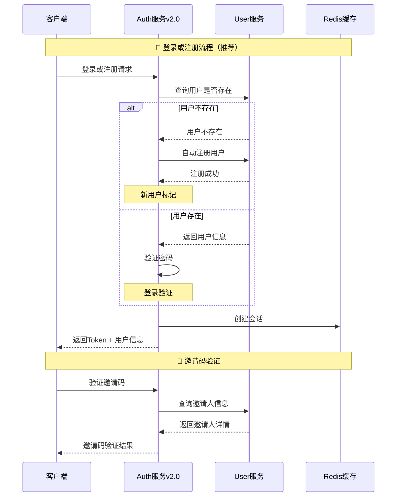

# Auth 模块 API 接口文档

## 📋 目录
- [模块概述](#模块概述)
- [简化认证机制](#简化认证机制)
- [认证接口列表](#认证接口列表)
- [Token管理接口](#token管理接口)
- [数据模型](#数据模型)
- [错误码定义](#错误码定义)
- [使用示例](#使用示例)

---

## 📚 模块概述

Auth 模块是 Collide 社交平台的认证授权服务 v2.0，基于 Code 项目设计哲学，实现了**简化认证系统**，降低用户使用门槛，提供高效、安全的认证服务。

### 🌟 简化认证特性
- ✨ **纯用户名密码认证**: 无复杂验证流程，注册即激活
- 🎫 **邀请码系统**: 支持邀请码注册，建立用户关系网络
- 🚀 **登录时自动注册**: 用户不存在时一键完成注册和登录
- 🔄 **一个接口搞定**: 登录或注册接口解决所有认证需求
- 🛡️ **安全可靠**: 密码加密存储，Sa-Token会话管理

### 主要功能
- 用户注册（支持邀请码）
- 用户登录（标准登录）
- 登录或注册（核心功能！）
- 邀请码验证和管理
- Token生成与验证
- 会话管理
- 安全认证

### 技术架构
- **框架**: Spring Boot 3.x + SpringCloud Alibaba
- **认证**: Sa-Token 轻量级认证框架
- **密码加密**: BCrypt
- **RPC**: Apache Dubbo
- **缓存**: Redis + JetCache
- **文档**: OpenAPI 3.0

### 设计理念
- **用户体验至上**: 降低注册门槛，提升使用便利性
- **邀请关系**: 通过邀请码建立用户社交关系
- **自动化处理**: 智能判断登录或注册，减少用户操作
- **安全性**: 保证简化的同时不降低安全标准

---

## 🔐 简化认证机制

### 认证流程



### Token 配置

| 配置项 | 值 | 说明 |
|--------|-----|------|
| token-name | satoken | Token名称 |
| timeout | 2592000 | Token有效期（30天） |
| active-timeout | -1 | 活跃超时（不限制） |
| is-concurrent | true | 允许多地登录 |
| is-share | true | 共享Token |
| token-style | uuid | Token风格 |
| is-log | true | 记录操作日志 |

---

## 🔗 认证接口列表

### 1. 用户注册

**接口描述**: 简化的用户名密码注册，支持邀请码

**请求信息**:
- **URL**: `POST /api/v1/auth/register`
- **Content-Type**: `application/json`
- **需要认证**: 否

**请求参数**:
```json
{
  "username": "newuser123",
  "password": "password123",
  "email": "newuser@example.com",
  "phone": "13800138000",
  "inviteCode": "ABC12345"
}
```

| 参数名 | 类型 | 是否必填 | 说明 |
|--------|------|----------|------|
| username | String | 是 | 用户名，3-20字符，支持字母数字下划线 |
| password | String | 是 | 密码，6-50字符 |
| email | String | 否 | 邮箱地址，格式验证 |
| phone | String | 否 | 手机号码 |
| inviteCode | String | 否 | 邀请码，8位字符 |

**响应示例**:
```json
{
  "code": 200,
  "message": "success",
  "data": {
    "user": {
      "id": 12345,
      "username": "newuser123",
      "nickname": "用户1703845123456",
      "avatar": null,
      "role": "user",
      "status": "active",
      "inviteCode": "XYZ78901",
      "invitedCount": 0,
      "createTime": "2024-01-16T10:30:00",
      "lastLoginTime": "2024-01-16T10:30:00"
    },
    "token": "eyJ0eXAiOiJKV1QiLCJhbGciOiJIUzI1NiJ9...",
    "message": "注册成功"
  }
}
```

**特性说明**:
- ✅ 注册成功后自动登录
- ✅ 返回完整用户信息和Token
- ✅ 支持邀请码建立关系
- ✅ 注册即激活，无需邮件验证

---

### 2. 用户登录

**接口描述**: 标准用户名密码登录

**请求信息**:
- **URL**: `POST /api/v1/auth/login`
- **Content-Type**: `application/json`
- **需要认证**: 否

**请求参数**:
```json
{
  "username": "johndoe",
  "password": "password123",
  "rememberMe": true
}
```

| 参数名 | 类型 | 是否必填 | 说明 |
|--------|------|----------|------|
| username | String | 是 | 用户名 |
| password | String | 是 | 密码 |
| rememberMe | Boolean | 否 | 是否记住登录状态，默认false |

**响应示例**:
```json
{
  "code": 200,
  "message": "success",
  "data": {
    "user": {
      "id": 12345,
      "username": "johndoe",
      "nickname": "John Doe",
      "avatar": "https://cdn.collide.com/avatars/12345.jpg",
      "role": "user",
      "status": "active",
      "inviteCode": "XYZ78901",
      "invitedCount": 3,
      "createTime": "2023-12-01T08:00:00",
      "lastLoginTime": "2024-01-16T10:30:00"
    },
    "token": "eyJ0eXAiOiJKV1QiLCJhbGciOiJIUzI1NiJ9...",
    "message": "登录成功"
  }
}
```

**错误响应**:
```json
{
  "code": 400,
  "message": "用户名或密码错误",
  "data": null
}
```

---

### 3. 🌟 登录或注册（核心功能）

**接口描述**: 基于Code项目设计哲学！用户不存在时自动注册，一个接口解决登录和注册需求

**请求信息**:
- **URL**: `POST /api/v1/auth/login-or-register`
- **Content-Type**: `application/json`
- **需要认证**: 否

**请求参数**:
```json
{
  "username": "anyuser",
  "password": "password123",
  "inviteCode": "ABC12345"
}
```

| 参数名 | 类型 | 是否必填 | 说明 |
|--------|------|----------|------|
| username | String | 是 | 用户名，3-20字符 |
| password | String | 是 | 密码，6-50字符 |
| inviteCode | String | 否 | 邀请码，新用户注册时使用 |

**响应示例（新用户自动注册）**:
```json
{
  "code": 200,
  "message": "success",
  "data": {
    "user": {
      "id": 67890,
      "username": "anyuser",
      "nickname": "用户1703845234567",
      "avatar": null,
      "role": "user",
      "status": "active",
      "inviteCode": "DEF45678",
      "invitedCount": 0,
      "createTime": "2024-01-16T10:35:00",
      "lastLoginTime": "2024-01-16T10:35:00"
    },
    "token": "eyJ0eXAiOiJKV1QiLCJhbGciOiJIUzI1NiJ9...",
    "isNewUser": true,
    "message": "注册并登录成功"
  }
}
```

**响应示例（现有用户登录）**:
```json
{
  "code": 200,
  "message": "success",
  "data": {
    "user": {
      "id": 12345,
      "username": "anyuser",
      "nickname": "Existing User",
      "avatar": "https://cdn.collide.com/avatars/12345.jpg",
      "role": "user",
      "status": "active",
      "inviteCode": "XYZ78901",
      "invitedCount": 5,
      "createTime": "2023-12-01T08:00:00",
      "lastLoginTime": "2024-01-16T10:35:00"
    },
    "token": "eyJ0eXAiOiJKV1QiLCJhbGciOiJIUzI1NiJ9...",
    "isNewUser": false,
    "message": "登录成功"
  }
}
```

**特性说明**:
- 🚀 **智能判断**: 自动判断是登录还是注册
- 🎯 **降低门槛**: 用户无需关心注册流程
- 🔄 **一键完成**: 一个接口解决所有认证需求
- 📊 **结果标识**: `isNewUser`字段明确指示操作类型

---

### 4. 用户登出

**接口描述**: 用户登出，清除会话信息

**请求信息**:
- **URL**: `POST /api/v1/auth/logout`
- **需要认证**: 是

**响应示例**:
```json
{
  "code": 200,
  "message": "success",
  "data": "登出成功"
}
```

---

### 5. 验证邀请码

**接口描述**: 检查邀请码是否有效并返回邀请人信息

**请求信息**:
- **URL**: `GET /api/v1/auth/validate-invite-code`
- **需要认证**: 否

**查询参数**:

| 参数名 | 类型 | 是否必填 | 说明 |
|--------|------|----------|------|
| inviteCode | String | 是 | 邀请码 |

**响应示例（有效邀请码）**:
```json
{
  "code": 200,
  "message": "success",
  "data": {
    "valid": true,
    "inviter": {
      "id": 12345,
      "username": "inviter_user",
      "nickname": "邀请用户",
      "avatar": "https://cdn.collide.com/avatars/12345.jpg"
    }
  }
}
```

**响应示例（无效邀请码）**:
```json
{
  "code": 200,
  "message": "success",
  "data": {
    "valid": false,
    "message": "邀请码无效"
  }
}
```

---

### 6. 获取我的邀请信息

**接口描述**: 获取当前用户的邀请码和邀请统计

**请求信息**:
- **URL**: `GET /api/v1/auth/my-invite-info`
- **需要认证**: 是

**响应示例**:
```json
{
  "code": 200,
  "message": "success",
  "data": {
    "inviteCode": "XYZ78901",
    "totalInvitedCount": 5,
    "invitedUsers": [
      {
        "id": 67890,
        "username": "invited_user1",
        "nickname": "被邀请用户1",
        "createTime": "2024-01-15T09:00:00"
      },
      {
        "id": 67891,
        "username": "invited_user2",
        "nickname": "被邀请用户2",
        "createTime": "2024-01-15T10:00:00"
      }
    ]
  }
}
```

---

## 🎫 Token管理接口

### 1. 获取特定Token

**接口描述**: 根据场景和键值获取特定用途的Token

**请求信息**:
- **URL**: `GET /api/v1/token/get`
- **需要认证**: 是

**查询参数**:

| 参数名 | 类型 | 是否必填 | 说明 |
|--------|------|----------|------|
| scene | String | 是 | 使用场景，如：upload、share、api |
| key | String | 是 | 业务键值，用于标识特定业务 |

**响应示例**:
```json
{
  "code": 200,
  "message": "success",
  "data": "token_upload_12345_avatar_1705478400000"
}
```

---

### 2. 验证Token

**接口描述**: 验证Token的有效性

**请求信息**:
- **URL**: `GET /api/v1/token/verify`
- **需要认证**: 否

**查询参数**:

| 参数名 | 类型 | 是否必填 | 说明 |
|--------|------|----------|------|
| token | String | 是 | 待验证的Token |

**响应示例**:
```json
{
  "code": 200,
  "message": "success",
  "data": true
}
```

---

### 3. 服务健康检查

**接口描述**: 检查认证服务状态

**请求信息**:
- **URL**: `GET /api/v1/auth/test`
- **需要认证**: 否

**响应示例**:
```
Collide Auth Service v2.0 is running! (Simplified Authentication System)
```

---

## 📊 数据模型

### RegisterParam

注册请求参数

```json
{
  "username": "newuser123",
  "password": "password123",
  "email": "newuser@example.com",
  "phone": "13800138000",
  "inviteCode": "ABC12345"
}
```

| 字段名 | 类型 | 必填 | 验证规则 | 说明 |
|--------|------|------|----------|------|
| username | String | 是 | 3-20字符，字母数字下划线 | 用户名 |
| password | String | 是 | 6-50字符 | 密码 |
| email | String | 否 | 邮箱格式 | 邮箱地址 |
| phone | String | 否 | - | 手机号码 |
| inviteCode | String | 否 | 8位字符 | 邀请码 |

### LoginParam

登录请求参数

```json
{
  "username": "johndoe",
  "password": "password123",
  "rememberMe": true
}
```

| 字段名 | 类型 | 必填 | 验证规则 | 说明 |
|--------|------|------|----------|------|
| username | String | 是 | 3-20字符 | 用户名 |
| password | String | 是 | 6-50字符 | 密码 |
| rememberMe | Boolean | 否 | - | 是否记住登录 |

### LoginOrRegisterParam ⭐️

登录或注册请求参数（核心模型）

```json
{
  "username": "anyuser",
  "password": "password123",
  "inviteCode": "ABC12345"
}
```

| 字段名 | 类型 | 必填 | 验证规则 | 说明 |
|--------|------|------|----------|------|
| username | String | 是 | 3-20字符 | 用户名 |
| password | String | 是 | 6-50字符 | 密码 |
| inviteCode | String | 否 | 8位字符 | 邀请码（自动注册时使用） |

### AuthResponseData

认证响应数据

```json
{
  "user": {
    "id": 12345,
    "username": "johndoe",
    "nickname": "John Doe",
    "avatar": "https://cdn.collide.com/avatars/12345.jpg",
    "role": "user",
    "status": "active",
    "inviteCode": "XYZ78901",
    "invitedCount": 5,
    "createTime": "2023-12-01T08:00:00",
    "lastLoginTime": "2024-01-16T10:30:00"
  },
  "token": "eyJ0eXAiOiJKV1QiLCJhbGciOiJIUzI1NiJ9...",
  "isNewUser": false,
  "message": "登录成功"
}
```

| 字段名 | 类型 | 说明 |
|--------|------|------|
| user | Object | 用户信息对象 |
| token | String | 访问令牌 |
| isNewUser | Boolean | 是否新用户（仅登录或注册接口返回） |
| message | String | 操作结果消息 |

### InviteCodeValidation

邀请码验证结果

```json
{
  "valid": true,
  "inviter": {
    "id": 12345,
    "username": "inviter_user",
    "nickname": "邀请用户",
    "avatar": "https://cdn.collide.com/avatars/12345.jpg"
  }
}
```

### InviteStatistics

邀请统计信息

```json
{
  "inviteCode": "XYZ78901",
  "totalInvitedCount": 5,
  "invitedUsers": [
    {
      "id": 67890,
      "username": "invited_user1",
      "nickname": "被邀请用户1",
      "createTime": "2024-01-15T09:00:00"
    }
  ]
}
```

---

## ❌ 错误码定义

### 通用错误码

| 错误码 | HTTP状态码 | 说明 |
|--------|-----------|------|
| 200 | 200 | 成功 |
| 400 | 400 | 请求参数错误 |
| 401 | 401 | 认证失败 |
| 403 | 403 | 权限不足 |
| 500 | 500 | 服务器内部错误 |

### 认证错误码

| 错误码 | 说明 |
|--------|------|
| REGISTER_ERROR | 注册失败 |
| LOGIN_ERROR | 登录失败 |
| LOGIN_REGISTER_ERROR | 登录或注册失败 |
| LOGOUT_ERROR | 登出失败 |
| INVALID_INVITE_CODE | 邀请码无效 |
| VALIDATE_ERROR | 验证失败 |
| GET_INVITE_INFO_ERROR | 获取邀请信息失败 |

### 用户相关错误码

| 错误码 | 说明 |
|--------|------|
| USER_STATUS_IS_NOT_ACTIVE | 用户状态不可用 |
| USER_NOT_LOGIN | 用户未登录 |
| USER_NOT_EXIST | 用户不存在 |
| USERNAME_ALREADY_EXISTS | 用户名已存在 |
| PASSWORD_WRONG | 密码错误 |

### Token相关错误码

| 错误码 | 说明 |
|--------|------|
| TOKEN_EXPIRED | Token已过期 |
| TOKEN_INVALID | Token无效 |

---

## 🔒 安全特性

### 密码安全
- **加密算法**: BCrypt，自动生成盐值
- **强度要求**: 6-50字符，灵活配置
- **存储方式**: 只存储哈希值，不存储明文
- **简化策略**: 降低复杂度要求，提升用户体验

### Token 安全
- **生成方式**: UUID格式，高度随机
- **有效期**: 默认30天，支持自定义
- **存储位置**: Redis分布式缓存
- **传输方式**: HTTP Header Authorization Bearer

### 会话安全
- **会话隔离**: 每个用户独立会话空间
- **并发控制**: 支持多地同时登录配置
- **自动过期**: 支持活跃超时和绝对超时
- **安全登出**: 彻底清除服务端会话信息

### 邀请码安全
- **唯一性**: 全局唯一，8位字符组合
- **防刷取**: 生成算法防止恶意获取
- **关系追踪**: 完整的邀请关系链记录

---

## 💡 使用示例

### 1. 🌟 推荐认证流程（一键登录注册）

```bash
# 一个接口搞定所有认证需求
curl -X POST "http://localhost:9502/api/v1/auth/login-or-register" \
  -H "Content-Type: application/json" \
  -d '{
    "username": "myuser",
    "password": "password123",
    "inviteCode": "ABC12345"
  }'

# 响应结果：
# - 如果用户存在：直接登录
# - 如果用户不存在：自动注册并登录
# - isNewUser 字段标识操作类型
```

### 2. 传统认证流程

```bash
# 1. 用户注册（支持邀请码）
curl -X POST "http://localhost:9502/api/v1/auth/register" \
  -H "Content-Type: application/json" \
  -d '{
    "username": "newuser123",
    "password": "password123",
    "email": "newuser@example.com",
    "inviteCode": "ABC12345"
  }'

# 2. 用户登录
curl -X POST "http://localhost:9502/api/v1/auth/login" \
  -H "Content-Type: application/json" \
  -d '{
    "username": "newuser123",
    "password": "password123",
    "rememberMe": true
  }'

# 3. 用户登出
curl -X POST "http://localhost:9502/api/v1/auth/logout" \
  -H "Authorization: Bearer YOUR_TOKEN"
```

### 3. 邀请码功能

```bash
# 验证邀请码
curl -X GET "http://localhost:9502/api/v1/auth/validate-invite-code?inviteCode=ABC12345"

# 获取我的邀请信息
curl -X GET "http://localhost:9502/api/v1/auth/my-invite-info" \
  -H "Authorization: Bearer YOUR_TOKEN"
```

### 4. JavaScript 前端集成（推荐方式）

```javascript
class SimplifiedAuthService {
  constructor() {
    this.baseURL = '/api/v1/auth';
    this.tokenKey = 'auth_token';
  }

  /**
   * 🌟 一键认证（推荐）
   * 智能判断登录或注册
   */
  async loginOrRegister(credentials) {
    try {
      const response = await fetch(`${this.baseURL}/login-or-register`, {
        method: 'POST',
        headers: {
          'Content-Type': 'application/json'
        },
        body: JSON.stringify(credentials)
      });

      const result = await response.json();
      
      if (result.code === 200) {
        // 保存Token
        this.setToken(result.data.token);
        
        if (result.data.isNewUser) {
          console.log('🎉 欢迎新用户！自动注册并登录成功');
          // 可以显示新用户引导
          this.showNewUserGuide();
        } else {
          console.log('👋 欢迎回来！登录成功');
        }
        
        return { 
          success: true, 
          data: result.data,
          isNewUser: result.data.isNewUser 
        };
      } else {
        console.error('认证失败:', result.message);
        return { success: false, message: result.message };
      }
    } catch (error) {
      console.error('认证请求失败:', error);
      return { success: false, message: '网络错误' };
    }
  }

  /**
   * 验证邀请码
   */
  async validateInviteCode(inviteCode) {
    try {
      const response = await fetch(`${this.baseURL}/validate-invite-code?inviteCode=${inviteCode}`);
      const result = await response.json();
      
      if (result.code === 200) {
        return result.data;
      }
      throw new Error(result.message);
    } catch (error) {
      console.error('邀请码验证失败:', error);
      return { valid: false, message: '验证失败' };
    }
  }

  /**
   * 获取邀请信息
   */
  async getMyInviteInfo() {
    try {
      const response = await fetch(`${this.baseURL}/my-invite-info`, {
        headers: {
          'Authorization': `Bearer ${this.getToken()}`
        }
      });
      
      const result = await response.json();
      if (result.code === 200) {
        return result.data;
      }
      throw new Error(result.message);
    } catch (error) {
      console.error('获取邀请信息失败:', error);
      return null;
    }
  }

  /**
   * 用户登出
   */
  async logout() {
    try {
      const response = await fetch(`${this.baseURL}/logout`, {
        method: 'POST',
        headers: {
          'Authorization': `Bearer ${this.getToken()}`
        }
      });

      // 无论服务端是否成功，都清除本地Token
      this.removeToken();
      console.log('👋 已登出');
      return { success: true };
    } catch (error) {
      console.error('登出请求失败:', error);
      this.removeToken(); // 确保清除本地状态
      return { success: true };
    }
  }

  // Token管理
  setToken(token) {
    localStorage.setItem(this.tokenKey, token);
  }

  getToken() {
    return localStorage.getItem(this.tokenKey);
  }

  removeToken() {
    localStorage.removeItem(this.tokenKey);
  }

  isLoggedIn() {
    return !!this.getToken();
  }

  getAuthHeader() {
    const token = this.getToken();
    return token ? { 'Authorization': `Bearer ${token}` } : {};
  }

  // 新用户引导
  showNewUserGuide() {
    // 显示新用户引导界面
    console.log('🎯 显示新用户引导');
  }
}

// 使用示例
const authService = new SimplifiedAuthService();

// 🌟 推荐：一键认证
authService.loginOrRegister({
  username: 'myuser',
  password: 'password123',
  inviteCode: 'ABC12345' // 可选
}).then(result => {
  if (result.success) {
    if (result.isNewUser) {
      // 新用户流程
      console.log('新用户注册成功');
      window.location.href = '/welcome';
    } else {
      // 老用户流程
      console.log('登录成功');
      window.location.href = '/dashboard';
    }
  } else {
    alert(`认证失败: ${result.message}`);
  }
});

// 邀请码验证示例
async function validateAndShowInviter() {
  const inviteCode = 'ABC12345';
  const result = await authService.validateInviteCode(inviteCode);
  
  if (result.valid) {
    console.log('邀请人:', result.inviter);
    // 显示邀请人信息
  } else {
    console.log('邀请码无效');
  }
}
```

### 5. Vue.js 组件集成示例

```vue
<template>
  <div class="auth-form">
    <h2>{{ isLogin ? '登录' : '注册' }}</h2>
    
    <!-- 一键认证表单 -->
    <form @submit.prevent="handleAuth">
      <div class="form-group">
        <input 
          v-model="form.username" 
          type="text" 
          placeholder="用户名"
          required
        />
      </div>
      
      <div class="form-group">
        <input 
          v-model="form.password" 
          type="password" 
          placeholder="密码"
          required
        />
      </div>
      
      <div class="form-group" v-if="showInviteCode">
        <input 
          v-model="form.inviteCode" 
          type="text" 
          placeholder="邀请码（可选）"
          @blur="validateInviteCode"
        />
        <div v-if="inviteInfo.valid" class="invite-info">
          👤 邀请人: {{ inviteInfo.inviter.nickname }}
        </div>
      </div>
      
      <button type="submit" :disabled="loading">
        {{ loading ? '处理中...' : '一键登录/注册' }}
      </button>
    </form>
    
    <div class="toggle-mode">
      <a href="#" @click="toggleMode">
        {{ isLogin ? '没有账号？点击注册' : '已有账号？点击登录' }}
      </a>
    </div>
  </div>
</template>

<script>
export default {
  name: 'AuthForm',
  data() {
    return {
      isLogin: true,
      loading: false,
      form: {
        username: '',
        password: '',
        inviteCode: ''
      },
      inviteInfo: {
        valid: false,
        inviter: null
      }
    }
  },
  computed: {
    showInviteCode() {
      return !this.isLogin || this.form.inviteCode;
    }
  },
  methods: {
    async handleAuth() {
      this.loading = true;
      
      try {
        const result = await this.$auth.loginOrRegister({
          username: this.form.username,
          password: this.form.password,
          inviteCode: this.form.inviteCode || undefined
        });
        
        if (result.success) {
          this.$message.success(
            result.isNewUser ? '注册并登录成功！' : '登录成功！'
          );
          
          // 跳转到目标页面
          this.$router.push(result.isNewUser ? '/welcome' : '/dashboard');
        } else {
          this.$message.error(result.message);
        }
      } catch (error) {
        this.$message.error('认证失败，请稍后重试');
      } finally {
        this.loading = false;
      }
    },
    
    async validateInviteCode() {
      if (!this.form.inviteCode) {
        this.inviteInfo = { valid: false, inviter: null };
        return;
      }
      
      const result = await this.$auth.validateInviteCode(this.form.inviteCode);
      this.inviteInfo = result;
    },
    
    toggleMode() {
      this.isLogin = !this.isLogin;
      this.form.inviteCode = '';
      this.inviteInfo = { valid: false, inviter: null };
    }
  }
}
</script>
```

---

## 📋 集成指南

### 前端集成最佳实践

1. **优先使用一键认证**
   ```javascript
   // ✅ 推荐：简化用户操作
   authService.loginOrRegister(credentials);
   
   // ❌ 不推荐：复杂的注册流程
   // if (needRegister) {
   //   authService.register(data);
   // } else {
   //   authService.login(data);
   // }
   ```

2. **邀请码预填充**
   ```javascript
   // 从URL参数获取邀请码
   const urlParams = new URLSearchParams(window.location.search);
   const inviteCode = urlParams.get('invite');
   
   if (inviteCode) {
     // 自动填充邀请码
     form.inviteCode = inviteCode;
     // 验证并显示邀请人信息
     validateInviteCode(inviteCode);
   }
   ```

3. **智能响应处理**
   ```javascript
   const result = await authService.loginOrRegister(data);
   
   if (result.success) {
     if (result.isNewUser) {
       // 新用户：显示欢迎页面、设置引导等
       showWelcomeFlow();
     } else {
       // 老用户：直接进入主界面
       redirectToDashboard();
     }
   }
   ```

### 后端服务集成

```java
@RestController
public class BusinessController {
    
    @SaCheckLogin  // Sa-Token注解，要求用户登录
    @GetMapping("/protected")
    public Result<String> protectedEndpoint() {
        Long userId = StpUtil.getLoginIdAsLong();
        String username = (String) StpUtil.getSession().get("username");
        return Result.success("Hello " + username + " (ID: " + userId + ")");
    }
    
    @GetMapping("/invite/{code}")
    public Result<String> invitePage(@PathVariable String code) {
        // 验证邀请码并跳转到注册页面
        return Result.success("redirect:/register?invite=" + code);
    }
}
```

---

## 🎯 设计理念总结

### 简化认证的核心价值

1. **用户体验至上** 📱
   - 降低注册门槛，提升用户转化率
   - 一个接口解决所有认证需求
   - 智能判断，减少用户思考成本

2. **邀请关系建立** 🤝
   - 通过邀请码建立用户社交网络
   - 追踪邀请关系，支持推荐算法
   - 激励用户分享，促进平台增长

3. **开发友好** 👩‍💻
   - 统一的接口设计，减少前端复杂度
   - 清晰的错误码体系，便于问题定位
   - 完善的文档和示例，降低集成成本

4. **安全保障** 🔒
   - 简化不等于降低安全性
   - 保留必要的安全机制
   - 平衡用户体验与系统安全

---

## 📞 技术支持

- **开发团队**: Collide Team  
- **认证框架**: Sa-Token v1.37.0
- **架构版本**: v2.0 (简化认证系统)
- **文档版本**: v2.0
- **更新日期**: 2024-01-16
- **联系方式**: tech@collide.com

---

*本文档基于 Auth 模块 v2.0.0 版本生成，采用简化认证系统和Code项目设计哲学。如有疑问请联系技术团队。* 