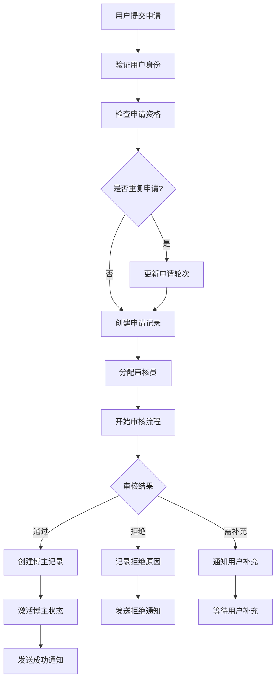
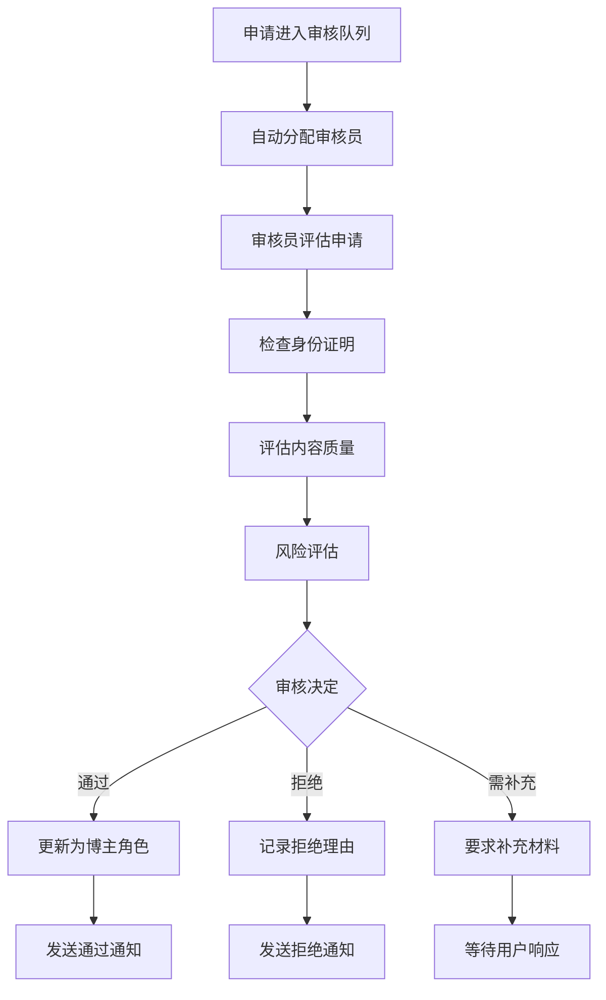
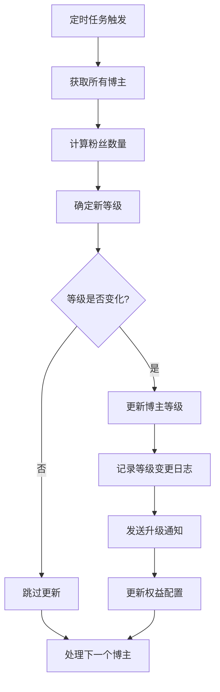

# 博主系统设计文档

## 设计概述

博主系统是基于`ARTIST`用户角色的独立模块，实现博主申请、审核、管理等完整流程。系统采用无外键设计，通过ID关联，保证模块的独立性和高性能。成为博主需要经过严格的审核流程，确保平台内容质量。

## 架构设计

### 模块结构
```
collide-api/src/main/java/com/gig/collide/api/artist/
├── service/                    # 服务接口层
│   ├── ArtistFacadeService.java       # 博主门面服务
│   └── ArtistRecommendService.java    # 博主推荐服务
├── request/                    # 请求参数层
│   ├── ArtistApplicationRequest.java  # 博主申请请求
│   ├── ArtistReviewRequest.java       # 审核请求
│   ├── ArtistUpdateRequest.java       # 更新请求
│   ├── ArtistQueryRequest.java        # 查询请求
│   └── ArtistPageQueryRequest.java    # 分页查询请求
├── response/                   # 响应参数层
│   ├── ArtistOperatorResponse.java    # 操作响应
│   ├── ArtistQueryResponse.java       # 查询响应
│   └── data/
│       ├── ArtistInfo.java           # 博主信息
│       ├── ArtistApplicationInfo.java # 申请信息
│       └── ArtistStatistics.java      # 统计信息
└── constant/                   # 常量定义层
    ├── ArtistStatus.java             # 博主状态
    ├── ArtistApplicationType.java    # 申请类型
    ├── ArtistReviewResult.java       # 审核结果
    ├── ArtistLevel.java              # 博主等级
    ├── ArtistCategory.java           # 博主分类
    └── ArtistOperateTypeEnum.java    # 操作类型
```

## 核心特性

### 1. 博主申请系统

#### 申请类型分类
```java
public enum ArtistApplicationType {
    PERSONAL("个人博主"),      // 个人创作者
    ORGANIZATION("机构博主"),  // 机构账号
    BRAND("品牌博主"),        // 品牌官方账号
    MEDIA("媒体博主"),        // 媒体机构
    KOL("KOL"),              // 意见领袖
    PROFESSIONAL("专业博主"); // 专业领域专家
}
```

#### 申请流程
```
用户提交申请 → 资料审核 → 身份验证 → 内容评估 → 审核决定 → 博主激活
```

### 2. 审核管理系统

#### 审核结果类型
```java
public enum ArtistReviewResult {
    APPROVED("审核通过"),           // 申请通过
    REJECTED("审核拒绝"),           // 申请被拒
    NEED_SUPPLEMENT("需要补充材料"), // 需要补充
    SUSPENDED("暂停审核"),          // 暂停处理
    RE_REVIEW("重新审核");          // 重新评估
}
```

#### 分级审核标准
- **个人博主**: 基础审核（等级2）
- **专业博主**: 专业认证（等级3）
- **KOL**: 影响力评估（等级3）
- **机构博主**: 机构验证（等级4）
- **品牌博主**: 品牌认证（等级4）
- **媒体博主**: 最严格审核（等级5）

### 3. 博主等级体系

#### 等级分类
```java
public enum ArtistLevel {
    NEWCOMER(1, "新手博主", 0, 1000),        // 新手阶段
    GROWING(2, "成长博主", 1000, 10000),     // 成长阶段
    EXCELLENT(3, "优秀博主", 10000, 50000),  // 优秀阶段
    FAMOUS(4, "知名博主", 50000, 200000),    // 知名阶段
    TOP(5, "顶级博主", 200000, Integer.MAX_VALUE); // 顶级阶段
}
```

#### 等级权益
- **新手博主**: 每日发布5篇内容，基础功能
- **成长博主**: 每日发布10篇，可创建话题
- **优秀博主**: 每日发布20篇，可置顶内容
- **知名博主**: 每日发布50篇，可开直播
- **顶级博主**: 每日发布100篇，优先技术支持

### 4. 博主分类系统

#### 内容分类
```java
// 专业类别
TECHNOLOGY("科技数码"), EDUCATION("教育学习"), BUSINESS("商业财经")

// 创意类别  
ART("艺术创作"), FASHION("时尚美妆"), FOOD("美食烹饪")

// 生活类别
LIFESTYLE("生活方式"), FITNESS("健身运动"), TRAVEL("旅行摄影")
```

## 数据库设计

### 1. 核心表结构

#### artist - 博主主表
```sql
- user_id: 用户ID（唯一，无外键约束）
- artist_name: 博主名称
- status: 博主状态
- application_type: 申请类型
- categories: 博主分类（JSON格式）
- level: 博主等级
- followers_count: 粉丝数量
- hot_score: 热度分数
- influence_index: 影响力指数
```

#### artist_application - 博主申请表
```sql
- user_id: 申请用户ID
- application_type: 申请类型
- status: 申请状态
- apply_reason: 申请理由
- reviewer_id: 审核员ID
- review_result: 审核结果
- application_round: 申请轮次
```

#### artist_statistics - 博主统计表
```sql
- artist_id: 博主ID
- today_followers_growth: 今日粉丝增长
- engagement_rate: 互动率
- influence_index: 影响力指数
- followers_growth_trend: 粉丝增长趋势（JSON）
```

### 2. 无外键设计原则

#### 独立性保证
- **无外键约束**: 所有关联通过ID进行，不使用外键
- **模块解耦**: 博主模块可独立部署和维护
- **角色集成**: 与用户角色系统通过UserRole.ARTIST集成
- **数据一致性**: 通过应用层逻辑保证数据一致性

## 业务流程设计

### 1. 博主申请流程



### 2. 审核管理流程



### 3. 等级更新流程



## API接口设计

### 1. 博主申请接口

#### 提交申请
```java
ArtistOperatorResponse applyToBeArtist(ArtistApplicationRequest request);
```
- 验证用户资格和申请资料
- 创建申请记录并进入审核队列
- 发送申请确认通知

#### 查询申请状态
```java
ArtistQueryResponse<ArtistApplicationInfo> queryApplicationById(Long applicationId);
```
- 返回申请详细信息和审核进度
- 包含审核意见和后续操作建议

### 2. 审核管理接口

#### 审核申请
```java
ArtistOperatorResponse reviewArtistApplication(ArtistReviewRequest request);
```
- 支持通过、拒绝、需补充等审核结果
- 记录审核意见和评分
- 自动更新申请状态

#### 批量审核
```java
ArtistOperatorResponse batchReviewApplications(List<ArtistReviewRequest> requests);
```
- 支持批量审核操作
- 提高审核效率
- 保证事务一致性

### 3. 博主管理接口

#### 更新博主信息
```java
ArtistOperatorResponse updateArtistInfo(ArtistUpdateRequest request);
```
- 支持博主资料更新
- 记录变更历史
- 验证更新权限

#### 博主状态管理
```java
ArtistOperatorResponse suspendArtist(Long artistId, Long operatorId, String reason);
ArtistOperatorResponse restoreArtist(Long artistId, Long operatorId, String reason);
```
- 支持暂停、恢复、禁用等状态操作
- 记录操作原因和操作人
- 发送状态变更通知

## 推荐算法设计

### 1. 博主推荐策略

#### 基于兴趣推荐
```java
public List<ArtistInfo> recommendByUserInterests(Long userId, List<String> userTags, Integer limit) {
    // 1. 分析用户兴趣标签
    // 2. 匹配相关分类的博主
    // 3. 按影响力指数排序
    // 4. 返回推荐结果
}
```

#### 协同过滤推荐
```java
public List<ArtistInfo> recommendSimilarArtists(Long userId, Integer limit) {
    // 1. 找到相似用户群体
    // 2. 分析相似用户关注的博主
    // 3. 过滤用户已关注的博主
    // 4. 按相似度评分排序
}
```

### 2. 热度计算算法

#### 影响力指数计算
```java
影响力指数 = (粉丝数 * 0.3 + 互动率 * 0.4 + 内容质量 * 0.3) * 等级权重
```

#### 热度分数更新
```java
热度分数 = 基础热度 + 最近活跃度 + 互动增长率 + 内容发布频率
```

## 性能优化策略

### 1. 缓存设计

#### 多级缓存架构
```java
// L1缓存：博主基础信息
@Cacheable(value = "artist:info", key = "#artistId")
public ArtistInfo getArtistById(Long artistId) { ... }

// L2缓存：热门博主列表
@Cacheable(value = "artist:hot", key = "#category + ':' + #limit")
public List<ArtistInfo> getHotArtists(ArtistCategory category, Integer limit) { ... }

// L3缓存：推荐博主
@Cacheable(value = "artist:recommend", key = "#userId + ':' + #limit")
public List<ArtistInfo> getRecommendedArtists(Long userId, Integer limit) { ... }
```

### 2. 数据库优化

#### 索引优化
```sql
-- 复合索引
CREATE INDEX idx_artist_status_level ON artist (status, level, followers_count);
CREATE INDEX idx_application_status_type ON artist_application (status, application_type, submit_time);

-- 覆盖索引
CREATE INDEX idx_artist_cover ON artist (status, application_type, level, followers_count, hot_score);
```

#### 分表策略
```java
// 博主统计表按时间分表
public String getStatTableName(Date date) {
    return "artist_statistics_" + DateUtils.format(date, "yyyyMM");
}

// 操作日志表按博主ID分表
public String getLogTableName(Long artistId) {
    return "artist_operation_log_" + (artistId % 10);
}
```

### 3. 异步处理

#### 统计数据更新
```java
@Async("artistExecutor")
public void updateArtistStatistics(Long artistId) {
    // 异步更新博主统计数据
    updateFollowersCount(artistId);
    updateEngagementRate(artistId);
    updateInfluenceIndex(artistId);
}
```

#### 等级自动更新
```java
@Scheduled(cron = "0 0 2 * * ?") // 每天凌晨2点执行
public void updateArtistLevels() {
    // 批量更新博主等级
    List<Long> artistIds = getAllActiveArtistIds();
    artistIds.parallelStream().forEach(this::updateArtistLevel);
}
```

## 安全和权限控制

### 1. 审核安全

#### 审核员权限管理
- **角色权限**: 只有管理员角色可以进行审核
- **分级审核**: 不同类型申请需要不同级别审核员
- **审核记录**: 所有审核操作都有完整日志记录
- **防止舞弊**: 审核员不能审核自己的申请

#### 申请防刷机制
- **频率限制**: 同一用户24小时内只能提交一次申请
- **重复检测**: 检测重复申请和虚假信息
- **黑名单机制**: 恶意申请用户加入黑名单
- **IP限制**: 同一IP地址申请次数限制

### 2. 数据安全

#### 敏感信息保护
- **身份证明**: 加密存储身份证明文件
- **联系信息**: 脱敏处理联系方式
- **审核意见**: 内部审核意见不对外暴露
- **操作日志**: 敏感操作日志定期归档

## 监控和运维

### 1. 业务监控

#### 关键指标
- **申请转化率**: 申请通过率统计
- **审核效率**: 平均审核时间
- **博主活跃度**: 博主发布内容频率
- **用户满意度**: 申请用户反馈评分

#### 实时监控
- **申请队列**: 待审核申请数量监控
- **审核超时**: 超时未审核申请预警
- **异常申请**: 可疑申请实时告警
- **系统性能**: 接口响应时间监控

### 2. 数据分析

#### 申请分析
- **申请趋势**: 每日申请数量趋势
- **分类分布**: 不同类型申请占比
- **通过率分析**: 各类型申请通过率
- **拒绝原因**: 申请被拒原因统计

#### 博主分析
- **等级分布**: 各等级博主数量分布
- **活跃度分析**: 博主活跃度统计
- **影响力排行**: 博主影响力排行榜
- **内容质量**: 博主内容质量评分

## 扩展功能设计

### 1. 智能审核

#### AI辅助审核
- **内容识别**: 自动识别申请材料真伪
- **风险评估**: AI评估申请风险等级
- **相似度检测**: 检测重复和抄袭申请
- **质量评分**: 自动评估申请质量

### 2. 博主成长体系

#### 成长激励
- **任务系统**: 博主成长任务和奖励
- **技能认证**: 专业技能认证体系
- **导师计划**: 资深博主指导新人
- **创作扶持**: 优质内容创作扶持

## 总结

博主系统设计具有以下特点：

1. **完整的申请审核流程**: 从申请到激活的完整闭环
2. **无外键独立设计**: 模块完全独立，易于维护
3. **严格的审核机制**: 多级审核保证博主质量
4. **灵活的等级体系**: 基于粉丝数的动态等级管理
5. **智能推荐支持**: 为推荐系统提供博主数据
6. **高性能设计**: 缓存、异步、分表等优化策略
7. **安全可靠**: 完善的权限控制和审核机制

该设计为平台博主生态建设提供了坚实的技术基础，能够支撑大规模博主管理和内容创作需求。 