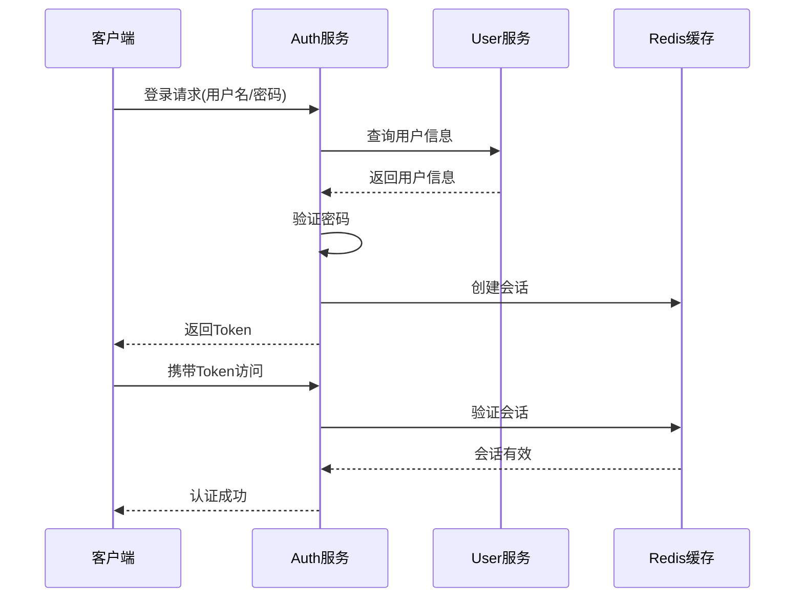

# Auth 模块 API 接口文档

## 📋 目录
- [模块概述](#模块概述)
- [认证机制](#认证机制)
- [接口列表](#接口列表)
- [数据模型](#数据模型)
- [错误码定义](#错误码定义)
- [使用示例](#使用示例)

---

## 📚 模块概述

Auth 模块是 Collide 社交平台的认证授权服务，负责用户登录、注册、Token管理、会话管理等核心安全功能。

### 主要功能
- 用户注册与登录
- Token生成与验证
- 会话管理
- 密码加密与验证
- 安全认证
- 登出管理

### 技术架构
- **框架**: Spring Boot 3.x + Spring Security
- **认证**: Sa-Token
- **密码加密**: BCrypt
- **RPC**: Apache Dubbo
- **缓存**: Redis
- **文档**: OpenAPI 3.0

### 设计特点
- 基于用户名密码的认证方式
- 支持记住登录状态
- 分布式会话管理
- 安全的密码存储
- 灵活的Token管理

---

## 🔐 认证机制

### 认证流程



### Token 配置

| 配置项 | 值 | 说明 |
|--------|-----|------|
| token-name | satoken | Token名称 |
| timeout | 2592000 | Token有效期（30天） |
| active-timeout | -1 | 活跃超时（不限制） |
| is-concurrent | true | 允许多地登录 |
| is-share | true | 共享Token |
| token-style | uuid | Token风格 |

---

## 🔗 接口列表

### 1. 用户注册

**接口描述**: 新用户注册账号

**请求信息**:
- **URL**: `POST /api/v1/auth/register`
- **Content-Type**: `application/json`
- **需要认证**: 否

**请求参数**:
```json
{
  "username": "newuser123",
  "password": "SecurePass123!",
  "email": "newuser@example.com",
  "phone": "13800138000"
}
```

| 参数名 | 类型 | 是否必填 | 说明 |
|--------|------|----------|------|
| username | String | 是 | 用户名，3-20字符，英文数字下划线 |
| password | String | 是 | 密码，6-20字符，包含字母和数字 |
| email | String | 否 | 邮箱地址，格式验证 |
| phone | String | 否 | 手机号码，11位数字 |

**响应示例**:
```json
{
  "code": 200,
  "message": "success",
  "data": true
}
```

**错误响应**:
```json
{
  "code": 400,
  "message": "用户名已存在",
  "data": false
}
```

---

### 2. 用户登录

**接口描述**: 用户登录获取访问令牌

**请求信息**:
- **URL**: `POST /api/v1/auth/login`
- **Content-Type**: `application/json`
- **需要认证**: 否

**请求参数**:
```json
{
  "username": "johndoe",
  "password": "MyPassword123!",
  "rememberMe": true
}
```

| 参数名 | 类型 | 是否必填 | 说明 |
|--------|------|----------|------|
| username | String | 是 | 用户名 |
| password | String | 是 | 密码 |
| rememberMe | Boolean | 否 | 是否记住登录状态，默认false |

**响应示例**:
```json
{
  "code": 200,
  "message": "success",
  "data": {
    "userId": "12345",
    "token": "eyJ0eXAiOiJKV1QiLCJhbGciOiJIUzI1NiJ9...",
    "tokenExpiration": 1706198400000
  }
}
```

**响应字段说明**:

| 字段名 | 类型 | 说明 |
|--------|------|------|
| userId | String | 用户ID |
| token | String | 访问令牌 |
| tokenExpiration | Long | 令牌过期时间戳（毫秒） |

**错误响应**:
```json
{
  "code": 401,
  "message": "用户名或密码错误",
  "data": null
}
```

---

### 3. 用户登出

**接口描述**: 用户登出，清除会话信息

**请求信息**:
- **URL**: `POST /api/v1/auth/logout`
- **需要认证**: 是

**响应示例**:
```json
{
  "code": 200,
  "message": "success",
  "data": true
}
```

---

### 4. 获取Token

**接口描述**: 根据场景和键值获取特定用途的Token

**请求信息**:
- **URL**: `GET /api/v1/token/get`
- **需要认证**: 是

**查询参数**:

| 参数名 | 类型 | 是否必填 | 说明 |
|--------|------|----------|------|
| scene | String | 是 | 使用场景，如：upload、share、api |
| key | String | 是 | 业务键值，用于标识特定业务 |

**响应示例**:
```json
{
  "code": 200,
  "message": "success",
  "data": "token_upload_12345_avatar_1705478400000"
}
```

---

### 5. 验证Token

**接口描述**: 验证Token的有效性

**请求信息**:
- **URL**: `GET /api/v1/token/verify`
- **需要认证**: 否

**查询参数**:

| 参数名 | 类型 | 是否必填 | 说明 |
|--------|------|----------|------|
| token | String | 是 | 待验证的Token |

**响应示例**:
```json
{
  "code": 200,
  "message": "success",
  "data": true
}
```

---

### 6. 服务健康检查

**接口描述**: 检查认证服务状态

**请求信息**:
- **URL**: `GET /api/v1/auth/test`
- **需要认证**: 否

**响应示例**:
```
Collide Auth Service is running!
```

---

## 📊 数据模型

### LoginParam

登录请求参数

```json
{
  "username": "johndoe",
  "password": "MyPassword123!",
  "rememberMe": true
}
```

| 字段名 | 类型 | 必填 | 验证规则 | 说明 |
|--------|------|------|----------|------|
| username | String | 是 | 3-20字符 | 用户名 |
| password | String | 是 | 6-20字符 | 密码 |
| rememberMe | Boolean | 否 | - | 是否记住登录 |

### RegisterParam

注册请求参数

```json
{
  "username": "newuser123",
  "password": "SecurePass123!",
  "email": "newuser@example.com",
  "phone": "13800138000"
}
```

| 字段名 | 类型 | 必填 | 验证规则 | 说明 |
|--------|------|------|----------|------|
| username | String | 是 | 3-20字符，字母数字下划线 | 用户名 |
| password | String | 是 | 6-20字符，包含字母数字 | 密码 |
| email | String | 否 | 邮箱格式 | 邮箱地址 |
| phone | String | 否 | 11位数字 | 手机号码 |

### LoginVO

登录响应对象

```json
{
  "userId": "12345",
  "token": "eyJ0eXAiOiJKV1QiLCJhbGciOiJIUzI1NiJ9...",
  "tokenExpiration": 1706198400000
}
```

| 字段名 | 类型 | 说明 |
|--------|------|------|
| userId | String | 用户唯一标识 |
| token | String | 访问令牌 |
| tokenExpiration | Long | 令牌过期时间戳（毫秒） |

---

## ❌ 错误码定义

### 通用错误码

| 错误码 | HTTP状态码 | 说明 |
|--------|-----------|------|
| 200 | 200 | 成功 |
| 400 | 400 | 请求参数错误 |
| 401 | 401 | 认证失败 |
| 403 | 403 | 权限不足 |
| 500 | 500 | 服务器内部错误 |

### 认证错误码

| 错误码 | 说明 |
|--------|------|
| USER_NOT_FOUND | 用户不存在 |
| PASSWORD_WRONG | 密码错误 |
| USER_EXISTS | 用户名已存在 |
| NOT_LOGGED_IN | 用户未登录 |
| TOKEN_EXPIRED | Token已过期 |
| TOKEN_INVALID | Token无效 |
| REGISTER_ERROR | 注册失败 |
| LOGIN_ERROR | 登录失败 |
| LOGOUT_ERROR | 登出失败 |
| VERIFICATION_CODE_WRONG | 验证码错误 |

---

## 🔒 安全特性

### 密码安全
- **加密算法**: BCrypt，自动生成盐值
- **强度要求**: 6-20字符，必须包含字母和数字
- **存储方式**: 只存储哈希值，不存储明文
- **防暴力破解**: 登录失败次数限制

### Token 安全
- **生成方式**: UUID格式，高度随机
- **有效期**: 默认30天，支持自定义
- **存储位置**: Redis分布式缓存
- **传输方式**: HTTP Header Authorization Bearer

### 会话安全
- **会话隔离**: 每个用户独立会话空间
- **并发控制**: 支持多地同时登录配置
- **自动过期**: 支持活跃超时和绝对超时
- **安全登出**: 彻底清除服务端会话信息

---

## 💡 使用示例

### 1. 完整认证流程示例

```bash
# 1. 用户注册
curl -X POST "http://localhost:8081/api/v1/auth/register" \
  -H "Content-Type: application/json" \
  -d '{
    "username": "testuser123",
    "password": "TestPass123!",
    "email": "test@example.com"
  }'

# 2. 用户登录
curl -X POST "http://localhost:8081/api/v1/auth/login" \
  -H "Content-Type: application/json" \
  -d '{
    "username": "testuser123",
    "password": "TestPass123!",
    "rememberMe": true
  }'

# 3. 获取特定Token（需要登录后的token）
curl -X GET "http://localhost:8081/api/v1/token/get?scene=upload&key=avatar" \
  -H "Authorization: Bearer YOUR_TOKEN"

# 4. 验证Token
curl -X GET "http://localhost:8081/api/v1/token/verify?token=YOUR_TOKEN"

# 5. 用户登出
curl -X POST "http://localhost:8081/api/v1/auth/logout" \
  -H "Authorization: Bearer YOUR_TOKEN"
```

### 2. JavaScript 前端集成

```javascript
class AuthService {
  constructor() {
    this.baseURL = '/api/v1/auth';
    this.tokenKey = 'auth_token';
  }

  // 用户注册
  async register(userData) {
    try {
      const response = await fetch(`${this.baseURL}/register`, {
        method: 'POST',
        headers: {
          'Content-Type': 'application/json'
        },
        body: JSON.stringify(userData)
      });

      const result = await response.json();
      
      if (result.code === 200) {
        console.log('注册成功');
        return { success: true, data: result.data };
      } else {
        console.error('注册失败:', result.message);
        return { success: false, message: result.message };
      }
    } catch (error) {
      console.error('注册请求失败:', error);
      return { success: false, message: '网络错误' };
    }
  }

  // 用户登录
  async login(credentials) {
    try {
      const response = await fetch(`${this.baseURL}/login`, {
        method: 'POST',
        headers: {
          'Content-Type': 'application/json'
        },
        body: JSON.stringify(credentials)
      });

      const result = await response.json();
      
      if (result.code === 200) {
        // 保存Token
        this.setToken(result.data.token);
        console.log('登录成功');
        return { success: true, data: result.data };
      } else {
        console.error('登录失败:', result.message);
        return { success: false, message: result.message };
      }
    } catch (error) {
      console.error('登录请求失败:', error);
      return { success: false, message: '网络错误' };
    }
  }

  // 用户登出
  async logout() {
    try {
      const response = await fetch(`${this.baseURL}/logout`, {
        method: 'POST',
        headers: {
          'Authorization': `Bearer ${this.getToken()}`
        }
      });

      const result = await response.json();
      
      if (result.code === 200) {
        // 清除本地Token
        this.removeToken();
        console.log('登出成功');
        return { success: true };
      }
    } catch (error) {
      console.error('登出请求失败:', error);
    }
    
    // 无论服务端是否成功，都清除本地Token
    this.removeToken();
    return { success: true };
  }

  // Token管理
  setToken(token) {
    localStorage.setItem(this.tokenKey, token);
  }

  getToken() {
    return localStorage.getItem(this.tokenKey);
  }

  removeToken() {
    localStorage.removeItem(this.tokenKey);
  }

  isLoggedIn() {
    return !!this.getToken();
  }

  // 获取认证头
  getAuthHeader() {
    const token = this.getToken();
    return token ? { 'Authorization': `Bearer ${token}` } : {};
  }

  // 自动添加认证头的fetch封装
  async authenticatedFetch(url, options = {}) {
    const authHeaders = this.getAuthHeader();
    const headers = { ...options.headers, ...authHeaders };
    
    return fetch(url, { ...options, headers });
  }
}

// 使用示例
const authService = new AuthService();

// 登录
authService.login({
  username: 'testuser',
  password: 'password123',
  rememberMe: true
}).then(result => {
  if (result.success) {
    window.location.href = '/dashboard';
  } else {
    alert(`登录失败: ${result.message}`);
  }
});
```

### 3. 请求拦截器集成（Axios）

```javascript
import axios from 'axios';

// 创建axios实例
const apiClient = axios.create({
  baseURL: '/api',
  timeout: 10000
});

// 请求拦截器 - 自动添加认证头
apiClient.interceptors.request.use(
  config => {
    const token = localStorage.getItem('auth_token');
    if (token) {
      config.headers.Authorization = `Bearer ${token}`;
    }
    return config;
  },
  error => {
    return Promise.reject(error);
  }
);

// 响应拦截器 - 处理认证错误
apiClient.interceptors.response.use(
  response => {
    return response;
  },
  error => {
    if (error.response?.status === 401) {
      // Token过期或无效，跳转到登录页
      localStorage.removeItem('auth_token');
      window.location.href = '/login';
    }
    return Promise.reject(error);
  }
);

export default apiClient;
```

---

## 📝 集成指南

### 前端集成步骤

1. **初始化认证状态**
   ```javascript
   // 页面加载时检查登录状态
   if (authService.isLoggedIn()) {
     // 用户已登录，获取用户信息
     loadUserInfo();
   } else {
     // 用户未登录，显示登录页面
     showLoginForm();
   }
   ```

2. **处理Token过期**
   ```javascript
   // 定期检查Token有效性
   setInterval(async () => {
     if (authService.isLoggedIn()) {
       const isValid = await authService.verifyToken();
       if (!isValid) {
         authService.logout();
         showLoginForm();
       }
     }
   }, 5 * 60 * 1000); // 每5分钟检查一次
   ```

3. **路由守卫**
   ```javascript
   // 页面路由守卫
   router.beforeEach((to, from, next) => {
     if (to.meta.requiresAuth && !authService.isLoggedIn()) {
       next('/login');
     } else {
       next();
     }
   });
   ```

### 后端服务集成

```java
@RestController
public class BusinessController {
    
    @SaCheckLogin  // Sa-Token注解，要求用户登录
    @GetMapping("/protected")
    public Result<String> protectedEndpoint() {
        Long userId = StpUtil.getLoginIdAsLong();
        return Result.success("Hello User: " + userId);
    }
}
```

---

## 📞 技术支持

- **开发团队**: Collide Team  
- **认证框架**: Sa-Token
- **文档版本**: v1.0
- **更新日期**: 2024-01-15
- **联系方式**: tech@collide.com

---

*本文档基于 Auth 模块 v1.0.0 版本生成，如有疑问请联系技术团队。* 