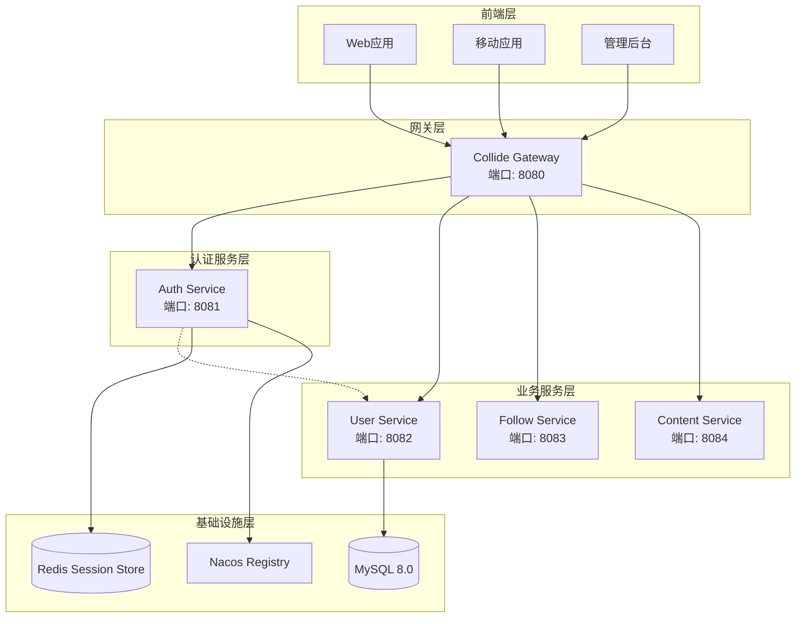
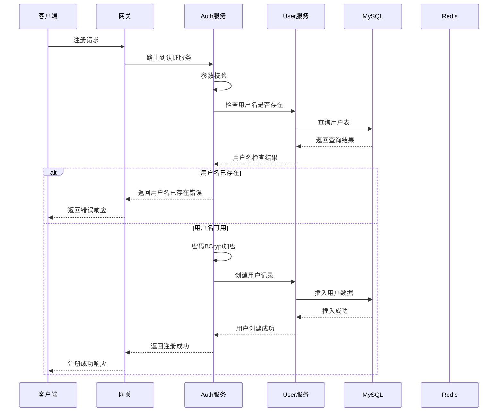
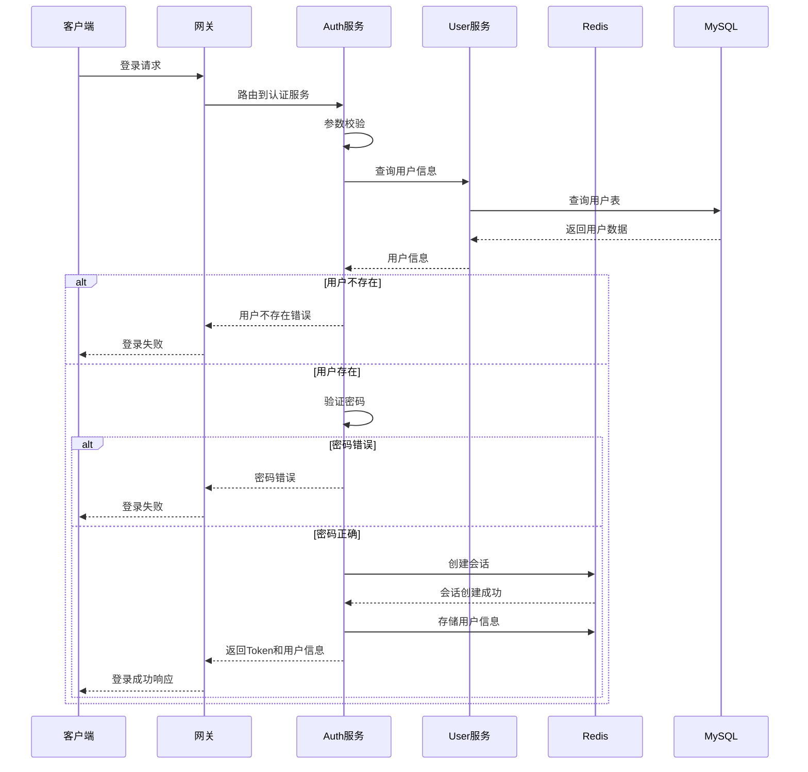
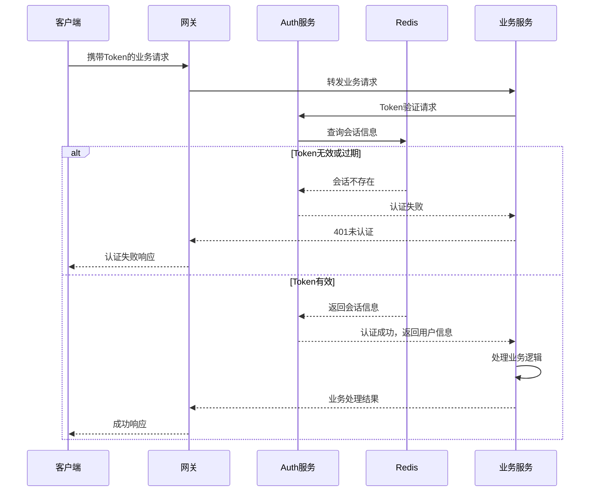
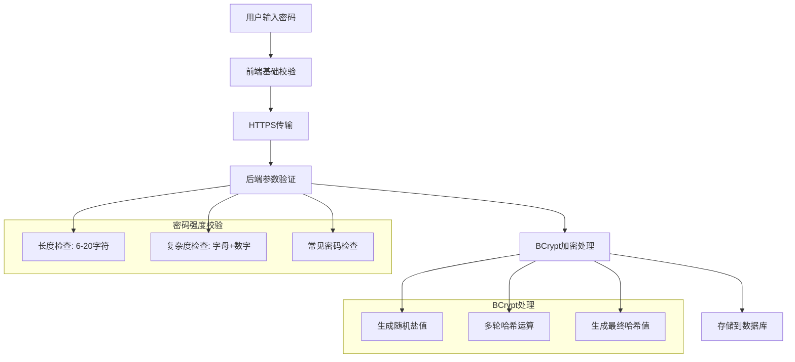
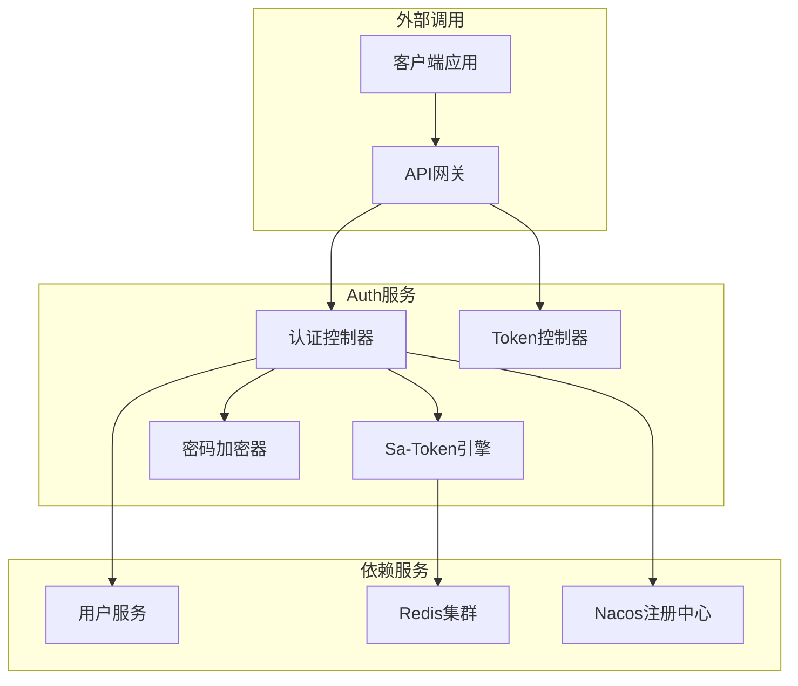
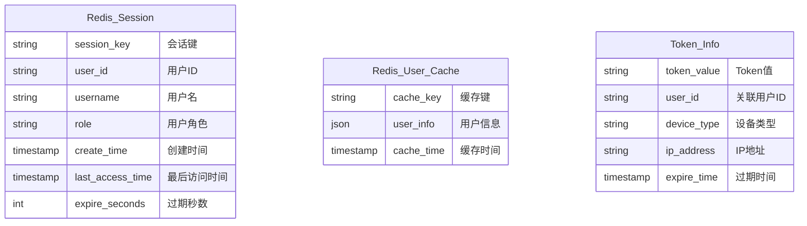
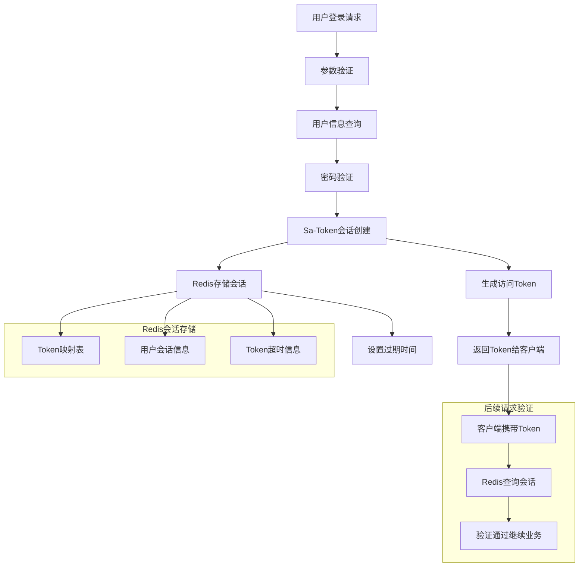
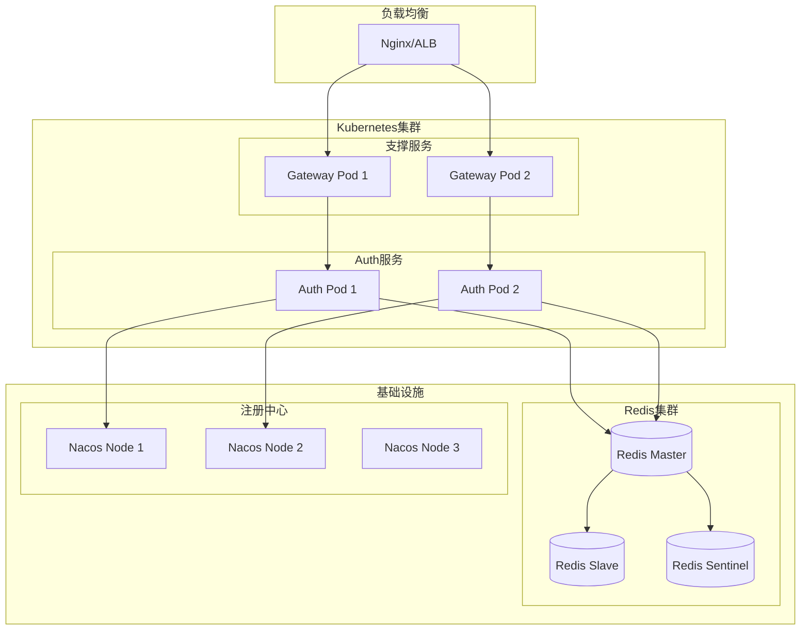

# Auth 模块系统设计概览

## 📋 目录
- [系统架构](#系统架构)
- [技术栈选型](#技术栈选型)
- [认证流程设计](#认证流程设计)
- [安全机制](#安全机制)
- [服务交互](#服务交互)
- [部署架构](#部署架构)

---

## 🏗️ 系统架构

### 整体架构图



### Auth 服务核心组件

| 组件名称 | 职责 | 技术实现 | 说明 |
|----------|------|----------|------|
| **AuthController** | 认证API接口 | Spring MVC | 登录、注册、登出接口 |
| **TokenController** | Token管理 | Spring MVC | Token生成、验证接口 |
| **Sa-Token** | 会话管理 | Sa-Token Framework | 分布式会话、权限控制 |
| **BCrypt** | 密码加密 | Spring Security Crypto | 密码哈希和验证 |
| **Dubbo Client** | 服务调用 | Apache Dubbo | 调用User服务获取用户信息 |

---

## 🔧 技术栈选型

### 认证技术栈

| 分类 | 技术选型 | 版本 | 选型理由 |
|------|----------|------|----------|
| **基础框架** | Spring Boot | 3.2.x | 成熟稳定，快速开发 |
| **认证框架** | Sa-Token | 1.37.x | 轻量级、功能完善、易集成 |
| **密码加密** | BCrypt | - | 安全的自适应哈希函数 |
| **会话存储** | Redis | 7.x | 分布式会话、高性能 |
| **RPC通信** | Apache Dubbo | 3.2.x | 高性能RPC调用 |
| **服务注册** | Nacos | 2.3.x | 服务发现和配置管理 |

### Sa-Token 特性优势

| 特性 | 优势 | 应用场景 |
|------|------|----------|
| **轻量级** | 集成简单，学习成本低 | 快速开发、中小型项目 |
| **多端支持** | 支持Web、移动端、小程序 | 多终端统一认证 |
| **分布式** | Redis分布式会话 | 微服务、集群部署 |
| **功能丰富** | 权限、单点登录、踢人下线等 | 复杂业务场景 |
| **灵活配置** | 多种Token风格和配置 | 个性化需求 |

---

## 🔐 认证流程设计

### 用户注册流程



### 用户登录流程



### Token验证流程



---

## 🛡️ 安全机制

### 密码安全设计



**密码安全特性**:
- **传输安全**: HTTPS加密传输，防止中间人攻击
- **存储安全**: BCrypt哈希存储，不保存明文密码
- **强度要求**: 6-20字符，必须包含字母和数字
- **盐值保护**: BCrypt自动生成随机盐值
- **防暴力破解**: 登录失败次数限制（计划实现）

### Token安全设计

```mermaid
graph TB
    subgraph "Token生成"
        A[UUID随机生成]
        B[会话信息关联]
        C[Redis存储]
    end
    
    subgraph "Token传输"
        D[HTTP Header]
        E[Authorization Bearer]
        F[HTTPS加密]
    end
    
    subgraph "Token验证"
        G[Redis查询]
        H[过期时间检查]
        I[会话信息验证]
    end
    
    subgraph "Token管理"
        J[自动续期]
        K[主动失效]
        L[并发控制]
    end
    
    A --> B
    B --> C
    D --> E
    E --> F
    G --> H
    H --> I
    J --> K
    K --> L
```



**Token安全特性**:
- **随机性**: UUID格式，高度随机，难以猜测
- **时效性**: 默认30天过期，支持自定义
- **传输安全**: Authorization Header + HTTPS
- **存储安全**: Redis分布式存储，支持集群
- **并发控制**: 支持多地同时登录配置

### 会话安全设计

| 安全特性 | 实现方式 | 安全等级 | 说明 |
|----------|----------|----------|------|
| **会话隔离** | Redis Key前缀 | 高 | 不同用户会话完全隔离 |
| **自动过期** | Redis TTL | 高 | 会话超时自动清理 |
| **安全登出** | 删除Redis Key | 高 | 彻底清除服务端会话 |
| **并发控制** | 配置化支持 | 中 | 支持单点/多点登录 |
| **异地检测** | IP地址记录 | 中 | 异常登录检测（计划） |

---

## 🔄 服务交互

### 服务依赖关系



**依赖说明**:
- **强依赖**: Redis（会话存储）、Nacos（服务注册）
- **弱依赖**: User服务（用户信息查询，可降级）
- **无依赖**: MySQL（Auth服务不直接访问数据库）

### 认证服务API设计

#### REST API接口
```
POST /api/v1/auth/register      # 用户注册
POST /api/v1/auth/login         # 用户登录
POST /api/v1/auth/logout        # 用户登出
GET  /api/v1/token/get          # 获取Token
GET  /api/v1/token/verify       # 验证Token
GET  /api/v1/auth/test          # 健康检查
```

#### 内部服务接口
```java
// Sa-Token集成的权限验证
@SaCheckLogin                   // 要求用户登录
@SaCheckRole("ADMIN")          // 要求管理员角色
@SaCheckPermission("user:add") // 要求特定权限

// 编程式调用
StpUtil.isLogin()              // 检查登录状态
StpUtil.getLoginId()           // 获取用户ID
StpUtil.logout()               // 登出用户
```

---

## 📊 数据流转

### 会话数据结构



### Redis Key设计

| Key格式 | 用途 | TTL | 示例 |
|---------|------|-----|------|
| `satoken:login:token:{token}` | Token与用户ID映射 | 30天 | `satoken:login:token:abc123` |
| `satoken:login:session:{userId}` | 用户会话信息 | 30天 | `satoken:login:session:12345` |
| `satoken:login:token-timeout:{token}` | Token过期时间 | 30天 | `satoken:login:token-timeout:abc123` |
| `auth:user:cache:{userId}` | 用户信息缓存 | 1小时 | `auth:user:cache:12345` |

### 数据流转图



---

## 🚀 部署架构

### 容器化部署



### Kubernetes配置

#### Deployment配置
```yaml
apiVersion: apps/v1
kind: Deployment
metadata:
  name: collide-auth
  namespace: collide
spec:
  replicas: 2
  selector:
    matchLabels:
      app: collide-auth
  template:
    metadata:
      labels:
        app: collide-auth
    spec:
      containers:
      - name: collide-auth
        image: collide/auth:v1.0.0
        ports:
        - containerPort: 8081
        env:
        - name: SPRING_PROFILES_ACTIVE
          value: "prod"
        - name: NACOS_SERVER_ADDR
          value: "nacos-service:8848"
        - name: REDIS_HOST
          value: "redis-service"
        - name: SA_TOKEN_TIMEOUT
          value: "2592000"
        resources:
          requests:
            memory: "512Mi"
            cpu: "250m"
          limits:
            memory: "1Gi"
            cpu: "500m"
        livenessProbe:
          httpGet:
            path: /api/v1/auth/test
            port: 8081
          initialDelaySeconds: 30
          periodSeconds: 30
        readinessProbe:
          httpGet:
            path: /api/v1/auth/test
            port: 8081
          initialDelaySeconds: 15
          periodSeconds: 10
```

#### Service配置
```yaml
apiVersion: v1
kind: Service
metadata:
  name: collide-auth-service
  namespace: collide
spec:
  selector:
    app: collide-auth
  ports:
  - name: http
    protocol: TCP
    port: 8081
    targetPort: 8081
  type: ClusterIP
```

#### ConfigMap配置
```yaml
apiVersion: v1
kind: ConfigMap
metadata:
  name: auth-config
  namespace: collide
data:
  sa-token-timeout: "2592000"
  sa-token-style: "uuid"
  redis-timeout: "3000"
  bcrypt-strength: "10"
```

### 环境配置矩阵

| 环境 | 实例数 | CPU/内存 | Redis | 特性配置 |
|------|--------|----------|-------|----------|
| **开发环境** | 1 | 0.25C/512Mi | 单机 | 短Token有效期 |
| **测试环境** | 1 | 0.25C/512Mi | 单机 | 完整功能测试 |
| **预生产** | 2 | 0.5C/1Gi | 主从 | 生产配置验证 |
| **生产环境** | 2+ | 0.5C/1Gi | 集群 | 高可用部署 |

---

## 📈 性能与监控

### 性能指标

| 指标类型 | 目标值 | 当前值 | 监控方法 |
|----------|--------|--------|----------|
| **登录响应时间** | P99 < 100ms | - | APM监控 |
| **Token验证时间** | P99 < 10ms | - | Redis监控 |
| **并发登录数** | > 1000 QPS | - | 压力测试 |
| **服务可用性** | 99.9% | - | 健康检查 |

### 关键业务指标

| 业务指标 | 统计周期 | 告警阈值 | 说明 |
|----------|----------|----------|------|
| **登录成功率** | 5分钟 | < 95% | 认证服务健康度 |
| **Token验证成功率** | 5分钟 | < 99% | 会话管理稳定性 |
| **新用户注册数** | 1天 | - | 业务增长指标 |
| **活跃会话数** | 实时 | - | 并发用户统计 |

### 监控配置

#### Prometheus监控指标
```yaml
# Auth服务监控
- job_name: 'collide-auth'
  static_configs:
    - targets: ['collide-auth:8081']
  metrics_path: '/actuator/prometheus'
  scrape_interval: 15s
  
# 自定义业务指标
- job_name: 'auth-business-metrics'
  static_configs:
    - targets: ['collide-auth:8081']
  metrics_path: '/actuator/auth-metrics'
```

#### 自定义监控指标
```java
@Component
public class AuthMetrics {
    
    private final Counter loginAttempts = Counter.builder()
        .name("auth_login_attempts_total")
        .description("Total login attempts")
        .tag("result", "success")
        .register(Metrics.globalRegistry);
        
    private final Timer loginDuration = Timer.builder()
        .name("auth_login_duration_seconds")
        .description("Login process duration")
        .register(Metrics.globalRegistry);
        
    private final Gauge activeSessions = Gauge.builder()
        .name("auth_active_sessions")
        .description("Current active sessions")
        .register(Metrics.globalRegistry, this, AuthMetrics::getActiveSessionCount);
}
```

#### 告警规则
```yaml
groups:
- name: auth-service-alerts
  rules:
  - alert: AuthServiceDown
    expr: up{job="collide-auth"} == 0
    for: 1m
    labels:
      severity: critical
    annotations:
      summary: "认证服务不可用"
      
  - alert: HighLoginFailureRate
    expr: rate(auth_login_attempts_total{result="failure"}[5m]) > 0.1
    for: 2m
    labels:
      severity: warning
    annotations:
      summary: "登录失败率过高"
      
  - alert: RedisConnectionFailure
    expr: redis_connected_clients{service="auth"} == 0
    for: 30s
    labels:
      severity: critical
    annotations:
      summary: "Redis连接失败"
```

---

## 🔒 安全运维

### 安全加固措施

#### 网络安全
```yaml
# 网络策略 - 仅允许特定服务访问
apiVersion: networking.k8s.io/v1
kind: NetworkPolicy
metadata:
  name: auth-network-policy
spec:
  podSelector:
    matchLabels:
      app: collide-auth
  policyTypes:
  - Ingress
  - Egress
  ingress:
  - from:
    - podSelector:
        matchLabels:
          app: collide-gateway
    ports:
    - protocol: TCP
      port: 8081
  egress:
  - to:
    - podSelector:
        matchLabels:
          app: redis
    - podSelector:
        matchLabels:
          app: nacos
```

#### 访问控制
```yaml
# RBAC配置
apiVersion: rbac.authorization.k8s.io/v1
kind: Role
metadata:
  namespace: collide
  name: auth-service-role
rules:
- apiGroups: [""]
  resources: ["secrets", "configmaps"]
  verbs: ["get", "list"]
---
apiVersion: rbac.authorization.k8s.io/v1
kind: RoleBinding
metadata:
  name: auth-service-binding
  namespace: collide
subjects:
- kind: ServiceAccount
  name: auth-service-account
  namespace: collide
roleRef:
  kind: Role
  name: auth-service-role
  apiGroup: rbac.authorization.k8s.io
```

### 安全审计

#### 登录日志记录
```java
@Component
@Slf4j
public class LoginAuditLogger {
    
    public void logLoginAttempt(String username, String ip, boolean success) {
        log.info("LOGIN_AUDIT: username={}, ip={}, success={}, timestamp={}", 
            username, ip, success, Instant.now());
    }
    
    public void logTokenGeneration(String userId, String tokenId, String ip) {
        log.info("TOKEN_AUDIT: userId={}, tokenId={}, ip={}, timestamp={}", 
            userId, tokenId, ip, Instant.now());
    }
    
    public void logLogout(String userId, String reason) {
        log.info("LOGOUT_AUDIT: userId={}, reason={}, timestamp={}", 
            userId, reason, Instant.now());
    }
}
```

#### 异常检测
```java
@Component
public class SecurityMonitor {
    
    private final RedisTemplate<String, Object> redisTemplate;
    
    // 检测异常登录模式
    public boolean detectAnomalousLogin(String username, String ip) {
        // 同一用户短时间内多次登录失败
        String failKey = "login:fail:" + username;
        Long failCount = redisTemplate.opsForValue().increment(failKey);
        redisTemplate.expire(failKey, Duration.ofMinutes(15));
        
        if (failCount > 5) {
            log.warn("SECURITY_ALERT: User {} has {} failed login attempts", username, failCount);
            return true;
        }
        
        // 同一IP短时间内多次登录不同用户
        String ipKey = "login:ip:" + ip;
        Set<String> users = redisTemplate.opsForSet().members(ipKey);
        if (users != null && users.size() > 10) {
            log.warn("SECURITY_ALERT: IP {} attempted login for {} different users", ip, users.size());
            return true;
        }
        
        return false;
    }
}
```

---

## 📝 运维管理

### 配置管理

#### 应用配置
```yaml
# application.yml
spring:
  application:
    name: collide-auth
  config:
    import: 
      - classpath:base-dev.yml
      - classpath:config.yml
      - classpath:rpc.yml
      - classpath:cache.yml

sa-token:
  token-name: satoken
  timeout: 2592000
  active-timeout: -1
  is-concurrent: true
  is-share: true
  token-style: uuid
  is-log: true
  
server:
  port: 8081
  
logging:
  level:
    com.gig.collide.auth: INFO
    org.springframework.security: WARN
  pattern:
    file: "%d{yyyy-MM-dd HH:mm:ss} [%thread] %-5level [%X{traceId}] %logger{36} - %msg%n"
```

#### Nacos配置中心
```yaml
# Nacos配置: collide-auth.yml
auth:
  password:
    bcrypt-strength: 12
    min-length: 6
    max-length: 50
    require-digits: true
    require-letters: true
    
  token:
    default-timeout: 2592000
    max-concurrent-sessions: 5
    
  security:
    login-failure-limit: 5
    ip-whitelist: []
    enable-audit-log: true
```

### 故障处理手册

#### 常见故障及解决方案

| 故障类型 | 症状 | 原因分析 | 解决方案 |
|----------|------|----------|----------|
| **Redis连接失败** | Token验证失败 | 网络问题/Redis宕机 | 检查网络连接，重启Redis |
| **登录接口超时** | 登录请求无响应 | User服务不可用 | 实现降级策略，检查User服务 |
| **Token过期过快** | 频繁要求重新登录 | 配置错误 | 检查sa-token.timeout配置 |
| **内存使用过高** | Pod重启 | 会话缓存过多 | 调整Redis配置，增加内存限制 |

#### 应急处理脚本

```bash
#!/bin/bash
# Auth服务应急处理脚本

# 检查服务状态
check_service_health() {
    curl -f http://collide-auth:8081/api/v1/auth/test || exit 1
    echo "Auth service is healthy"
}

# 检查Redis连接
check_redis_connection() {
    redis-cli -h redis-service ping || exit 1
    echo "Redis connection is healthy"
}

# 清理过期会话
cleanup_expired_sessions() {
    redis-cli -h redis-service --scan --pattern "satoken:*" | \
    xargs -I {} redis-cli -h redis-service ttl {} | \
    awk '$1 == -1 {print $2}' | \
    xargs -I {} redis-cli -h redis-service del {}
    echo "Expired sessions cleaned"
}

# 重启服务
restart_auth_service() {
    kubectl rollout restart deployment/collide-auth -n collide
    kubectl rollout status deployment/collide-auth -n collide
    echo "Auth service restarted"
}

# 主流程
case $1 in
    "check")
        check_service_health
        check_redis_connection
        ;;
    "cleanup")
        cleanup_expired_sessions
        ;;
    "restart")
        restart_auth_service
        ;;
    *)
        echo "Usage: $0 {check|cleanup|restart}"
        exit 1
        ;;
esac
```

---

## 📞 技术支持

### 服务信息
- **服务名称**: Collide Auth Service
- **服务端口**: 8081 (HTTP)
- **健康检查**: GET /api/v1/auth/test
- **监控端口**: 8081/actuator/prometheus

### 依赖服务
- **Redis**: 会话存储，端口6379
- **Nacos**: 服务注册，端口8848  
- **User Service**: 用户信息查询，Dubbo RPC

### 联系方式
- **开发团队**: Collide Team
- **文档版本**: v1.0
- **更新日期**: 2024-01-15
- **联系方式**: tech@collide.com

---

## 📋 附录

### Sa-Token配置参考
```yaml
sa-token:
  # token名称 (同时也是cookie名称)
  token-name: satoken
  # token有效期，单位s 默认30天, -1代表永不过期
  timeout: 2592000
  # token临时有效期 (指定时间内无操作就视为token过期) 单位: 秒
  activity-timeout: -1
  # 是否允许同一账号并发登录 (为true时允许一起登录, 为false时新登录挤掉旧登录)
  is-concurrent: true
  # 在多人登录同一账号时，是否共用一个token (为true时所有登录共用一个token, 为false时每次登录新建一个token)
  is-share: true
  # token风格
  token-style: uuid
  # 是否输出操作日志
  is-log: false
```

### BCrypt配置参考
```java
@Configuration
public class PasswordConfig {
    
    @Bean
    public BCryptPasswordEncoder passwordEncoder() {
        // strength: 加密强度4-31，值越大越安全但越耗时
        // 推荐值: 开发环境4-6，生产环境10-12
        return new BCryptPasswordEncoder(12);
    }
}
```

---

*本文档描述了 Auth 模块的完整系统设计，包含认证流程、安全机制、部署方案等核心内容。如有疑问请联系技术团队。* 