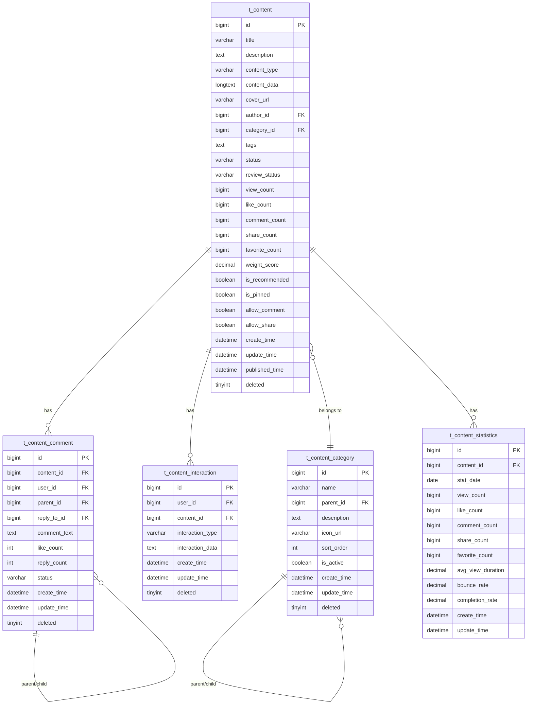

# Content 模块数据库设计文档

## 📋 目录
- [设计概述](#设计概述)
- [数据表结构](#数据表结构)
- [索引设计](#索引设计)
- [数据字典](#数据字典)
- [性能优化](#性能优化)
- [数据迁移](#数据迁移)

---

## 📚 设计概述

### 设计原则
- **多媒体支持**: 统一的数据模型支持多种内容类型
- **灵活扩展**: JSON字段支持不同内容类型的差异化数据
- **高性能查询**: 优化的索引策略支持各种查询场景  
- **数据完整性**: 合理的约束和关联关系
- **统计友好**: 设计支持高效的统计查询

### 核心表关系



---

## 🗄️ 数据表结构

### 1. 内容主表 (t_content)

存储所有类型的内容基础信息和统计数据。

| 字段名 | 数据类型 | 长度 | 约束 | 默认值 | 说明 |
|--------|----------|------|------|--------|------|
| id | BIGINT | - | PK, AUTO_INCREMENT | - | 内容ID |
| title | VARCHAR | 200 | NOT NULL | - | 内容标题 |
| description | TEXT | - | NULL | - | 内容描述/摘要 |
| content_type | VARCHAR | 50 | NOT NULL | - | 内容类型枚举 |
| content_data | LONGTEXT | - | NULL | - | 内容数据JSON |
| cover_url | VARCHAR | 500 | NULL | - | 封面图片URL |
| author_id | BIGINT | - | NOT NULL | - | 作者用户ID |
| category_id | BIGINT | - | NULL | - | 分类ID |
| tags | TEXT | - | NULL | - | 标签JSON数组 |
| status | VARCHAR | 50 | NOT NULL | 'DRAFT' | 内容状态 |
| review_status | VARCHAR | 50 | NOT NULL | 'PENDING' | 审核状态 |
| review_comment | TEXT | - | NULL | - | 审核意见 |
| reviewer_id | BIGINT | - | NULL | - | 审核员ID |
| reviewed_time | DATETIME | - | NULL | - | 审核时间 |
| view_count | BIGINT | - | NOT NULL | 0 | 查看数 |
| like_count | BIGINT | - | NOT NULL | 0 | 点赞数 |
| comment_count | BIGINT | - | NOT NULL | 0 | 评论数 |
| share_count | BIGINT | - | NOT NULL | 0 | 分享数 |
| favorite_count | BIGINT | - | NOT NULL | 0 | 收藏数 |
| weight_score | DECIMAL | 10,2 | NOT NULL | 0.00 | 权重分数 |
| is_recommended | BOOLEAN | - | NOT NULL | FALSE | 是否推荐 |
| is_pinned | BOOLEAN | - | NOT NULL | FALSE | 是否置顶 |
| allow_comment | BOOLEAN | - | NOT NULL | TRUE | 是否允许评论 |
| allow_share | BOOLEAN | - | NOT NULL | TRUE | 是否允许分享 |
| create_time | DATETIME | - | NOT NULL | CURRENT_TIMESTAMP | 创建时间 |
| update_time | DATETIME | - | NOT NULL | CURRENT_TIMESTAMP ON UPDATE CURRENT_TIMESTAMP | 更新时间 |
| published_time | DATETIME | - | NULL | - | 发布时间 |
| deleted | TINYINT | - | NOT NULL | 0 | 逻辑删除标记 |

#### 状态枚举值

**content_type (内容类型)**
- `NOVEL`: 小说
- `COMIC`: 漫画  
- `SHORT_VIDEO`: 短视频
- `LONG_VIDEO`: 长视频
- `ARTICLE`: 图文
- `AUDIO`: 音频

**status (内容状态)**
- `DRAFT`: 草稿
- `PENDING`: 待审核
- `PUBLISHED`: 已发布
- `REJECTED`: 已拒绝
- `OFFLINE`: 已下架

**review_status (审核状态)**
- `PENDING`: 待审核
- `APPROVED`: 审核通过
- `REJECTED`: 审核拒绝

### 2. 内容分类表 (t_content_category)

存储内容的分类信息，支持多级分类。

| 字段名 | 数据类型 | 长度 | 约束 | 默认值 | 说明 |
|--------|----------|------|------|--------|------|
| id | BIGINT | - | PK, AUTO_INCREMENT | - | 分类ID |
| name | VARCHAR | 100 | NOT NULL | - | 分类名称 |
| parent_id | BIGINT | - | NULL | - | 父分类ID |
| description | TEXT | - | NULL | - | 分类描述 |
| icon_url | VARCHAR | 500 | NULL | - | 分类图标URL |
| sort_order | INT | - | NOT NULL | 0 | 排序顺序 |
| is_active | BOOLEAN | - | NOT NULL | TRUE | 是否启用 |
| create_time | DATETIME | - | NOT NULL | CURRENT_TIMESTAMP | 创建时间 |
| update_time | DATETIME | - | NOT NULL | CURRENT_TIMESTAMP ON UPDATE CURRENT_TIMESTAMP | 更新时间 |
| deleted | TINYINT | - | NOT NULL | 0 | 逻辑删除标记 |

### 3. 内容互动表 (t_content_interaction)

存储用户对内容的互动行为记录。

| 字段名 | 数据类型 | 长度 | 约束 | 默认值 | 说明 |
|--------|----------|------|------|--------|------|
| id | BIGINT | - | PK, AUTO_INCREMENT | - | 互动ID |
| user_id | BIGINT | - | NOT NULL | - | 用户ID |
| content_id | BIGINT | - | NOT NULL | - | 内容ID |
| interaction_type | VARCHAR | 50 | NOT NULL | - | 互动类型 |
| interaction_data | TEXT | - | NULL | - | 互动数据JSON |
| create_time | DATETIME | - | NOT NULL | CURRENT_TIMESTAMP | 创建时间 |
| update_time | DATETIME | - | NOT NULL | CURRENT_TIMESTAMP ON UPDATE CURRENT_TIMESTAMP | 更新时间 |
| deleted | TINYINT | - | NOT NULL | 0 | 逻辑删除标记 |

#### 互动类型 (interaction_type)
- `LIKE`: 点赞
- `FAVORITE`: 收藏
- `SHARE`: 分享
- `VIEW`: 浏览

### 4. 内容评论表 (t_content_comment)

存储内容的评论信息，支持多级评论。

| 字段名 | 数据类型 | 长度 | 约束 | 默认值 | 说明 |
|--------|----------|------|------|--------|------|
| id | BIGINT | - | PK, AUTO_INCREMENT | - | 评论ID |
| content_id | BIGINT | - | NOT NULL | - | 内容ID |
| user_id | BIGINT | - | NOT NULL | - | 评论用户ID |
| parent_id | BIGINT | - | NULL | - | 父评论ID |
| reply_to_id | BIGINT | - | NULL | - | 回复的评论ID |
| comment_text | TEXT | - | NOT NULL | - | 评论内容 |
| like_count | INT | - | NOT NULL | 0 | 点赞数 |
| reply_count | INT | - | NOT NULL | 0 | 回复数 |
| status | VARCHAR | 50 | NOT NULL | 'NORMAL' | 评论状态 |
| create_time | DATETIME | - | NOT NULL | CURRENT_TIMESTAMP | 创建时间 |
| update_time | DATETIME | - | NOT NULL | CURRENT_TIMESTAMP ON UPDATE CURRENT_TIMESTAMP | 更新时间 |
| deleted | TINYINT | - | NOT NULL | 0 | 逻辑删除标记 |

#### 评论状态 (status)
- `NORMAL`: 正常显示
- `HIDDEN`: 隐藏显示
- `DELETED`: 已删除

### 5. 内容统计表 (t_content_statistics)

存储内容的详细统计数据，按日期维度统计。

| 字段名 | 数据类型 | 长度 | 约束 | 默认值 | 说明 |
|--------|----------|------|------|--------|------|
| id | BIGINT | - | PK, AUTO_INCREMENT | - | 统计ID |
| content_id | BIGINT | - | NOT NULL | - | 内容ID |
| stat_date | DATE | - | NOT NULL | - | 统计日期 |
| view_count | BIGINT | - | NOT NULL | 0 | 当日查看数 |
| like_count | BIGINT | - | NOT NULL | 0 | 当日点赞数 |
| comment_count | BIGINT | - | NOT NULL | 0 | 当日评论数 |
| share_count | BIGINT | - | NOT NULL | 0 | 当日分享数 |
| favorite_count | BIGINT | - | NOT NULL | 0 | 当日收藏数 |
| avg_view_duration | DECIMAL | 10,2 | NULL | - | 平均观看时长(秒) |
| bounce_rate | DECIMAL | 5,2 | NULL | - | 跳出率 |
| completion_rate | DECIMAL | 5,2 | NULL | - | 完成率 |
| create_time | DATETIME | - | NOT NULL | CURRENT_TIMESTAMP | 创建时间 |
| update_time | DATETIME | - | NOT NULL | CURRENT_TIMESTAMP ON UPDATE CURRENT_TIMESTAMP | 更新时间 |

---

## 📇 索引设计

### 主键索引

| 表名 | 索引名 | 字段 | 类型 |
|------|--------|------|------|
| t_content | PRIMARY | id | 主键索引 |
| t_content_category | PRIMARY | id | 主键索引 |
| t_content_interaction | PRIMARY | id | 主键索引 |
| t_content_comment | PRIMARY | id | 主键索引 |
| t_content_statistics | PRIMARY | id | 主键索引 |

### 普通索引

#### t_content 表索引

| 索引名 | 字段 | 类型 | 用途 |
|--------|------|------|------|
| idx_author_id | author_id | 单列索引 | 查询用户内容 |
| idx_category_id | category_id | 单列索引 | 分类查询 |
| idx_content_type | content_type | 单列索引 | 内容类型查询 |
| idx_status | status | 单列索引 | 状态筛选 |
| idx_review_status | review_status | 单列索引 | 审核查询 |
| idx_published_time | published_time | 单列索引 | 发布时间排序 |
| idx_create_time | create_time | 单列索引 | 创建时间排序 |
| idx_weight_score | weight_score | 单列索引 | 推荐算法排序 |
| idx_view_count | view_count | 单列索引 | 热度排序 |
| idx_like_count | like_count | 单列索引 | 点赞排序 |
| idx_is_recommended | is_recommended | 单列索引 | 推荐内容查询 |
| idx_deleted | deleted | 单列索引 | 逻辑删除过滤 |

#### 复合索引

| 索引名 | 字段组合 | 用途 |
|--------|----------|------|
| idx_author_status | (author_id, status) | 用户内容按状态查询 |
| idx_type_status | (content_type, status) | 类型内容按状态查询 |
| idx_status_published | (status, published_time) | 已发布内容时间排序 |

#### t_content_category 表索引

| 索引名 | 字段 | 类型 | 用途 |
|--------|------|------|------|
| idx_parent_id | parent_id | 单列索引 | 查询子分类 |
| idx_sort_order | sort_order | 单列索引 | 分类排序 |
| idx_is_active | is_active | 单列索引 | 启用状态过滤 |
| idx_deleted | deleted | 单列索引 | 逻辑删除过滤 |

### 唯一索引

| 表名 | 索引名 | 字段组合 | 约束说明 |
|------|--------|----------|----------|
| t_content_category | uk_name_parent | (name, parent_id) | 同级分类名称唯一 |
| t_content_interaction | uk_user_content_type | (user_id, content_id, interaction_type) | 用户对内容的同类型互动唯一 |
| t_content_statistics | uk_content_date | (content_id, stat_date) | 内容每日统计记录唯一 |

### 全文索引

| 表名 | 索引名 | 字段 | 用途 |
|------|--------|------|------|
| t_content | ft_title_desc | (title, description) | 标题描述全文搜索 |
| t_content_comment | ft_comment_text | comment_text | 评论内容搜索 |

---

## 📖 数据字典

### JSON字段数据结构

#### content_data 字段格式

##### 小说内容 (NOVEL)
```json
{
  "synopsis": "作品简介",
  "totalChapters": 100,
  "totalWords": 200000,
  "chapters": [
    {
      "id": 1,
      "title": "第一章",
      "content": "章节内容...",
      "wordCount": 2000,
      "publishTime": "2024-01-01T10:00:00"
    }
  ],
  "writingStatus": "ONGOING|COMPLETED|PAUSED",
  "updateFrequency": "DAILY|WEEKLY|MONTHLY"
}
```

##### 漫画内容 (COMIC)
```json
{
  "totalEpisodes": 50,
  "episodes": [
    {
      "id": 1,
      "title": "第1话",
      "pages": ["url1", "url2"],
      "publishTime": "2024-01-01T10:00:00"
    }
  ],
  "style": "COLOR|BLACK_WHITE",
  "orientation": "VERTICAL|HORIZONTAL"
}
```

##### 视频内容 (SHORT_VIDEO/LONG_VIDEO)
```json
{
  "videoUrl": "https://example.com/video.mp4",
  "duration": 300,
  "resolution": "1920x1080",
  "format": "MP4|AVI|MOV",
  "fileSize": 52428800,
  "thumbnails": ["url1", "url2"],
  "subtitles": [
    {
      "language": "zh-CN",
      "url": "subtitle_url"
    }
  ]
}
```

##### 图文内容 (ARTICLE)
```json
{
  "content": [
    {
      "type": "text",
      "content": "文本内容"
    },
    {
      "type": "image", 
      "url": "image_url",
      "caption": "图片描述"
    }
  ],
  "readTime": 5,
  "imageCount": 3
}
```

##### 音频内容 (AUDIO)
```json
{
  "audioUrl": "https://example.com/audio.mp3",
  "duration": 1800,
  "format": "MP3|WAV|AAC",
  "fileSize": 15728640,
  "lyrics": "歌词内容",
  "album": "专辑名称",
  "artist": "演唱者"
}
```

#### tags 字段格式
```json
["标签1", "标签2", "标签3"]
```

#### interaction_data 字段格式

##### 点赞数据 (LIKE)
```json
{
  "timestamp": "2024-01-15T10:30:00",
  "platform": "WEB|MOBILE|APP",
  "userAgent": "Mozilla/5.0..."
}
```

##### 收藏数据 (FAVORITE)
```json
{
  "timestamp": "2024-01-15T10:30:00",
  "collectionId": 123,
  "collectionName": "我的收藏夹"
}
```

##### 分享数据 (SHARE)
```json
{
  "timestamp": "2024-01-15T10:30:00",
  "platform": "WECHAT|WEIBO|QQ",
  "shareText": "分享文案"
}
```

##### 浏览数据 (VIEW)
```json
{
  "timestamp": "2024-01-15T10:30:00",
  "duration": 120,
  "referrer": "https://example.com",
  "exitPoint": 0.75
}
```

---

## ⚡ 性能优化

### 查询优化策略

#### 1. 内容列表查询优化
```sql
-- 推荐内容查询（使用复合索引）
SELECT * FROM t_content 
WHERE deleted = 0 
  AND status = 'PUBLISHED' 
  AND review_status = 'APPROVED'
  AND is_recommended = 1
ORDER BY weight_score DESC, published_time DESC
LIMIT 20;

-- 索引: (deleted, status, review_status, is_recommended, weight_score, published_time)
```

#### 2. 用户内容查询优化
```sql
-- 用户内容列表（使用author_status复合索引）
SELECT * FROM t_content 
WHERE deleted = 0 
  AND author_id = 123 
  AND status IN ('PUBLISHED', 'DRAFT')
ORDER BY create_time DESC
LIMIT 20;

-- 索引: (author_id, status, create_time)
```

#### 3. 分类内容查询优化
```sql
-- 分类内容查询（使用category_status复合索引）
SELECT * FROM t_content 
WHERE deleted = 0 
  AND category_id = 5 
  AND status = 'PUBLISHED'
  AND review_status = 'APPROVED'
ORDER BY published_time DESC
LIMIT 20;

-- 索引: (category_id, status, review_status, published_time)
```

### 统计查询优化

#### 1. 内容统计数据
```sql
-- 用户内容统计（使用author_id索引）
SELECT 
    status,
    COUNT(*) as count,
    SUM(view_count) as total_views,
    SUM(like_count) as total_likes
FROM t_content 
WHERE deleted = 0 AND author_id = 123
GROUP BY status;
```

#### 2. 热门内容统计
```sql
-- 热门内容查询（使用权重分数索引）
SELECT * FROM t_content 
WHERE deleted = 0 
  AND status = 'PUBLISHED'
  AND published_time >= DATE_SUB(NOW(), INTERVAL 7 DAY)
ORDER BY (like_count + comment_count + share_count) DESC
LIMIT 50;
```

### 分区策略

#### 1. 按时间分区
```sql
-- 内容统计表按月分区
ALTER TABLE t_content_statistics PARTITION BY RANGE (YEAR(stat_date) * 100 + MONTH(stat_date)) (
    PARTITION p202401 VALUES LESS THAN (202402),
    PARTITION p202402 VALUES LESS THAN (202403),
    PARTITION p202403 VALUES LESS THAN (202404),
    -- ... 继续添加分区
    PARTITION pmax VALUES LESS THAN MAXVALUE
);
```

#### 2. 按内容类型分区
```sql
-- 如果单表数据量过大，可考虑按内容类型垂直分表
-- t_content_novel (小说内容)
-- t_content_video (视频内容) 
-- t_content_comic (漫画内容)
```

### 缓存策略

#### 1. 热门内容缓存
- Redis存储热门内容列表
- 缓存时间：30分钟
- 更新策略：定时任务更新

#### 2. 用户个人内容缓存
- Redis存储用户内容计数
- 缓存时间：5分钟
- 更新策略：写操作后失效

#### 3. 分类数据缓存
- Redis存储分类树结构
- 缓存时间：1小时
- 更新策略：分类变更时失效

---

## 🔄 数据迁移

### 初始化脚本

#### 1. 基础数据插入
```sql
-- 插入初始分类数据
INSERT INTO t_content_category (name, parent_id, description, sort_order) VALUES
('小说', NULL, '各类小说作品', 1),
('漫画', NULL, '漫画作品', 2),
('视频', NULL, '视频内容', 3),
('图文', NULL, '图文内容', 4),
('音频', NULL, '音频内容', 5);

-- 插入子分类
INSERT INTO t_content_category (name, parent_id, description, sort_order) VALUES
('玄幻', 1, '玄幻小说', 1),
('都市', 1, '都市小说', 2),
('历史', 1, '历史小说', 3),
('科幻', 1, '科幻小说', 4);
```

#### 2. 权重分数初始化
```sql
-- 初始化已有内容的权重分数
UPDATE t_content 
SET weight_score = (
    view_count * 0.1 + 
    like_count * 2.0 + 
    comment_count * 3.0 + 
    share_count * 5.0 + 
    favorite_count * 4.0
)
WHERE weight_score = 0;
```

### 数据清理脚本

#### 1. 清理过期数据
```sql
-- 清理超过1年的统计数据
DELETE FROM t_content_statistics 
WHERE stat_date < DATE_SUB(CURDATE(), INTERVAL 365 DAY);

-- 清理已删除内容的相关数据
DELETE FROM t_content_interaction 
WHERE content_id IN (
    SELECT id FROM t_content WHERE deleted = 1 
    AND update_time < DATE_SUB(NOW(), INTERVAL 30 DAY)
);
```

#### 2. 数据归档脚本
```sql
-- 创建归档表
CREATE TABLE t_content_statistics_archive LIKE t_content_statistics;

-- 归档1年前的统计数据
INSERT INTO t_content_statistics_archive 
SELECT * FROM t_content_statistics 
WHERE stat_date < DATE_SUB(CURDATE(), INTERVAL 365 DAY);
```

---

## 📋 维护建议

### 定期维护任务

#### 1. 索引优化
- 定期分析查询日志
- 根据查询模式调整索引
- 删除未使用的索引

#### 2. 统计信息更新
- 定期更新表统计信息
- 重建索引统计
- 分析慢查询日志

#### 3. 数据清理
- 定期清理逻辑删除数据
- 归档历史统计数据
- 压缩表空间

### 监控指标

#### 1. 性能指标
- 平均查询响应时间
- 慢查询数量和频率
- 索引使用率

#### 2. 容量指标
- 表空间使用率
- 索引空间占用
- 数据增长趋势

#### 3. 业务指标
- 内容发布量统计
- 用户互动活跃度
- 热门内容排行

---

*本文档详细描述了 Content 模块的数据库设计方案，包括表结构、索引策略、性能优化等方面。在实际使用中应根据业务需求和数据量调整相关配置。* 