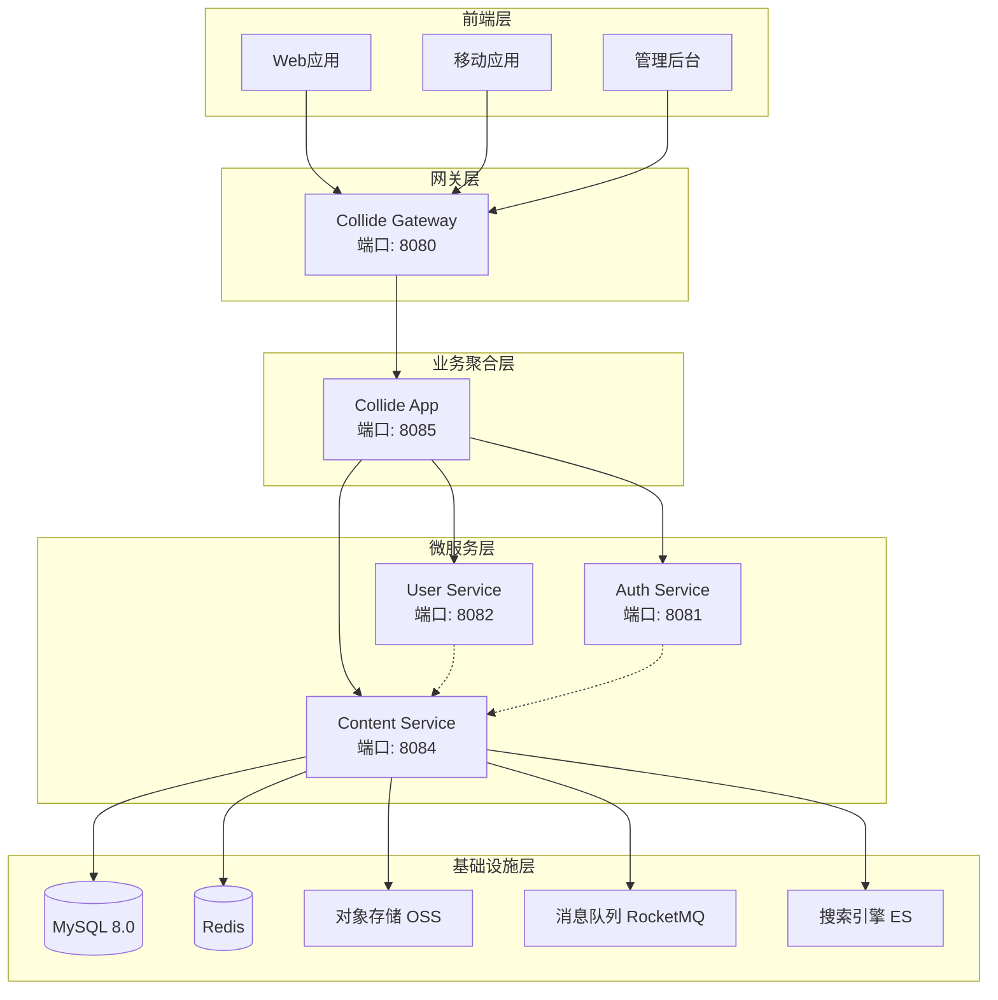
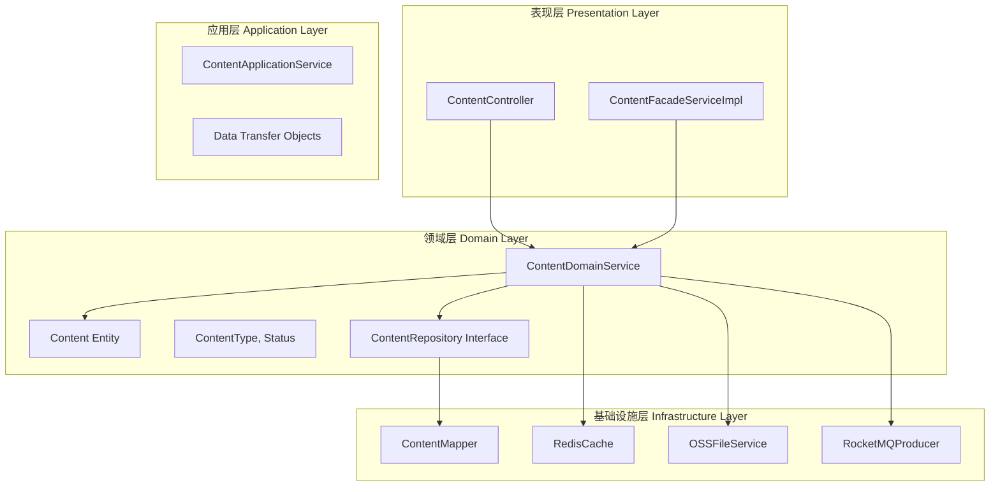
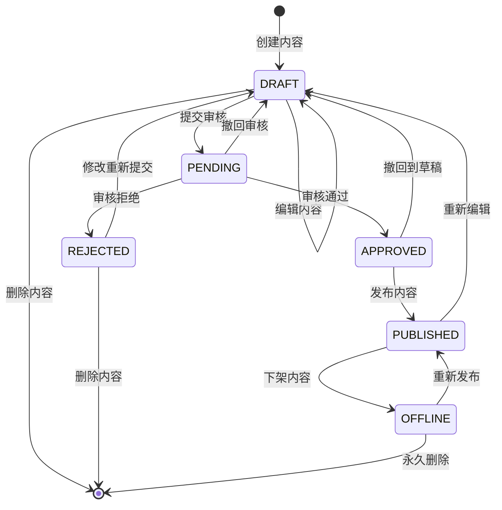
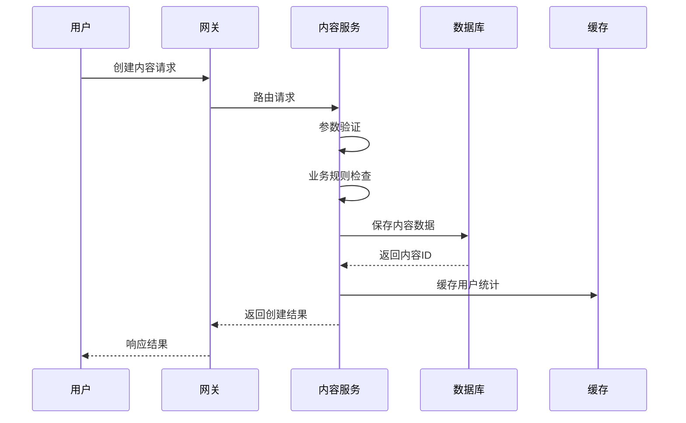
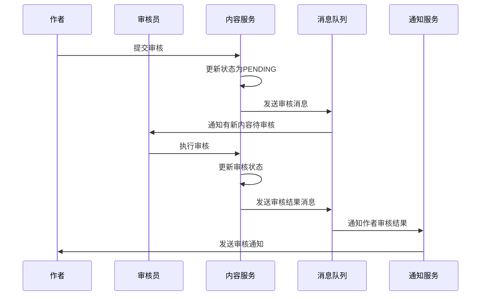
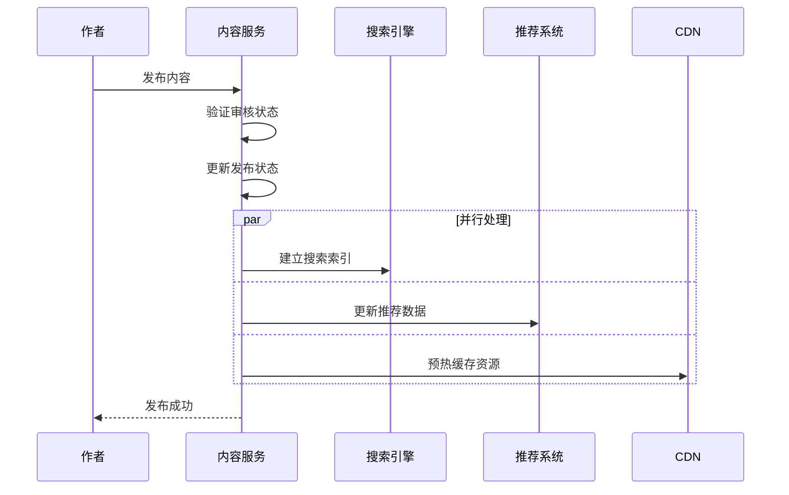
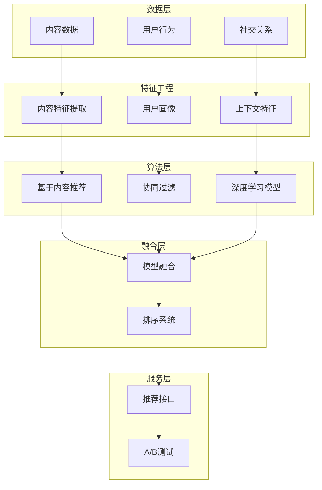
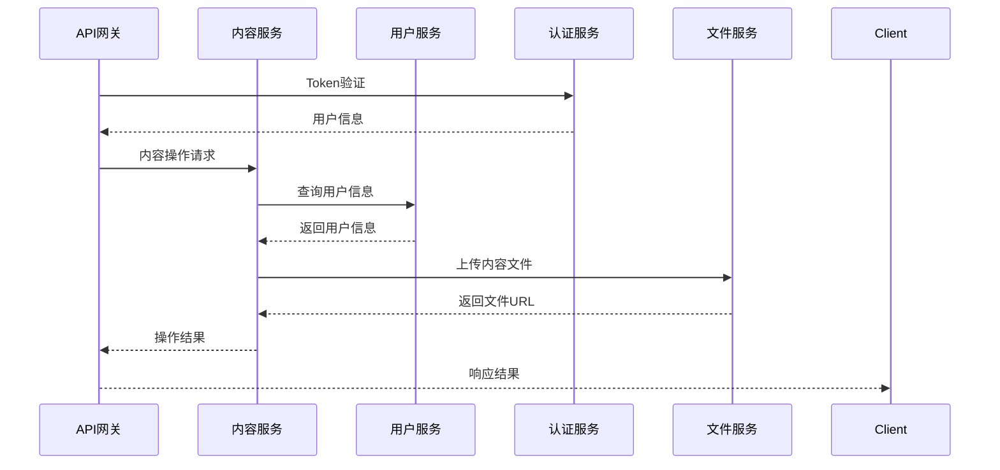
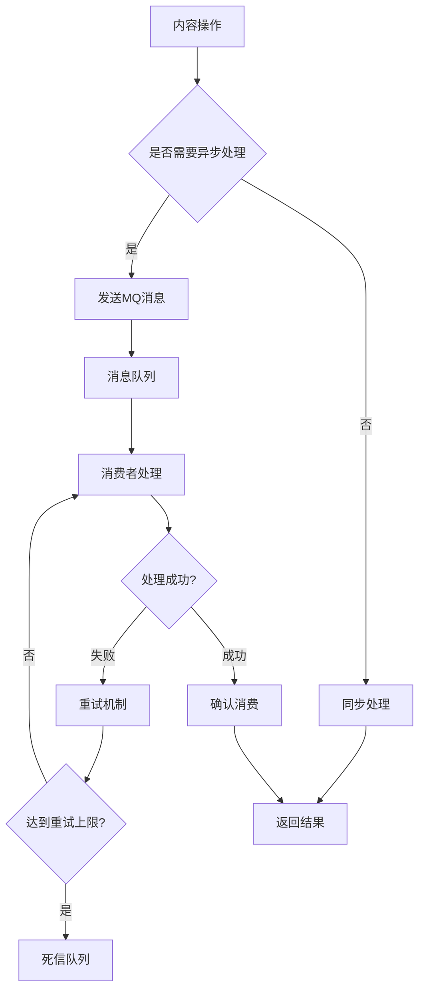
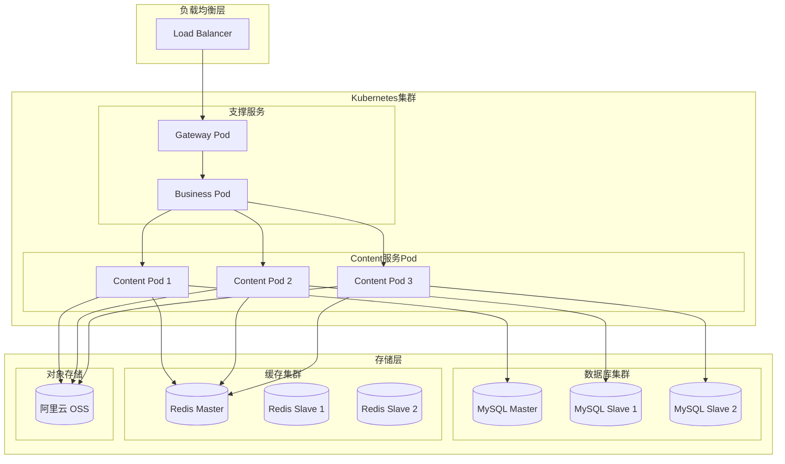

# Content 模块系统设计概览

## 📋 目录
- [系统架构](#系统架构)
- [技术栈选型](#技术栈选型)
- [模块分层](#模块分层)
- [内容生命周期](#内容生命周期)
- [推荐算法设计](#推荐算法设计)
- [部署架构](#部署架构)

---

## 🏗️ 系统架构

### 整体架构图



### Content 服务核心组件

| 组件名称 | 职责 | 技术实现 | 说明 |
|----------|------|----------|------|
| **ContentController** | REST API接口 | Spring MVC | 内容管理HTTP接口 |
| **ContentFacadeServiceImpl** | RPC服务实现 | Dubbo | 对外服务接口 |
| **ContentDomainService** | 核心业务逻辑 | Spring Service | 内容生命周期管理 |
| **ContentMapper** | 数据访问层 | MyBatis Plus | 数据库操作接口 |
| **ContentConvertor** | 对象转换 | MapStruct | 实体与DTO转换 |

---

## 🔧 技术栈选型

### 核心技术栈

| 分类 | 技术选型 | 版本 | 选型理由 |
|------|----------|------|----------|
| **基础框架** | Spring Boot | 3.2.x | 成熟稳定、生态丰富 |
| **Web框架** | Spring MVC | 6.x | RESTful API标准 |
| **数据访问** | MyBatis Plus | 3.5.x | 高效ORM、代码生成 |
| **数据库** | MySQL | 8.0 | 关系型数据库、ACID保证 |
| **缓存** | Redis | 7.x | 高性能KV存储 |
| **RPC框架** | Apache Dubbo | 3.2.x | 高性能RPC通信 |
| **消息队列** | Apache RocketMQ | 5.x | 可靠异步处理 |
| **对象存储** | 阿里云 OSS | - | 大文件存储 |
| **搜索引擎** | Elasticsearch | 8.x | 全文检索 |

### 技术特性对比

#### 内容存储方案

| 方案 | 优势 | 劣势 | 适用场景 |
|------|------|------|----------|
| **MySQL JSON** | 灵活结构、事务保证 | 查询性能有限 | 结构化内容数据 |
| **MongoDB** | 原生JSON支持 | 一致性相对弱 | 非结构化数据 |
| **对象存储** | 成本低、扩展性好 | 访问延迟 | 大文件、多媒体 |

**选择理由**: 采用 MySQL JSON + 对象存储的混合方案，结构化数据用MySQL保证一致性，大文件用OSS降低成本。

#### 缓存策略

| 缓存类型 | 技术方案 | TTL | 更新策略 |
|----------|----------|-----|----------|
| **热门内容** | Redis List | 30分钟 | 定时更新 |
| **内容详情** | Redis Hash | 1小时 | 写入失效 |
| **用户统计** | Redis String | 5分钟 | 计数更新 |
| **分类数据** | Redis Hash | 24小时 | 手动刷新 |

---

## 📚 模块分层

### DDD分层架构



### 各层职责说明

#### 表现层 (Presentation Layer)
- **ContentController**: 处理HTTP请求，参数验证，响应格式化
- **ContentFacadeServiceImpl**: 实现RPC接口，服务间通信

#### 应用层 (Application Layer)  
- **ContentApplicationService**: 业务流程编排，事务管理
- **DTO对象**: 数据传输对象，跨层数据交换

#### 领域层 (Domain Layer)
- **ContentDomainService**: 核心业务逻辑，业务规则实现
- **Content Entity**: 领域实体，包含业务方法
- **Value Object**: 值对象，如状态枚举

#### 基础设施层 (Infrastructure Layer)
- **ContentMapper**: 数据访问实现，SQL操作
- **Cache**: 缓存服务，性能优化
- **FileStorage**: 文件存储服务
- **MQ**: 消息队列，异步处理

---

## 🔄 内容生命周期

### 状态流转图



### 状态详细说明

| 状态 | 说明 | 可操作 | 可见性 |
|------|------|--------|--------|
| **DRAFT** | 草稿状态 | 编辑、删除、提交审核 | 仅作者可见 |
| **PENDING** | 待审核状态 | 撤回、等待审核 | 仅作者和审核员可见 |
| **APPROVED** | 审核通过 | 发布、撤回 | 仅作者可见 |
| **REJECTED** | 审核拒绝 | 修改后重新提交 | 仅作者可见 |
| **PUBLISHED** | 已发布 | 下架、重新编辑 | 公开可见 |
| **OFFLINE** | 已下架 | 重新发布、删除 | 仅作者可见 |

### 业务流程设计

#### 1. 内容创建流程



#### 2. 内容审核流程



#### 3. 内容发布流程



---

## 🤖 推荐算法设计

### 推荐系统架构



### 权重计算算法

#### 内容热度权重公式
```
Weight Score = 
    View Count × 0.1 +
    Like Count × 2.0 +
    Comment Count × 3.0 +
    Share Count × 5.0 +
    Favorite Count × 4.0 +
    Time Decay Factor × 1.0
```

#### 时间衰减因子
```
Time Decay = exp(-λ × (Current Time - Publish Time) / 86400)
其中 λ = 0.1 (可配置的衰减系数)
```

#### 用户兴趣计算
```
User Interest Score = Σ(Content Category Weight × Action Weight)

Action Weight:
- View: 0.1
- Like: 0.3  
- Comment: 0.5
- Share: 0.7
- Favorite: 0.9
```

### 推荐策略

#### 1. 冷启动策略
- **新用户**: 基于热门内容和分类推荐
- **新内容**: 基于作者历史表现和内容相似度
- **多样性保证**: 避免推荐内容过于集中

#### 2. 实时推荐
- **在线特征**: 当前浏览行为、时间上下文
- **召回策略**: 多路召回 + 实时排序
- **缓存策略**: 个性化结果缓存30分钟

#### 3. 长期兴趣建模
- **兴趣演化**: 基于时间序列的兴趣变化
- **兴趣衰减**: 历史行为权重随时间衰减
- **兴趣泛化**: 从具体内容抽象到类别兴趣

---

## 📊 服务交互

### 内部服务调用



### 服务依赖关系

| 服务类型 | 依赖服务 | 依赖强度 | 降级策略 |
|----------|----------|----------|----------|
| **强依赖** | MySQL | 高 | 服务不可用 |
| **强依赖** | Redis | 高 | 降级到数据库 |
| **弱依赖** | UserService | 中 | 使用缓存数据 |
| **弱依赖** | FileService | 中 | 暂存本地 |
| **弱依赖** | SearchEngine | 低 | 数据库模糊查询 |

### 异步处理设计

#### 消息队列使用场景

| 场景 | Topic | 消息类型 | 处理方式 |
|------|-------|----------|----------|
| **内容发布** | content-publish | 事件通知 | 异步处理 |
| **统计更新** | content-stats | 数据同步 | 批量处理 |
| **搜索索引** | search-index | 数据同步 | 异步更新 |
| **推荐更新** | recommend-update | 数据同步 | 实时计算 |

#### 消息处理流程



---

## 🚀 部署架构

### 容器化部署



### K8s配置示例

#### Deployment配置
```yaml
apiVersion: apps/v1
kind: Deployment
metadata:
  name: collide-content
  namespace: collide
spec:
  replicas: 3
  selector:
    matchLabels:
      app: collide-content
  template:
    metadata:
      labels:
        app: collide-content
    spec:
      containers:
      - name: collide-content
        image: collide/content:v1.0.0
        ports:
        - containerPort: 8084
        env:
        - name: SPRING_PROFILES_ACTIVE
          value: "prod"
        - name: MYSQL_HOST
          value: "mysql-service"
        - name: REDIS_HOST  
          value: "redis-service"
        resources:
          requests:
            memory: "1Gi"
            cpu: "500m"
          limits:
            memory: "2Gi" 
            cpu: "1000m"
        livenessProbe:
          httpGet:
            path: /actuator/health
            port: 8084
          initialDelaySeconds: 60
          periodSeconds: 30
        readinessProbe:
          httpGet:
            path: /actuator/health/readiness
            port: 8084
          initialDelaySeconds: 30
          periodSeconds: 10
```

#### Service配置
```yaml
apiVersion: v1
kind: Service
metadata:
  name: collide-content-service
  namespace: collide
spec:
  selector:
    app: collide-content
  ports:
  - name: http
    protocol: TCP
    port: 8084
    targetPort: 8084
  type: ClusterIP
```

### 环境配置

| 环境 | 实例数 | CPU/内存 | 数据库 | 缓存 | 特点 |
|------|--------|----------|--------|------|------|
| **开发环境** | 1 | 0.5C/1Gi | 单机MySQL | 单机Redis | 功能验证 |
| **测试环境** | 2 | 0.5C/1Gi | 主从MySQL | 单机Redis | 集成测试 |
| **预生产** | 3 | 1C/2Gi | 主从MySQL | 主从Redis | 性能测试 |
| **生产环境** | 3+ | 1C/2Gi | 集群MySQL | 集群Redis | 高可用 |

---

## 📈 监控与运维

### 关键指标监控

#### 业务指标

| 指标名称 | 统计维度 | 告警阈值 | 监控周期 |
|----------|----------|----------|----------|
| **内容发布量** | 小时/天 | - | 实时 |
| **内容审核通过率** | 天 | < 80% | 天级 |
| **用户互动率** | 小时 | 下降20% | 实时 |
| **热门内容覆盖率** | 天 | < 70% | 天级 |

#### 技术指标

| 指标名称 | 正常范围 | 告警阈值 | 监控周期 |
|----------|----------|----------|----------|
| **接口响应时间** | < 100ms | P99 > 500ms | 实时 |
| **服务可用性** | > 99.9% | < 99.5% | 分钟级 |
| **数据库连接数** | < 80% | > 90% | 分钟级 |
| **Redis命中率** | > 95% | < 90% | 分钟级 |
| **磁盘使用率** | < 80% | > 90% | 分钟级 |

### 日志规范

#### 日志级别定义

| 级别 | 用途 | 示例场景 |
|------|------|----------|
| **ERROR** | 系统错误 | 数据库连接失败、RPC调用超时 |
| **WARN** | 业务警告 | 内容审核失败、用户权限不足 |
| **INFO** | 关键业务 | 内容发布、用户操作 |
| **DEBUG** | 调试信息 | 参数验证、中间状态 |

#### 结构化日志格式
```json
{
  "timestamp": "2024-01-15T10:30:00.123Z",
  "level": "INFO",
  "service": "collide-content",
  "traceId": "abc123def456",
  "userId": 12345,
  "action": "content.publish",
  "contentId": 67890,
  "message": "内容发布成功",
  "duration": 120,
  "status": "success"
}
```

### 故障处理

#### 常见故障分类

| 故障类型 | 可能原因 | 处理步骤 | 预防措施 |
|----------|----------|----------|----------|
| **服务不响应** | 内存泄漏、死锁 | 重启服务、检查日志 | 监控内存、代码审查 |
| **数据库慢查询** | 索引缺失、数据量大 | 优化SQL、添加索引 | 定期分析、预警 |
| **缓存失效** | Redis宕机、网络问题 | 检查Redis、降级处理 | 多活部署、降级策略 |
| **文件上传失败** | OSS故障、网络异常 | 检查OSS、重试机制 | 多区域备份 |

#### 应急预案

```bash
#!/bin/bash
# Content服务应急处理脚本

case $1 in
    "health-check")
        # 健康检查
        curl -f http://localhost:8084/actuator/health
        ;;
    "restart")
        # 重启服务
        kubectl rollout restart deployment/collide-content -n collide
        ;;
    "scale")
        # 扩容服务
        kubectl scale deployment/collide-content --replicas=5 -n collide
        ;;
    "cache-warm")
        # 预热缓存
        curl -X POST http://localhost:8084/admin/cache/warm
        ;;
    *)
        echo "Usage: $0 {health-check|restart|scale|cache-warm}"
        ;;
esac
```

---

## 📞 技术支持

### 服务信息
- **服务名称**: Collide Content Service
- **服务端口**: 8084 (HTTP), 20884 (Dubbo)
- **健康检查**: GET /actuator/health
- **管理接口**: GET /actuator/
- **API文档**: GET /swagger-ui.html

### 依赖服务
- **MySQL**: 内容数据存储，端口3306
- **Redis**: 缓存服务，端口6379
- **RocketMQ**: 消息队列，端口9876
- **OSS**: 对象存储服务
- **Elasticsearch**: 搜索引擎，端口9200

### 配置中心
- **Nacos**: 服务注册发现，端口8848
- **配置文件**: collide-content.yml

---

## 📋 附录

### 性能基准测试

#### 接口性能指标

| 接口 | QPS | 平均响应时间 | P99响应时间 |
|------|-----|------------|------------|
| 创建内容 | 100 | 80ms | 200ms |
| 获取内容详情 | 1000 | 20ms | 50ms |
| 内容列表查询 | 800 | 30ms | 100ms |
| 用户内容查询 | 500 | 40ms | 120ms |
| 点赞/收藏 | 2000 | 10ms | 30ms |

#### 数据库性能指标

| 操作类型 | QPS | 平均响应时间 | 最大连接数 |
|----------|-----|------------|------------|
| SELECT | 5000 | 5ms | 100 |
| INSERT | 1000 | 10ms | 50 |
| UPDATE | 800 | 15ms | 50 |
| DELETE | 200 | 20ms | 20 |

### 容量规划

#### 存储容量评估

| 数据类型 | 单条大小 | 日增量 | 年存储量 | 保留期 |
|----------|----------|--------|----------|--------|
| 内容记录 | 5KB | 10K条 | 18GB | 永久 |
| 互动记录 | 0.5KB | 100K条 | 18GB | 2年 |
| 评论记录 | 1KB | 50K条 | 18GB | 2年 |
| 统计记录 | 2KB | 10K条 | 7GB | 1年 |

#### 服务器资源需求

| 环境 | CPU核数 | 内存 | 存储 | 网络带宽 |
|------|--------|------|------|----------|
| 开发 | 2核 | 4GB | 50GB | 10Mbps |
| 测试 | 4核 | 8GB | 100GB | 50Mbps |
| 生产 | 8核 | 16GB | 500GB | 1Gbps |

---

*本文档描述了 Content 模块的完整系统设计，涵盖架构设计、技术选型、业务流程等核心内容。在实际实施中应根据具体需求进行调整优化。* 