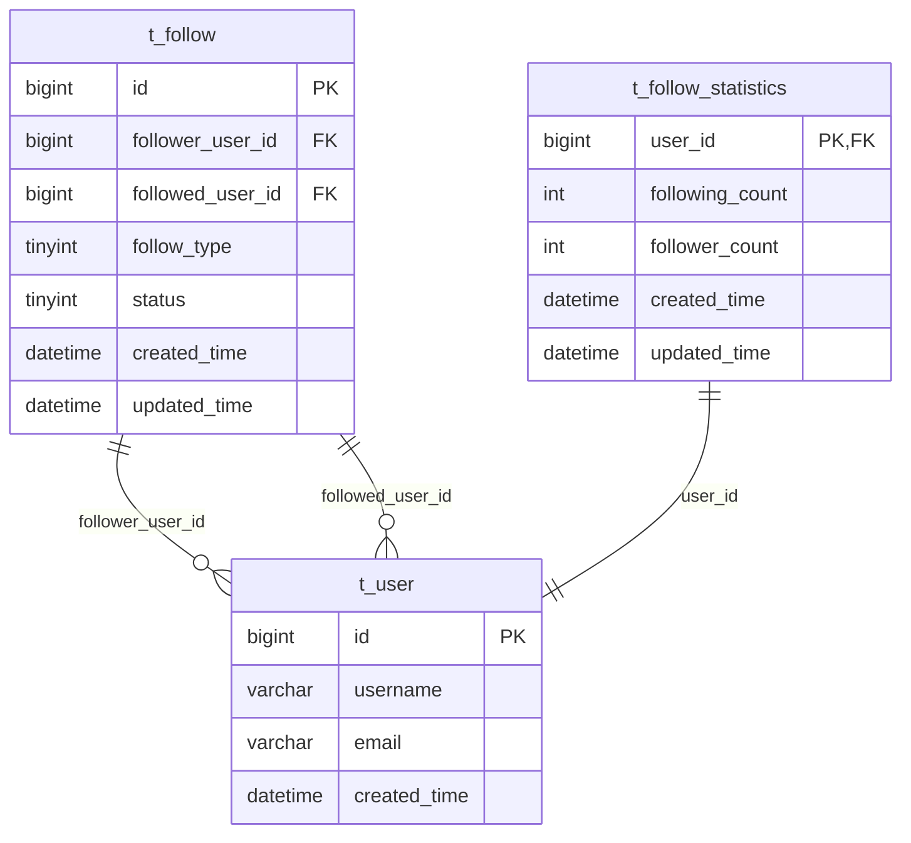

# Follow 模块数据库设计文档

## 📋 目录
- [设计概述](#设计概述)
- [数据表结构](#数据表结构)
- [索引设计](#索引设计)
- [数据字典](#数据字典)
- [性能优化](#性能优化)
- [数据迁移](#数据迁移)

---

## 📚 设计概述

### 设计原则
- **单一职责**: 每张表专注于特定的业务领域
- **数据一致性**: 通过约束和事务确保数据完整性
- **性能优化**: 合理的索引设计支持高频查询
- **可扩展性**: 预留字段支持未来功能扩展
- **数据安全**: 软删除机制保护重要数据

### 核心表关系


---

## 🗄️ 数据表结构

### 1. 关注关系表 (t_follow)

**表作用**: 存储用户之间的关注关系，记录关注行为的详细信息

```sql
CREATE TABLE `t_follow` (
    `id` BIGINT NOT NULL AUTO_INCREMENT COMMENT '关注ID，主键',
    `follower_user_id` BIGINT NOT NULL COMMENT '关注者用户ID',
    `followed_user_id` BIGINT NOT NULL COMMENT '被关注者用户ID',
    `follow_type` TINYINT NOT NULL DEFAULT 1 COMMENT '关注类型：1-普通关注，2-特别关注',
    `status` TINYINT NOT NULL DEFAULT 1 COMMENT '状态：0-已取消，1-正常，2-已屏蔽',
    `created_time` DATETIME NOT NULL DEFAULT CURRENT_TIMESTAMP COMMENT '创建时间',
    `updated_time` DATETIME NOT NULL DEFAULT CURRENT_TIMESTAMP ON UPDATE CURRENT_TIMESTAMP COMMENT '更新时间',
    PRIMARY KEY (`id`),
    UNIQUE KEY `uk_follower_followed` (`follower_user_id`, `followed_user_id`),
    KEY `idx_follower_user_id` (`follower_user_id`),
    KEY `idx_followed_user_id` (`followed_user_id`),
    KEY `idx_status` (`status`),
    KEY `idx_created_time` (`created_time`)
) ENGINE=InnoDB DEFAULT CHARSET=utf8mb4 COLLATE=utf8mb4_unicode_ci COMMENT='关注关系表';
```

**字段详解**:

| 字段名 | 类型 | 长度 | 可空 | 默认值 | 说明 |
|--------|------|------|------|--------|------|
| id | BIGINT | - | 否 | AUTO_INCREMENT | 关注记录的唯一标识 |
| follower_user_id | BIGINT | - | 否 | - | 发起关注的用户ID，外键引用 t_user.id |
| followed_user_id | BIGINT | - | 否 | - | 被关注的用户ID，外键引用 t_user.id |
| follow_type | TINYINT | - | 否 | 1 | 关注类型，支持不同级别的关注 |
| status | TINYINT | - | 否 | 1 | 关注状态，支持软删除和屏蔽 |
| created_time | DATETIME | - | 否 | CURRENT_TIMESTAMP | 首次关注时间，不可更改 |
| updated_time | DATETIME | - | 否 | CURRENT_TIMESTAMP | 最后更新时间，自动维护 |

**业务规则**:
- `follower_user_id` 不能等于 `followed_user_id`（防止自己关注自己）
- (`follower_user_id`, `followed_user_id`) 组合唯一
- 取消关注时更新 `status` 为 0，而非物理删除

### 2. 关注统计表 (t_follow_statistics)

**表作用**: 统计每个用户的关注数和粉丝数，提高查询性能

```sql
CREATE TABLE `t_follow_statistics` (
    `user_id` BIGINT NOT NULL COMMENT '用户ID，主键',
    `following_count` INT NOT NULL DEFAULT 0 COMMENT '关注数（我关注的人数）',
    `follower_count` INT NOT NULL DEFAULT 0 COMMENT '粉丝数（关注我的人数）',
    `created_time` DATETIME NOT NULL DEFAULT CURRENT_TIMESTAMP COMMENT '创建时间',
    `updated_time` DATETIME NOT NULL DEFAULT CURRENT_TIMESTAMP ON UPDATE CURRENT_TIMESTAMP COMMENT '更新时间',
    PRIMARY KEY (`user_id`)
) ENGINE=InnoDB DEFAULT CHARSET=utf8mb4 COLLATE=utf8mb4_unicode_ci COMMENT='关注统计表';
```

**字段详解**:

| 字段名 | 类型 | 长度 | 可空 | 默认值 | 说明 |
|--------|------|------|------|--------|------|
| user_id | BIGINT | - | 否 | - | 用户ID，主键，外键引用 t_user.id |
| following_count | INT | - | 否 | 0 | 该用户关注的其他用户数量 |
| follower_count | INT | - | 否 | 0 | 关注该用户的其他用户数量 |
| created_time | DATETIME | - | 否 | CURRENT_TIMESTAMP | 统计记录创建时间 |
| updated_time | DATETIME | - | 否 | CURRENT_TIMESTAMP | 统计数据最后更新时间 |

**业务规则**:
- 计数器不能为负数
- 当关注/取消关注时自动更新统计数据
- 支持定期校验和重新计算功能

---

## 🔍 索引设计

### 主键索引

| 表名 | 索引名 | 字段 | 类型 | 说明 |
|------|--------|------|------|------|
| t_follow | PRIMARY | id | 主键 | 关注记录唯一标识 |
| t_follow_statistics | PRIMARY | user_id | 主键 | 用户统计数据唯一标识 |

### 唯一索引

| 表名 | 索引名 | 字段 | 说明 |
|------|--------|------|------|
| t_follow | uk_follower_followed | (follower_user_id, followed_user_id) | 防止重复关注，确保唯一性 |

### 普通索引

| 表名 | 索引名 | 字段 | 基数 | 查询场景 |
|------|--------|------|------|----------|
| t_follow | idx_follower_user_id | follower_user_id | 高 | 查询用户的关注列表 |
| t_follow | idx_followed_user_id | followed_user_id | 高 | 查询用户的粉丝列表 |
| t_follow | idx_status | status | 低 | 按状态过滤关注记录 |
| t_follow | idx_created_time | created_time | 高 | 按时间排序查询 |

### 复合索引建议

```sql
-- 为常用查询组合创建复合索引
ALTER TABLE t_follow ADD INDEX idx_follower_status_time (follower_user_id, status, created_time);
ALTER TABLE t_follow ADD INDEX idx_followed_status_time (followed_user_id, status, created_time);
```

**说明**:
- `idx_follower_status_time`: 优化"查询某用户的有效关注列表并按时间排序"
- `idx_followed_status_time`: 优化"查询某用户的有效粉丝列表并按时间排序"

---

## 📖 数据字典

### follow_type 字段值定义

| 值 | 名称 | 说明 | 业务场景 |
|----|------|------|----------|
| 1 | 普通关注 | 标准的关注关系 | 一般用户关注 |
| 2 | 特别关注 | 重点关注，可能有特殊提醒 | VIP关注、置顶显示 |

### status 字段值定义

| 值 | 名称 | 说明 | 业务场景 |
|----|------|------|----------|
| 0 | 已取消 | 用户主动取消关注 | 软删除，保留历史记录 |
| 1 | 正常 | 正常的关注状态 | 活跃关注关系 |
| 2 | 已屏蔽 | 系统或管理员屏蔽 | 违规处理、封禁用户 |

### 统计数据范围

| 字段 | 最小值 | 最大值 | 异常处理 |
|------|--------|--------|----------|
| following_count | 0 | 2^31-1 | 超限时记录日志并限制 |
| follower_count | 0 | 2^31-1 | 超限时记录日志并限制 |

---

## ⚡ 性能优化

### 查询优化策略

#### 1. 关注列表查询
```sql
-- 优化前（全表扫描风险）
SELECT * FROM t_follow WHERE follower_user_id = ? ORDER BY created_time DESC;

-- 优化后（使用复合索引）
SELECT id, followed_user_id, follow_type, created_time 
FROM t_follow 
WHERE follower_user_id = ? AND status = 1 
ORDER BY created_time DESC 
LIMIT ?, ?;
```

#### 2. 相互关注查询
```sql
-- 使用EXISTS提高性能
SELECT f1.* FROM t_follow f1 
WHERE f1.follower_user_id = ? 
  AND f1.status = 1
  AND EXISTS (
    SELECT 1 FROM t_follow f2 
    WHERE f2.follower_user_id = f1.followed_user_id 
      AND f2.followed_user_id = f1.follower_user_id 
      AND f2.status = 1
  );
```

#### 3. 批量关注状态检查
```sql
-- 批量检查关注关系
SELECT followed_user_id 
FROM t_follow 
WHERE follower_user_id = ? 
  AND followed_user_id IN (?, ?, ?, ...) 
  AND status = 1;
```

### 缓存策略

#### Redis 缓存设计
```
Key 格式: follow:{type}:{userId}
- follow:following:{userId}     # 用户关注列表
- follow:followers:{userId}     # 用户粉丝列表  
- follow:stats:{userId}         # 用户关注统计
- follow:mutual:{userId}        # 相互关注列表
```

#### 缓存更新策略
```
写操作时：
1. 更新数据库
2. 删除相关缓存（Cache-Aside 模式）
3. 异步更新统计数据

读操作时：
1. 查询缓存
2. 缓存未命中则查库
3. 回写缓存（设置适当TTL）
```

### 分库分表建议

#### 水平分表策略
```sql
-- 按用户ID哈希分表
CREATE TABLE t_follow_0 LIKE t_follow;
CREATE TABLE t_follow_1 LIKE t_follow;
-- ... 更多分表

-- 分表规则：表名 = t_follow_{user_id % 分表数量}
```

#### 分表后的查询策略
```java
// 关注列表查询（单表）
String tableName = "t_follow_" + (followerUserId % SHARD_COUNT);

// 粉丝列表查询（需要查询所有分表）
List<String> tableNames = getAllShardTableNames();
// 并行查询各分表然后合并结果
```

---

## 🔄 数据迁移

### 初始化脚本

```sql
-- 1. 创建表结构
SOURCE /path/to/001_CREATE_FOLLOW.sql;

-- 2. 初始化基础数据（如果需要）
-- INSERT INTO t_follow_statistics (user_id, following_count, follower_count)
-- SELECT id, 0, 0 FROM t_user;

-- 3. 创建额外索引（生产环境）
ALTER TABLE t_follow ADD INDEX idx_follower_status_time (follower_user_id, status, created_time);
ALTER TABLE t_follow ADD INDEX idx_followed_status_time (followed_user_id, status, created_time);
```

### 数据校验脚本

```sql
-- 校验关注统计数据准确性
SELECT 
    fs.user_id,
    fs.following_count,
    fs.follower_count,
    COALESCE(following_actual.cnt, 0) as following_actual,
    COALESCE(follower_actual.cnt, 0) as follower_actual
FROM t_follow_statistics fs
LEFT JOIN (
    SELECT follower_user_id, COUNT(*) as cnt 
    FROM t_follow 
    WHERE status = 1 
    GROUP BY follower_user_id
) following_actual ON fs.user_id = following_actual.follower_user_id
LEFT JOIN (
    SELECT followed_user_id, COUNT(*) as cnt 
    FROM t_follow 
    WHERE status = 1 
    GROUP BY followed_user_id  
) follower_actual ON fs.user_id = follower_actual.followed_user_id
WHERE fs.following_count != COALESCE(following_actual.cnt, 0)
   OR fs.follower_count != COALESCE(follower_actual.cnt, 0);
```

### 统计数据重建

```sql
-- 重新计算所有用户的关注统计
REPLACE INTO t_follow_statistics (user_id, following_count, follower_count)
SELECT 
    u.id as user_id,
    COALESCE(following.cnt, 0) as following_count,
    COALESCE(follower.cnt, 0) as follower_count
FROM t_user u
LEFT JOIN (
    SELECT follower_user_id, COUNT(*) as cnt 
    FROM t_follow 
    WHERE status = 1 
    GROUP BY follower_user_id
) following ON u.id = following.follower_user_id
LEFT JOIN (
    SELECT followed_user_id, COUNT(*) as cnt 
    FROM t_follow 
    WHERE status = 1 
    GROUP BY followed_user_id
) follower ON u.id = follower.followed_user_id;
```

---

## 📊 监控指标

### 关键性能指标

| 指标名称 | 计算方式 | 告警阈值 | 说明 |
|----------|----------|----------|------|
| 关注成功率 | 成功关注数/总关注请求数 | < 95% | 业务健康度指标 |
| 查询响应时间 | P99响应时间 | > 100ms | 性能指标 |
| 数据一致性 | 统计表与明细表差异率 | > 1% | 数据质量指标 |
| 缓存命中率 | 缓存命中次数/总查询次数 | < 80% | 缓存效果指标 |

### 监控 SQL 示例

```sql
-- 每日新增关注数
SELECT DATE(created_time), COUNT(*) 
FROM t_follow 
WHERE created_time >= CURDATE() - INTERVAL 7 DAY
GROUP BY DATE(created_time);

-- 活跃用户关注数分布
SELECT 
    CASE 
        WHEN following_count = 0 THEN '0'
        WHEN following_count <= 10 THEN '1-10'
        WHEN following_count <= 100 THEN '11-100'
        WHEN following_count <= 1000 THEN '101-1000'
        ELSE '1000+' 
    END as following_range,
    COUNT(*) as user_count
FROM t_follow_statistics 
GROUP BY following_range;
```

---

## 📝 最佳实践

### 1. 写操作优化
- 使用事务确保数据一致性
- 批量操作时控制批次大小
- 异步更新统计数据降低响应延迟

### 2. 读操作优化
- 合理使用索引避免全表扫描
- 分页查询时使用游标而非OFFSET
- 热点数据使用缓存减少数据库压力

### 3. 数据维护
- 定期清理测试数据和无效数据
- 监控慢查询并及时优化
- 定期校验统计数据准确性

### 4. 扩容预案
- 监控表空间使用情况
- 准备分库分表方案
- 建立数据归档机制

---

## 📞 技术支持

- **数据库版本**: MySQL 8.0+
- **字符集**: utf8mb4_unicode_ci
- **存储引擎**: InnoDB
- **文档版本**: v1.0
- **更新日期**: 2024-01-15

---

*本文档基于 Follow 模块数据库设计 v1.0.0，如有疑问请联系 DBA 团队。* 