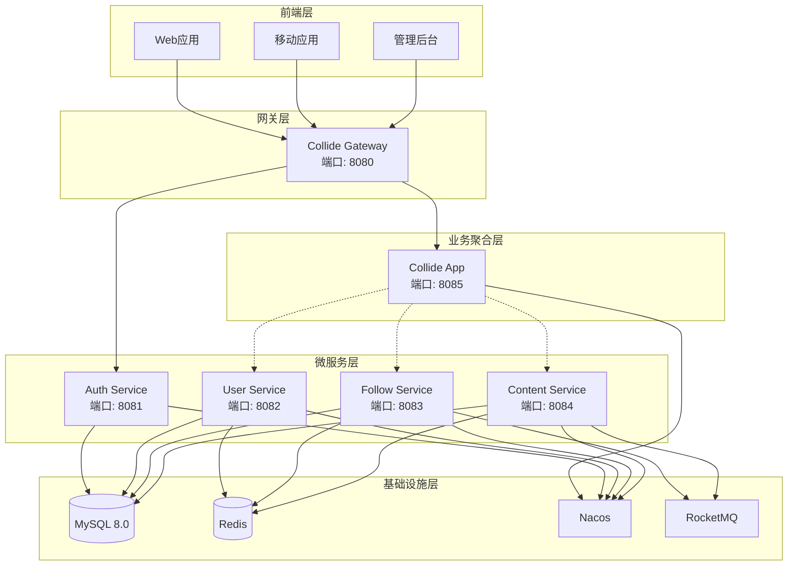
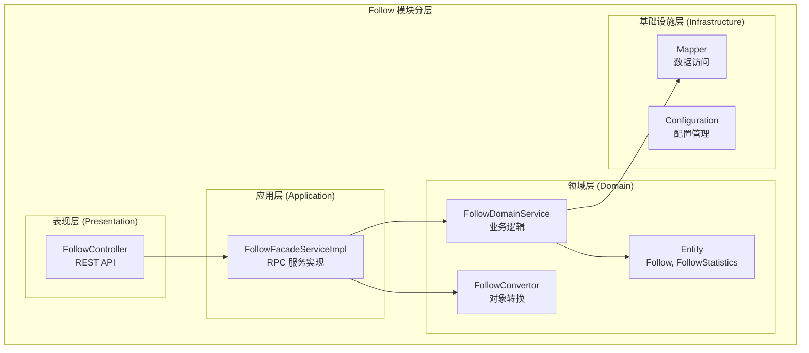
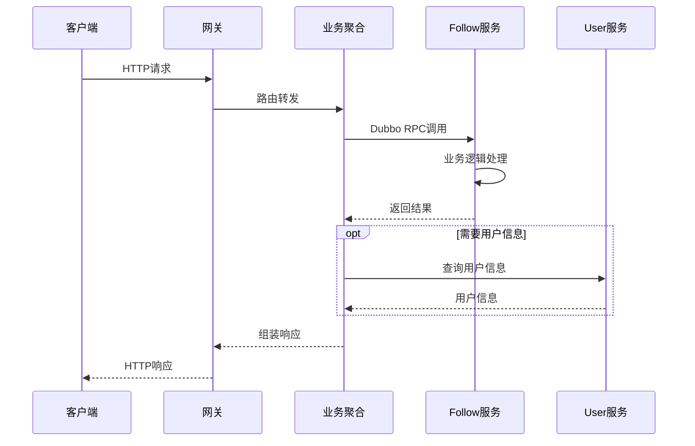
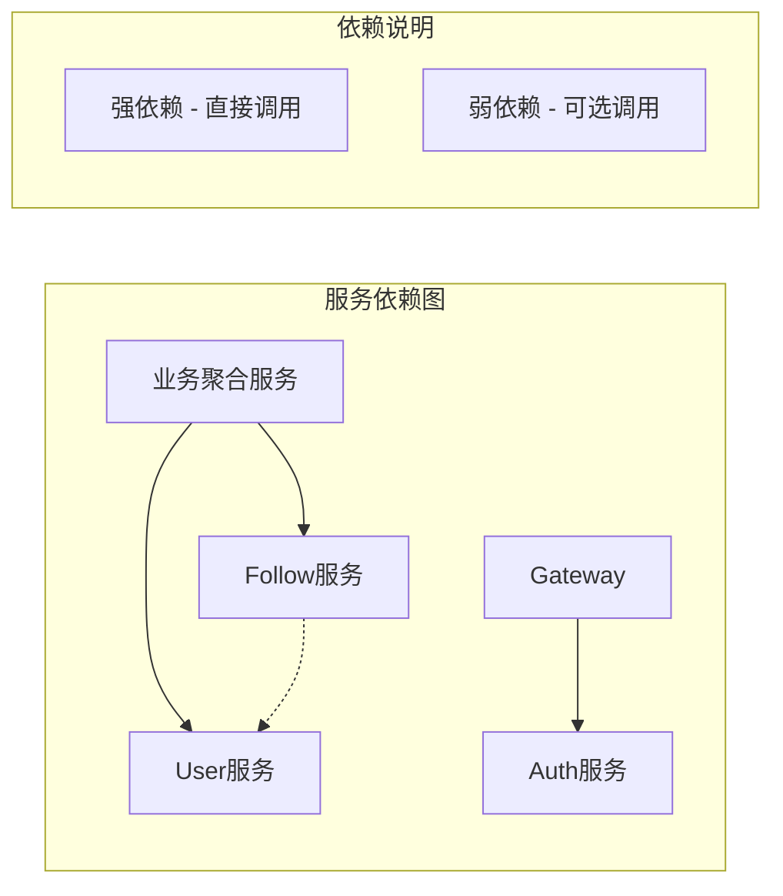
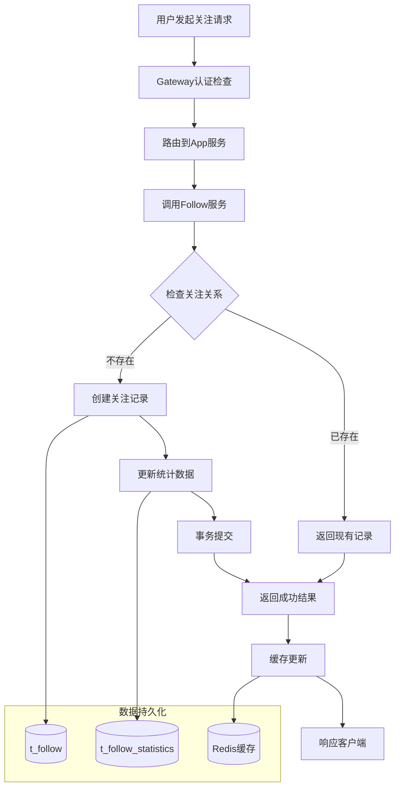
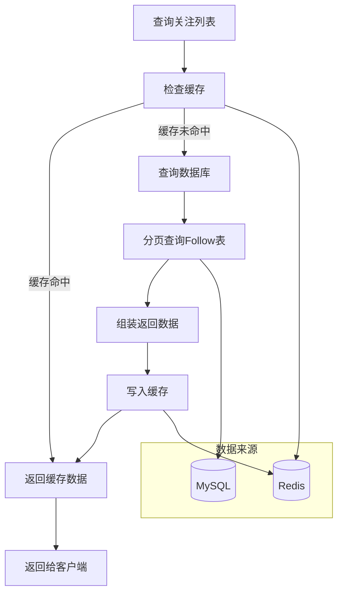
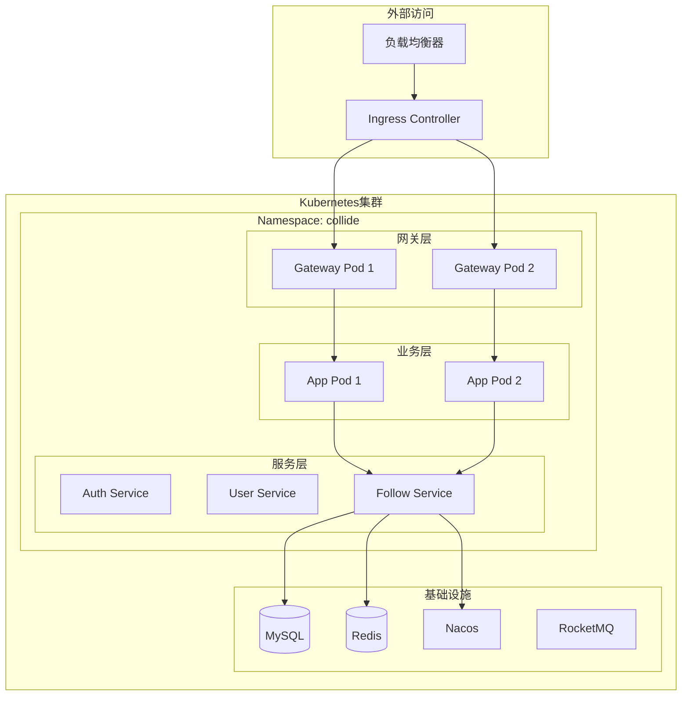
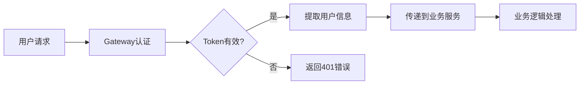

# Follow 模块系统设计概览

## 📋 目录
- [系统架构](#系统架构)
- [技术栈选型](#技术栈选型)
- [模块分层](#模块分层)
- [服务交互](#服务交互)
- [数据流转](#数据流转)
- [部署架构](#部署架构)

---

## 🏗️ 系统架构

### 整体架构图



### 核心组件说明

| 组件名称 | 职责 | 端口 | 技术栈 |
|----------|------|------|--------|
| Collide Gateway | API网关、路由转发、认证拦截 | 8080 | Spring Cloud Gateway |
| Collide App | 业务聚合、服务编排 | 8085 | Spring Boot + Dubbo |
| Follow Service | 关注业务逻辑 | 8083 | Spring Boot + MyBatis Plus |
| Auth Service | 认证授权 | 8081 | Spring Boot + Sa-Token |
| User Service | 用户管理 | 8082 | Spring Boot + MyBatis Plus |

---

## 🔧 技术栈选型

### 后端技术栈

| 分类 | 技术选型 | 版本 | 选型理由 |
|------|----------|------|----------|
| **基础框架** | Spring Boot | 3.2.x | 成熟稳定，生态丰富 |
| **微服务** | Spring Cloud | 2023.x | 完整的微服务解决方案 |
| **RPC通信** | Apache Dubbo | 3.2.x | 高性能、功能强大 |
| **API网关** | Spring Cloud Gateway | - | 响应式、高性能 |
| **服务注册** | Nacos | 2.3.x | 配置中心 + 注册中心 |
| **数据库** | MySQL | 8.0 | 事务支持、成熟稳定 |
| **ORM框架** | MyBatis Plus | 3.5.x | 简化开发、性能良好 |
| **缓存** | Redis | 7.x | 高性能、丰富数据结构 |
| **消息队列** | RocketMQ | 5.x | 高可靠、低延迟 |
| **认证授权** | Sa-Token | 1.37.x | 轻量级、功能完善 |

### 开发工具链

| 分类 | 工具 | 用途 |
|------|------|------|
| **构建工具** | Maven 3.9+ | 依赖管理、项目构建 |
| **代码简化** | Lombok | 减少样板代码 |
| **对象映射** | MapStruct | 高性能Bean映射 |
| **API文档** | OpenAPI 3.0 | 接口文档自动生成 |
| **数据校验** | Jakarta Validation | 参数校验 |
| **JSON处理** | FastJSON2 | 高性能JSON序列化 |

---

## 🏛️ 模块分层

### DDD分层架构



### 各层职责说明

#### 表现层 (Presentation Layer)
- **FollowController**: 处理HTTP请求，参数验证，响应格式化
- **职责**: Web API暴露，请求参数绑定和验证
- **技术**: Spring MVC, Validation

#### 应用层 (Application Layer)  
- **FollowFacadeServiceImpl**: RPC服务实现，对外暴露业务能力
- **职责**: 服务组装，异常处理，事务边界
- **技术**: Dubbo, Spring Transaction

#### 领域层 (Domain Layer)
- **FollowDomainService**: 核心业务逻辑，领域规则实现
- **Entity**: 领域对象，封装业务数据和行为  
- **Convertor**: 领域对象与传输对象转换
- **职责**: 业务逻辑封装，领域规则维护
- **技术**: Spring Service, MapStruct

#### 基础设施层 (Infrastructure Layer)
- **Mapper**: 数据持久化，数据库交互
- **Configuration**: 技术配置，第三方集成
- **职责**: 技术实现，外部资源访问
- **技术**: MyBatis Plus, Spring Configuration

---

## 🔄 服务交互

### Dubbo RPC 服务调用



### 服务间依赖关系



**依赖说明**:
- **强依赖**: App聚合服务直接调用各业务服务
- **弱依赖**: Follow服务可选择调用User服务获取用户详情
- **零依赖**: Follow服务与Auth服务无直接依赖

---

## 📊 数据流转

### 关注操作数据流



### 查询操作数据流



---

## 🚀 部署架构

### 容器化部署



### 部署配置

#### Service 配置
```yaml
apiVersion: v1
kind: Service
metadata:
  name: collide-follow-service
  namespace: collide
spec:
  selector:
    app: collide-follow
  ports:
  - protocol: TCP
    port: 8083
    targetPort: 8083
  type: ClusterIP
```

#### Deployment 配置
```yaml
apiVersion: apps/v1
kind: Deployment
metadata:
  name: collide-follow
  namespace: collide
spec:
  replicas: 2
  selector:
    matchLabels:
      app: collide-follow
  template:
    metadata:
      labels:
        app: collide-follow
    spec:
      containers:
      - name: collide-follow
        image: collide/follow:v1.0.0
        ports:
        - containerPort: 8083
        env:
        - name: SPRING_PROFILES_ACTIVE
          value: "prod"
        - name: NACOS_SERVER_ADDR
          value: "nacos-service:8848"
        resources:
          requests:
            memory: "512Mi"
            cpu: "200m"
          limits:
            memory: "1Gi" 
            cpu: "500m"
```

### 环境配置

| 环境 | 实例数量 | 资源配置 | 数据库 | 缓存 |
|------|----------|----------|--------|------|
| **开发环境** | 1 | 512Mi/0.2CPU | MySQL单机 | Redis单机 |
| **测试环境** | 1 | 1Gi/0.5CPU | MySQL单机 | Redis单机 |
| **预生产** | 2 | 1Gi/0.5CPU | MySQL主从 | Redis集群 |
| **生产环境** | 3+ | 2Gi/1CPU | MySQL集群 | Redis集群 |

---

## 📈 性能指标

### SLA指标

| 指标类型 | 目标值 | 监控方式 |
|----------|--------|----------|
| **可用性** | 99.9% | 健康检查、告警 |
| **响应时间** | P99 < 200ms | APM监控 |
| **吞吐量** | > 1000 QPS | 性能测试 |
| **错误率** | < 0.1% | 日志监控 |

### 容量规划

| 资源类型 | 当前容量 | 扩容阈值 | 扩容策略 |
|----------|----------|----------|----------|
| **CPU** | 500m/实例 | > 70% | 水平扩容 |
| **内存** | 1Gi/实例 | > 80% | 垂直扩容 |
| **数据库连接** | 20/实例 | > 15 | 连接池调优 |
| **缓存容量** | 1GB | > 80% | 增加实例 |

---

## 🔒 安全设计

### 认证授权


### 数据安全
- **传输加密**: HTTPS/TLS 1.3
- **存储加密**: 敏感字段AES加密
- **访问控制**: 基于角色的权限控制
- **审计日志**: 关键操作全程记录

### 接口安全
- **参数校验**: 严格的输入验证
- **SQL注入防护**: 使用预编译语句
- **XSS防护**: 输出数据HTML转义
- **CSRF防护**: Token验证

---

## 📞 运维支持

### 监控告警
- **应用监控**: Spring Boot Actuator + Prometheus
- **链路追踪**: SkyWalking APM
- **日志收集**: ELK Stack
- **告警通知**: 企业微信/钉钉

### 故障处理
- **熔断降级**: Sentinel流控
- **健康检查**: Kubernetes Liveness/Readiness  
- **自动重启**: 容器自愈机制
- **数据备份**: 定时备份策略

---

*本文档描述了 Follow 模块的完整系统设计，包含架构设计、技术选型、部署方案等核心内容。* 