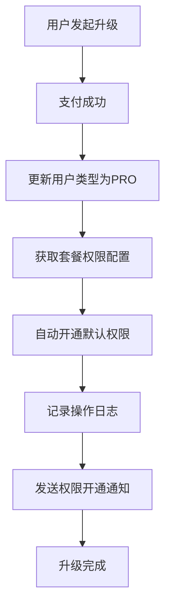
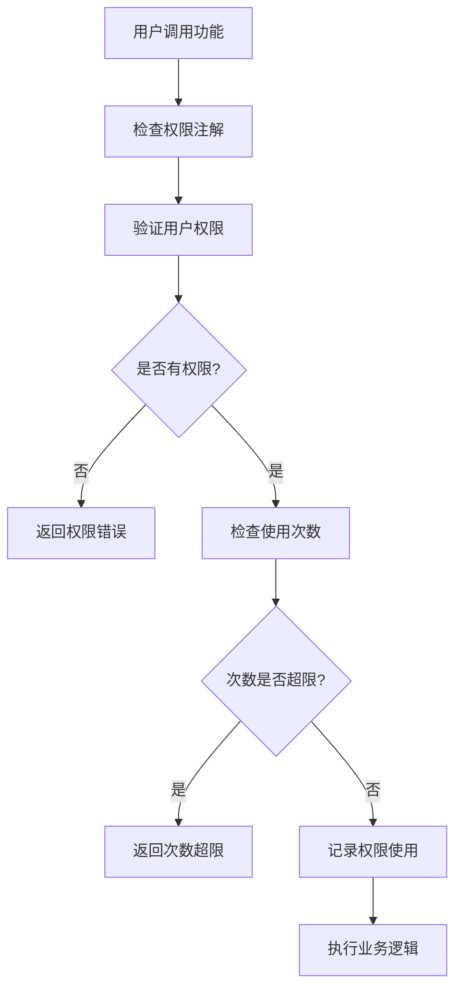
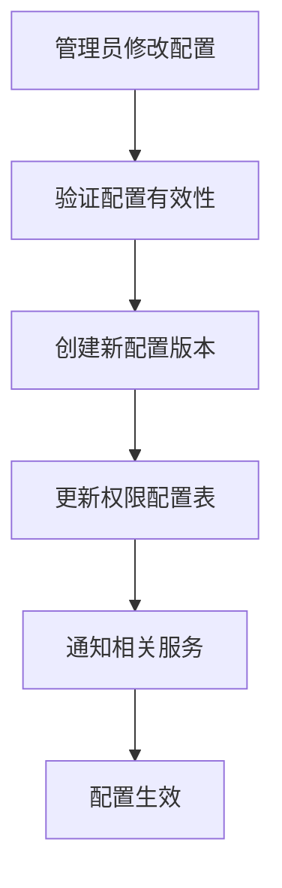

# Pro付费用户权限配置设计文档

## 设计概述

将付费用户功能从user模块独立到pro模块，设计灵活的权限配置系统，支持后台配置不同套餐的权限组合，实现用户升级后自动开通相应权限。

## 架构设计

### 模块结构
```
collide-api/src/main/java/com/gig/collide/api/pro/
├── service/                    # 服务接口层
│   ├── ProFacadeService.java          # Pro门面服务
│   └── ProPermissionConfigService.java # 权限配置服务
├── request/                    # 请求参数层
│   ├── ProUpgradeRequest.java
│   ├── ProDowngradeRequest.java
│   ├── ProPermissionActivateRequest.java
│   └── ...
├── response/                   # 响应参数层
│   ├── ProOperatorResponse.java
│   ├── ProQueryResponse.java
│   └── data/
│       ├── ProInfo.java
│       └── ProPermissionInfo.java
└── constant/                   # 常量定义层
    ├── ProStatus.java
    ├── ProPackageType.java
    ├── ProPermissionType.java
    ├── ProPermissionConfig.java
    └── ProOperateTypeEnum.java
```

## 权限配置体系

### 1. 权限类型定义 (ProPermissionType)

```java
public enum ProPermissionType {
    ADVANCED_SEARCH("高级搜索权限"),      // 高级搜索功能
    BATCH_OPERATION("批量操作权限"),      // 批量处理数据
    DATA_EXPORT("数据导出权限"),          // 数据导出功能
    ADVANCED_ANALYTICS("高级分析权限"),   // 数据分析图表
    CUSTOM_CONFIG("自定义配置权限"),      // 个性化配置
    PRIORITY_SUPPORT("优先级支持权限"),   // 优先技术支持
    API_ACCESS("API调用权限"),           // API接口调用
    ADVANCED_FOLLOW("高级关注权限"),      // 特别关注等功能
    DATA_BACKUP("数据备份权限"),         // 数据备份恢复
    ADVANCED_NOTIFICATION("高级通知权限") // 高级通知设置
}
```

### 2. 套餐权限配置

#### 月费套餐 (MONTHLY)
- ✅ 高级搜索权限 (使用次数限制: 1000/月)
- ✅ 数据导出权限 (使用次数限制: 50/月)
- ✅ 高级关注权限 (无限制)

#### 季费套餐 (QUARTERLY)
- ✅ 高级搜索权限 (使用次数限制: 3000/季)
- ✅ 数据导出权限 (使用次数限制: 200/季)
- ✅ 高级关注权限 (无限制)
- ✅ 批量操作权限 (使用次数限制: 100/季)
- ✅ 高级分析权限 (无限制)

#### 年费套餐 (YEARLY)
- ✅ 高级搜索权限 (无限制)
- ✅ 数据导出权限 (无限制)
- ✅ 高级关注权限 (无限制)
- ✅ 批量操作权限 (无限制)
- ✅ 高级分析权限 (无限制)
- ✅ 自定义配置权限 (无限制)
- ✅ 优先级支持权限 (无限制)
- ✅ API调用权限 (使用次数限制: 10000/年)

#### 终身套餐 (LIFETIME)
- ✅ 所有权限无限制使用

## 权限配置管理

### 1. 配置表设计

#### pro_permission_config - 权限配置表
```sql
- config_version: 配置版本 (v1.0, v2.0)
- package_type: 套餐类型
- permission_type: 权限类型
- default_enabled: 是否默认开通
- usage_limit: 使用次数限制 (-1表示无限制)
- valid_days: 有效期天数 (-1表示跟随套餐)
- priority: 权限优先级
- ext_config: 扩展配置 (JSON格式)
```

#### user_pro_permission - 用户权限表
```sql
- user_id: 用户ID
- permission_type: 权限类型
- is_active: 是否激活
- activated_time: 激活时间
- expired_time: 过期时间
- usage_limit: 使用次数限制
- used_count: 已使用次数
- auto_granted: 是否自动开通
```

### 2. 配置管理逻辑

#### 用户升级自动权限开通流程
```java
public List<ProPermissionType> autoGrantPermissionsOnUpgrade(
    Long userId, ProPackageType packageType, String configVersion) {
    
    // 1. 获取套餐默认权限配置
    List<ProPermissionType> defaultPermissions = 
        getDefaultPermissions(packageType, configVersion);
    
    // 2. 为用户开通权限
    for (ProPermissionType permission : defaultPermissions) {
        ProPermissionConfig.PermissionConfigItem config = 
            getPermissionConfig(packageType, permission, configVersion);
        
        // 创建用户权限记录
        createUserPermission(userId, permission, config);
    }
    
    // 3. 记录操作日志
    recordPermissionOperation(userId, ProOperateTypeEnum.AUTO_PERMISSION_GRANT);
    
    return defaultPermissions;
}
```

#### 权限使用验证流程
```java
public boolean validatePermissionUsage(Long userId, ProPermissionType permissionType) {
    
    // 1. 检查用户是否有该权限
    if (!hasPermission(userId, permissionType)) {
        return false;
    }
    
    // 2. 检查权限是否过期
    UserProPermission userPermission = getUserPermission(userId, permissionType);
    if (isExpired(userPermission)) {
        return false;
    }
    
    // 3. 检查使用次数限制
    if (userPermission.getUsageLimit() > 0) {
        return userPermission.getUsedCount() < userPermission.getUsageLimit();
    }
    
    return true;
}
```

## API接口设计

### 1. 核心接口

#### 用户升级接口
```java
ProOperatorResponse upgradeToPro(ProUpgradeRequest request);
```
- 自动开通套餐默认权限
- 记录升级操作日志
- 发送权限开通通知

#### 权限查询接口
```java
ProQueryResponse<ProPermissionInfo> queryProPermissions(ProPermissionQueryRequest request);
```
- 返回用户已激活权限
- 返回套餐可用权限
- 返回权限使用情况

#### 权限激活/停用接口
```java
ProOperatorResponse activateProPermission(ProPermissionActivateRequest request);
ProOperatorResponse deactivateProPermission(ProPermissionDeactivateRequest request);
```
- 支持批量权限操作
- 支持管理员手动操作
- 记录操作审计日志

### 2. 权限验证注解

```java
@Target({ElementType.METHOD, ElementType.TYPE})
@Retention(RetentionPolicy.RUNTIME)
public @interface RequireProPermission {
    ProPermissionType[] value();
    boolean allRequired() default false; // 是否需要所有权限
}
```

使用示例：
```java
@RequireProPermission(ProPermissionType.DATA_EXPORT)
@GetMapping("/export")
public Result<?> exportData() {
    // 只有拥有数据导出权限的用户才能访问
}

@RequireProPermission({ProPermissionType.ADVANCED_SEARCH, ProPermissionType.ADVANCED_ANALYTICS})
@GetMapping("/advanced-report")
public Result<?> getAdvancedReport() {
    // 需要同时拥有高级搜索和高级分析权限
}
```

## 配置管理特性

### 1. 版本化配置
- 支持多版本权限配置共存
- 新用户使用最新版本配置
- 现有用户可选择升级配置版本

### 2. 动态配置
- 支持运行时修改权限配置
- 配置变更实时生效
- 支持配置回滚

### 3. 权限继承
- 高级套餐包含低级套餐所有权限
- 用户升级套餐自动获得新权限
- 用户降级套餐自动失去权限

### 4. 使用统计
- 记录权限使用次数
- 生成权限使用报告
- 支持权限使用分析

## 业务流程

### 1. 用户升级流程


### 2. 权限使用流程


### 3. 配置更新流程


## 扩展性设计

### 1. 权限类型扩展
- 新增权限类型只需添加枚举值
- 在配置表中添加相应配置
- 无需修改核心逻辑

### 2. 套餐类型扩展
- 支持添加新的套餐类型
- 为新套餐配置权限组合
- 支持套餐间的权限继承关系

### 3. 权限规则扩展
- 支持基于时间的权限控制
- 支持基于地域的权限控制
- 支持基于用户等级的权限控制

### 4. 集成扩展
- 支持与其他系统的权限同步
- 支持SSO单点登录权限传递
- 支持第三方权限管理系统集成

## 安全考虑

### 1. 权限验证
- 所有权限操作都需要验证
- 支持权限缓存提高性能
- 定期清理过期权限

### 2. 操作审计
- 记录所有权限变更操作
- 包含操作人、操作时间、操作原因
- 支持权限操作回溯

### 3. 数据安全
- 权限配置数据加密存储
- 支持权限数据备份恢复
- 防止权限配置被恶意篡改 