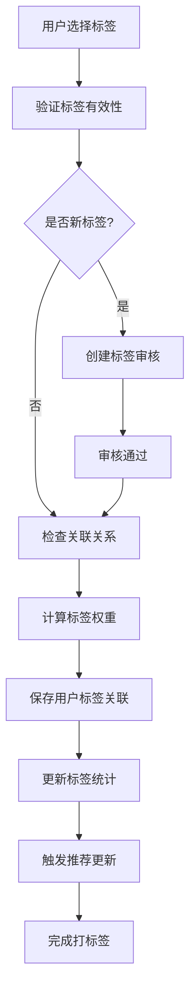
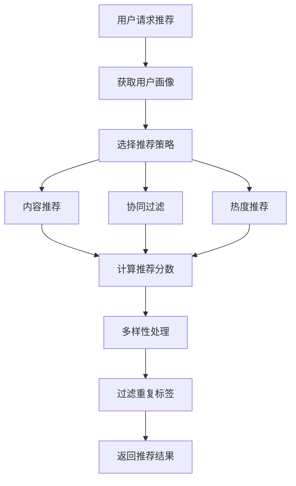
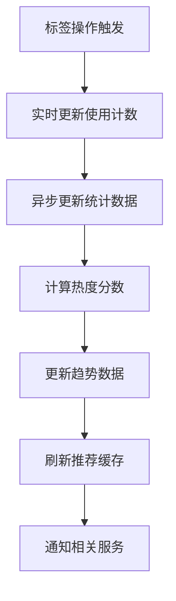

# 标签系统设计文档

## 设计概述

标签系统是一个独立的模块，设计支持最多三级标签结构，用户可以对内容、商品等对象进行打标签操作，为后续的内容推荐模块提供数据支持。系统采用无外键设计，通过ID关联，保证模块的独立性和高性能。

## 架构设计

### 模块结构
```
collide-api/src/main/java/com/gig/collide/api/tag/
├── service/                    # 服务接口层
│   ├── TagFacadeService.java          # 标签门面服务
│   └── TagRecommendService.java       # 标签推荐服务
├── request/                    # 请求参数层
│   ├── TagCreateRequest.java
│   ├── TagUpdateRequest.java
│   ├── TagQueryRequest.java
│   ├── TagPageQueryRequest.java
│   ├── UserTagRequest.java
│   ├── UserUntagRequest.java
│   └── UserTagQueryRequest.java
├── response/                   # 响应参数层
│   ├── TagOperatorResponse.java
│   ├── TagQueryResponse.java
│   └── data/
│       ├── TagInfo.java
│       ├── UserTagInfo.java
│       └── TagStatistics.java
└── constant/                   # 常量定义层
    ├── TagLevel.java
    ├── TagStatus.java
    ├── TagType.java
    ├── TagRelationType.java
    └── TagOperateTypeEnum.java
```

## 核心特性

### 1. 三级标签体系

#### 标签层级设计
```java
public enum TagLevel {
    LEVEL_1(1, "一级标签"),    // 根标签，如：技术、兴趣、生活
    LEVEL_2(2, "二级标签"),    // 分类标签，如：前端、后端、音乐、电影
    LEVEL_3(3, "三级标签");    // 具体标签，如：React、Vue、流行音乐、科幻电影
}
```

#### 标签树结构示例
```
技术 (LEVEL_1)
├── 前端 (LEVEL_2)
│   ├── JavaScript (LEVEL_3)
│   ├── React (LEVEL_3)
│   └── Vue (LEVEL_3)
├── 后端 (LEVEL_2)
│   ├── Java (LEVEL_3)
│   ├── Python (LEVEL_3)
│   └── Node.js (LEVEL_3)
└── 数据库 (LEVEL_2)
    ├── MySQL (LEVEL_3)
    ├── Redis (LEVEL_3)
    └── MongoDB (LEVEL_3)
```

### 2. 标签类型体系

#### 标签类型分类
```java
public enum TagType {
    SYSTEM("系统标签"),      // 系统预设标签，不可删除
    USER("用户标签"),        // 用户创建的标签
    CONTENT("内容标签"),     // 内容相关标签
    CATEGORY("分类标签"),    // 分类用途标签
    PERSONAL("个人标签"),    // 个人喜好标签
    TRENDING("热门标签");    // 热门推荐标签
}
```

#### 标签状态管理
```java
public enum TagStatus {
    ACTIVE("正常"),         // 可正常使用
    DISABLED("禁用"),       // 已禁用，不可使用
    DRAFT("草稿"),         // 草稿状态，待完善
    REVIEWING("审核中"),    // 用户创建的标签审核中
    REJECTED("审核拒绝");   // 审核被拒绝
}
```

### 3. 用户打标签功能

#### 关联类型设计
```java
public enum TagRelationType {
    USER("用户"),           // 用户的个人标签
    CONTENT("内容"),        // 文章、帖子等内容标签
    GOODS("商品"),          // 商品标签
    COLLECTION("藏品"),     // 藏品标签
    ACTIVITY("活动"),       // 活动标签
    TOPIC("话题"),          // 话题标签
    CHANNEL("频道"),        // 频道标签
    SPECIAL("专题");        // 专题标签
}
```

#### 用户标签权重机制
- **权重范围**: 0.0 - 1.0
- **自动调整**: 根据用户使用频率自动调整权重
- **个性化推荐**: 权重用于个性化内容推荐
- **多样性保证**: 防止用户标签过于集中

## 数据库设计

### 1. 核心表结构

#### tag - 标签主表
```sql
- id: 标签ID（自增主键）
- tag_name: 标签名称（支持中英文）
- tag_type: 标签类型
- status: 标签状态
- level: 标签层级（1-3）
- parent_tag_id: 父标签ID
- parent_tag_path: 标签路径（/1/2/3）
- usage_count: 使用计数
- hot_score: 热度分数
- creator_id: 创建者ID
```

#### user_tag_relation - 用户标签关联表
```sql
- user_id: 用户ID
- tag_id: 标签ID
- relation_type: 关联类型
- relation_object_id: 关联对象ID
- weight: 标签权重（0.0-1.0）
- usage_count: 使用次数
- is_auto_tag: 是否自动标签
```

#### tag_statistics - 标签统计表
```sql
- tag_id: 标签ID
- total_usage_count: 总使用次数
- user_count: 用户使用数量
- today_usage_count: 今日使用次数
- hot_trend: 热度趋势（JSON）
- avg_usage_frequency: 平均使用频率
```

### 2. 无外键设计原则

#### 独立性保证
- **无外键约束**: 所有关联通过ID进行，不使用外键
- **模块解耦**: 标签模块可独立部署和维护
- **性能优化**: 避免外键约束带来的性能影响
- **数据一致性**: 通过应用层逻辑保证数据一致性

#### 数据关联策略
```java
// 示例：查询用户标签时的关联处理
public List<UserTagInfo> queryUserTags(Long userId) {
    // 1. 查询用户标签关联
    List<UserTagRelation> relations = userTagMapper.selectByUserId(userId);
    
    // 2. 批量查询标签信息
    List<Long> tagIds = relations.stream()
        .map(UserTagRelation::getTagId)
        .collect(Collectors.toList());
    List<Tag> tags = tagMapper.selectByIds(tagIds);
    
    // 3. 组装数据
    return buildUserTagInfos(relations, tags);
}
```

## API接口设计

### 1. 标签管理接口

#### 创建标签
```java
TagOperatorResponse createTag(TagCreateRequest request);
```
- 支持三级标签创建
- 自动生成标签路径
- 用户创建标签需要审核（可配置）

#### 查询标签树
```java
TagQueryResponse<List<TagInfo>> queryTagTree(Long parentTagId, Boolean includeDisabled);
```
- 返回树形结构数据
- 支持懒加载
- 可控制是否包含禁用标签

#### 标签搜索
```java
TagQueryResponse<List<TagInfo>> searchTags(String keyword, Integer limit);
```
- 支持标签名称模糊搜索
- 按热度排序
- 支持拼音搜索（扩展功能）

### 2. 用户打标签接口

#### 用户打标签
```java
TagOperatorResponse userTag(UserTagRequest request);
```
- 支持批量打标签
- 自动计算标签权重
- 记录操作日志

#### 查询用户标签
```java
TagQueryResponse<List<UserTagInfo>> queryUserTags(UserTagQueryRequest request);
```
- 支持按关联类型过滤
- 按权重排序
- 返回标签详细信息

#### 标签推荐
```java
TagQueryResponse<List<TagInfo>> recommendTagsForUser(Long userId, Integer limit);
```
- 基于用户行为推荐
- 协同过滤算法
- 多样性保证

## 推荐算法设计

### 1. 基于内容的推荐

#### 内容特征提取
```java
public List<TagInfo> recommendByContentFeatures(
    Map<String, Object> contentFeatures, 
    TagRelationType relationType, 
    Integer limit) {
    
    // 1. 提取内容关键词
    List<String> keywords = extractKeywords(contentFeatures);
    
    // 2. 匹配相关标签
    List<TagInfo> candidateTags = matchTagsByKeywords(keywords);
    
    // 3. 计算相关度分数
    List<TagScore> tagScores = calculateRelevanceScore(candidateTags, contentFeatures);
    
    // 4. 返回Top-N推荐
    return tagScores.stream()
        .sorted(Comparator.comparing(TagScore::getScore).reversed())
        .limit(limit)
        .map(TagScore::getTagInfo)
        .collect(Collectors.toList());
}
```

### 2. 协同过滤推荐

#### 用户相似度计算
```java
public List<TagInfo> recommendByCollaborativeFiltering(Long userId, Integer limit) {
    
    // 1. 找到相似用户
    List<Long> similarUsers = findSimilarUsers(userId);
    
    // 2. 获取相似用户的热门标签
    Map<Long, Double> tagScores = calculateSimilarUsersTagScores(similarUsers, userId);
    
    // 3. 过滤用户已有标签
    tagScores = filterUserExistingTags(tagScores, userId);
    
    // 4. 返回推荐结果
    return getTopTagsByScore(tagScores, limit);
}
```

### 3. 热度趋势推荐

#### 趋势标签识别
```java
public List<TagInfo> recommendTrendingTags(
    TagRelationType relationType, 
    Integer timeRange, 
    Integer limit) {
    
    // 1. 计算标签热度变化率
    Map<Long, Double> trendScores = calculateTrendScores(relationType, timeRange);
    
    // 2. 结合基础热度
    Map<Long, Double> finalScores = combineWithBaseHotScore(trendScores);
    
    // 3. 返回趋势标签
    return getTopTrendingTags(finalScores, limit);
}
```

## 性能优化策略

### 1. 缓存设计

#### 多级缓存架构
```java
// L1缓存：JVM本地缓存（Caffeine）
@Cacheable(value = "tags", key = "#tagId")
public TagInfo getTagById(Long tagId) { ... }

// L2缓存：Redis分布式缓存
@Cacheable(value = "tag:tree", key = "#parentId")
public List<TagInfo> getTagTree(Long parentId) { ... }

// L3缓存：数据库查询缓存
@Cacheable(value = "tag:hot", key = "#limit")
public List<TagInfo> getHotTags(Integer limit) { ... }
```

#### 缓存更新策略
- **标签信息变更**: 清除相关缓存
- **用户标签变更**: 异步更新推荐缓存
- **统计数据更新**: 定时刷新热度缓存
- **缓存预热**: 系统启动时预加载热门数据

### 2. 数据库优化

#### 索引设计
```sql
-- 复合索引
KEY `idx_tag_type_status_level` (`tag_type`, `status`, `level`)
KEY `idx_user_relation_type` (`user_id`, `relation_type`, `weight`)

-- 覆盖索引
KEY `idx_cover_user_tags` (`user_id`, `tag_id`, `weight`, `last_used_time`)

-- 函数索引（MySQL 8.0+）
KEY `idx_tag_name_func` ((UPPER(`tag_name`)))
```

#### 分表策略
```java
// 用户标签关联表按用户ID分表
public String getTableName(Long userId) {
    return "user_tag_relation_" + (userId % 10);
}

// 标签统计表按时间分表
public String getStatTableName(Date date) {
    return "tag_statistics_" + DateUtils.format(date, "yyyyMM");
}
```

### 3. 异步处理

#### 标签统计更新
```java
@Async("tagExecutor")
public void updateTagStatistics(Long tagId, String operation) {
    // 异步更新标签使用统计
    tagStatisticsService.updateUsageCount(tagId);
    tagStatisticsService.updateHotScore(tagId);
    tagStatisticsService.updateTrendData(tagId);
}
```

#### 推荐数据计算
```java
@Scheduled(fixedRate = 3600000) // 每小时执行
public void updateRecommendData() {
    // 异步更新推荐相关数据
    updateUserTagWeights();
    updateTagCorrelations();
    updateTrendingTags();
}
```

## 扩展功能设计

### 1. 标签智能推荐

#### 机器学习集成
- **NLP技术**: 内容语义分析，自动提取标签
- **深度学习**: 用户行为预测，个性化推荐
- **知识图谱**: 标签关系图谱，语义相关推荐

#### 实时推荐引擎
- **流式计算**: 实时更新用户偏好
- **A/B测试**: 推荐策略效果评估
- **多臂老虎机**: 探索与利用平衡

### 2. 标签分析功能

#### 用户画像分析
```java
public Map<String, Object> analyzeUserTagProfile(Long userId) {
    return Map.of(
        "diversity", calculateTagDiversity(userId),      // 标签多样性
        "depth", calculateTagDepth(userId),             // 标签深度
        "activity", calculateTagActivity(userId),       // 标签活跃度
        "preferences", getTopPreferences(userId),       // 主要偏好
        "trends", getTagTrends(userId)                  // 偏好趋势
    );
}
```

#### 标签关系分析
```java
public Map<String, Object> analyzeTagRelations(List<Long> tagIds) {
    return Map.of(
        "correlations", calculateTagCorrelations(tagIds),   // 标签相关性
        "clusters", clusterRelatedTags(tagIds),            // 标签聚类
        "bridges", findBridgeTags(tagIds),                 // 桥接标签
        "communities", detectTagCommunities(tagIds)        // 标签社区
    );
}
```

## 业务流程

### 1. 用户打标签流程



### 2. 标签推荐流程



### 3. 标签数据更新流程



## 监控和运维

### 1. 性能监控

#### 关键指标
- **QPS**: 标签查询、打标签QPS
- **响应时间**: 接口响应时间分布
- **缓存命中率**: 各级缓存命中率
- **数据库连接**: 连接池使用情况

#### 业务监控
- **标签使用统计**: 日活跃标签数、新增标签数
- **用户行为**: 打标签频率、取消标签频率
- **推荐效果**: 推荐点击率、采用率
- **数据质量**: 标签覆盖率、标签深度分布

### 2. 数据治理

#### 标签质量管理
- **重复标签检测**: 自动识别相似标签
- **无效标签清理**: 清理无人使用的标签
- **标签合并**: 合并语义相同的标签
- **标签分类优化**: 优化标签层级结构

#### 用户行为分析
- **异常行为检测**: 识别刷标签等异常行为
- **标签垃圾识别**: 过滤垃圾标签和恶意标签
- **用户偏好变化**: 跟踪用户兴趣变化趋势

## 安全考虑

### 1. 权限控制

#### 操作权限
- **标签创建**: 用户可创建标签，需要审核
- **标签修改**: 只有创建者和管理员可修改
- **标签删除**: 只有管理员可删除系统标签
- **批量操作**: 限制批量操作频率和数量

#### 数据安全
- **输入验证**: 严格验证标签名称和描述
- **XSS防护**: 防止恶意脚本注入
- **SQL注入防护**: 参数化查询
- **频率限制**: 防止接口滥用

### 2. 隐私保护

#### 用户标签隐私
- **标签可见性**: 用户可设置标签是否公开
- **敏感标签**: 特殊处理敏感类型标签
- **数据匿名化**: 统计数据脱敏处理
- **用户控制**: 用户可删除自己的标签记录

## 总结

标签系统设计具有以下特点：

1. **架构独立性**: 无外键设计，模块完全独立
2. **三级标签体系**: 支持灵活的标签分类和组织
3. **用户打标签**: 完整的用户标签功能，支持多种关联类型
4. **智能推荐**: 多种推荐算法，为推荐系统提供数据支持
5. **高性能设计**: 多级缓存、异步处理、数据库优化
6. **可扩展性**: 支持机器学习、知识图谱等高级功能
7. **运维友好**: 完善的监控、数据治理和安全机制

该设计为后续的内容推荐模块提供了强大的数据基础，能够支撑大规模用户的个性化推荐需求。 