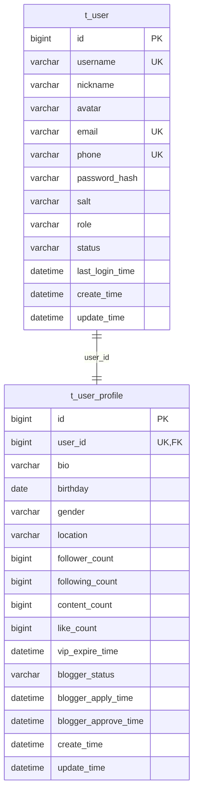

# User 模块数据库设计文档

## 📋 目录
- [设计概述](#设计概述)
- [数据表结构](#数据表结构)
- [索引设计](#索引设计)
- [数据字典](#数据字典)
- [性能优化](#性能优化)
- [数据迁移](#数据迁移)

---

## 📚 设计概述

### 设计原则
- **用户数据分离**: 基础信息与扩展信息分表存储，提高查询效率
- **数据完整性**: 通过约束确保用户数据的一致性和完整性
- **扩展性设计**: 预留字段支持未来业务功能扩展
- **隐私保护**: 敏感信息加密存储，支持数据脱敏
- **审计支持**: 完整的时间戳记录，支持数据变更追踪

### 核心表关系


---

## 🗄️ 数据表结构

### 1. 用户基础表 (t_user)

**表作用**: 存储用户的基础认证信息，包括登录凭据、角色权限等核心数据

```sql
CREATE TABLE `t_user` (
    `id` BIGINT NOT NULL AUTO_INCREMENT COMMENT '用户ID，主键',
    `username` VARCHAR(50) NOT NULL COMMENT '用户名，全局唯一',
    `nickname` VARCHAR(100) DEFAULT NULL COMMENT '用户昵称，可重复',
    `avatar` VARCHAR(500) DEFAULT NULL COMMENT '头像URL',
    `email` VARCHAR(255) DEFAULT NULL COMMENT '邮箱地址',
    `phone` VARCHAR(20) DEFAULT NULL COMMENT '手机号码',
    `password_hash` VARCHAR(255) NOT NULL COMMENT '密码哈希值',
    `salt` VARCHAR(64) DEFAULT NULL COMMENT '密码盐值',
    `role` VARCHAR(50) NOT NULL DEFAULT 'USER' COMMENT '用户角色：USER、ADMIN、BLOGGER',
    `status` VARCHAR(50) NOT NULL DEFAULT 'ACTIVE' COMMENT '用户状态：ACTIVE、FROZEN、DELETED',
    `last_login_time` DATETIME DEFAULT NULL COMMENT '最后登录时间',
    `create_time` DATETIME NOT NULL DEFAULT CURRENT_TIMESTAMP COMMENT '创建时间',
    `update_time` DATETIME NOT NULL DEFAULT CURRENT_TIMESTAMP ON UPDATE CURRENT_TIMESTAMP COMMENT '更新时间',
    PRIMARY KEY (`id`),
    UNIQUE KEY `uk_username` (`username`),
    UNIQUE KEY `uk_email` (`email`),
    UNIQUE KEY `uk_phone` (`phone`),
    KEY `idx_status` (`status`),
    KEY `idx_role` (`role`),
    KEY `idx_create_time` (`create_time`),
    KEY `idx_last_login_time` (`last_login_time`)
) ENGINE=InnoDB DEFAULT CHARSET=utf8mb4 COLLATE=utf8mb4_unicode_ci COMMENT='用户基础信息表';
```

**字段详解**:

| 字段名 | 类型 | 长度 | 可空 | 默认值 | 索引 | 说明 |
|--------|------|------|------|--------|------|------|
| id | BIGINT | - | 否 | AUTO_INCREMENT | PK | 用户唯一标识，自增主键 |
| username | VARCHAR | 50 | 否 | - | UK | 用户名，注册后不可修改 |
| nickname | VARCHAR | 100 | 是 | NULL | - | 用户昵称，可重复，可修改 |
| avatar | VARCHAR | 500 | 是 | NULL | - | 头像URL，支持CDN地址 |
| email | VARCHAR | 255 | 是 | NULL | UK | 邮箱地址，唯一性约束 |
| phone | VARCHAR | 20 | 是 | NULL | UK | 手机号码，唯一性约束 |
| password_hash | VARCHAR | 255 | 否 | - | - | BCrypt加密后的密码哈希 |
| salt | VARCHAR | 64 | 是 | NULL | - | 密码盐值（BCrypt自带盐值） |
| role | VARCHAR | 50 | 否 | USER | INDEX | 用户角色，影响权限控制 |
| status | VARCHAR | 50 | 否 | ACTIVE | INDEX | 用户状态，影响访问控制 |
| last_login_time | DATETIME | - | 是 | NULL | INDEX | 最后登录时间，用于活跃度统计 |

**业务规则**:
- `username` 全局唯一，注册后不可修改
- `email` 和 `phone` 可选填写，填写后需唯一
- `password_hash` 使用BCrypt加密，不存储明文密码
- `status` 为 DELETED 时，用户信息逻辑删除

### 2. 用户扩展表 (t_user_profile)

**表作用**: 存储用户的扩展档案信息，包括个人资料、统计数据、认证状态等

```sql
CREATE TABLE `t_user_profile` (
    `id` BIGINT NOT NULL AUTO_INCREMENT COMMENT '扩展信息ID，主键',
    `user_id` BIGINT NOT NULL COMMENT '用户ID，外键',
    `bio` VARCHAR(500) DEFAULT NULL COMMENT '个人简介',
    `birthday` DATE DEFAULT NULL COMMENT '生日',
    `gender` VARCHAR(20) DEFAULT 'unknown' COMMENT '性别：male、female、unknown',
    `location` VARCHAR(100) DEFAULT NULL COMMENT '所在地',
    `follower_count` BIGINT DEFAULT 0 COMMENT '粉丝数',
    `following_count` BIGINT DEFAULT 0 COMMENT '关注数',
    `content_count` BIGINT DEFAULT 0 COMMENT '发布内容数',
    `like_count` BIGINT DEFAULT 0 COMMENT '获得点赞数',
    `vip_expire_time` DATETIME DEFAULT NULL COMMENT 'VIP过期时间',
    `blogger_status` VARCHAR(20) DEFAULT 'none' COMMENT '博主认证状态',
    `blogger_apply_time` DATETIME DEFAULT NULL COMMENT '博主申请时间',
    `blogger_approve_time` DATETIME DEFAULT NULL COMMENT '博主认证通过时间',
    `create_time` DATETIME NOT NULL DEFAULT CURRENT_TIMESTAMP COMMENT '创建时间',
    `update_time` DATETIME NOT NULL DEFAULT CURRENT_TIMESTAMP ON UPDATE CURRENT_TIMESTAMP COMMENT '更新时间',
    PRIMARY KEY (`id`),
    UNIQUE KEY `uk_user_id` (`user_id`),
    KEY `idx_blogger_status` (`blogger_status`),
    KEY `idx_gender` (`gender`),
    KEY `idx_vip_expire` (`vip_expire_time`),
    KEY `idx_create_time` (`create_time`)
) ENGINE=InnoDB DEFAULT CHARSET=utf8mb4 COLLATE=utf8mb4_unicode_ci COMMENT='用户扩展信息表';
```

**字段详解**:

| 字段名 | 类型 | 长度 | 可空 | 默认值 | 索引 | 说明 |
|--------|------|------|------|--------|------|------|
| id | BIGINT | - | 否 | AUTO_INCREMENT | PK | 扩展信息记录ID |
| user_id | BIGINT | - | 否 | - | UK,FK | 关联用户表主键 |
| bio | VARCHAR | 500 | 是 | NULL | - | 个人简介，富文本支持 |
| birthday | DATE | - | 是 | NULL | - | 用户生日，隐私信息 |
| gender | VARCHAR | 20 | 是 | unknown | INDEX | 性别统计维度 |
| location | VARCHAR | 100 | 是 | NULL | - | 地理位置信息 |
| follower_count | BIGINT | - | 是 | 0 | - | 粉丝数统计缓存 |
| following_count | BIGINT | - | 是 | 0 | - | 关注数统计缓存 |
| content_count | BIGINT | - | 是 | 0 | - | 内容数统计缓存 |
| like_count | BIGINT | - | 是 | 0 | - | 获赞数统计缓存 |
| vip_expire_time | DATETIME | - | 是 | NULL | INDEX | VIP会员到期时间 |
| blogger_status | VARCHAR | 20 | 是 | none | INDEX | 博主认证状态 |

**业务规则**:
- `user_id` 与用户基础表一对一关系
- 统计字段（*_count）通过异步任务或触发器维护
- `blogger_status` 变更需要审核流程
- `vip_expire_time` 为空表示非VIP用户

---

## 🔍 索引设计

### 主键索引

| 表名 | 索引名 | 字段 | 类型 | 说明 |
|------|--------|------|------|------|
| t_user | PRIMARY | id | 主键 | 用户唯一标识 |
| t_user_profile | PRIMARY | id | 主键 | 扩展信息记录标识 |

### 唯一索引

| 表名 | 索引名 | 字段 | 基数 | 说明 |
|------|--------|------|------|------|
| t_user | uk_username | username | 高 | 用户名全局唯一 |
| t_user | uk_email | email | 高 | 邮箱地址唯一（允许NULL） |
| t_user | uk_phone | phone | 高 | 手机号码唯一（允许NULL） |
| t_user_profile | uk_user_id | user_id | 高 | 一对一关系保证 |

### 普通索引

| 表名 | 索引名 | 字段 | 基数 | 查询场景 |
|------|--------|------|------|----------|
| t_user | idx_status | status | 低 | 按状态筛选用户 |
| t_user | idx_role | role | 低 | 按角色查询用户 |
| t_user | idx_create_time | create_time | 高 | 注册时间排序 |
| t_user | idx_last_login_time | last_login_time | 高 | 活跃度分析 |
| t_user_profile | idx_blogger_status | blogger_status | 低 | 博主统计查询 |
| t_user_profile | idx_gender | gender | 低 | 性别统计查询 |
| t_user_profile | idx_vip_expire | vip_expire_time | 中 | VIP用户管理 |

### 复合索引建议

```sql
-- 管理后台用户查询优化
ALTER TABLE t_user ADD INDEX idx_status_role_create (status, role, create_time);

-- 博主用户查询优化  
ALTER TABLE t_user_profile ADD INDEX idx_blogger_create (blogger_status, create_time);

-- VIP用户到期提醒
ALTER TABLE t_user_profile ADD INDEX idx_vip_expire_status (vip_expire_time, blogger_status);
```

---

## 📖 数据字典

### role 字段值定义

| 值 | 名称 | 权限级别 | 说明 | 业务场景 |
|----|------|----------|------|----------|
| USER | 普通用户 | 1 | 基础用户权限 | 注册用户默认角色 |
| BLOGGER | 认证博主 | 2 | 内容创作者权限 | 通过认证的内容创作者 |
| ADMIN | 管理员 | 9 | 系统管理权限 | 系统管理和运营人员 |

### status 字段值定义

| 值 | 名称 | 说明 | 业务影响 |
|----|------|------|----------|
| ACTIVE | 正常 | 用户账号正常可用 | 正常使用所有功能 |
| FROZEN | 冻结 | 用户账号被临时冻结 | 登录受限，部分功能不可用 |
| DELETED | 已删除 | 用户账号被删除 | 逻辑删除，数据保留 |

### gender 字段值定义

| 值 | 名称 | 说明 | 统计用途 |
|----|------|------|----------|
| male | 男性 | 用户选择男性 | 用户画像分析 |
| female | 女性 | 用户选择女性 | 用户画像分析 |
| unknown | 未知 | 用户未选择或保密 | 默认值 |

### blogger_status 字段值定义

| 值 | 名称 | 说明 | 流程状态 |
|----|------|------|----------|
| none | 无 | 用户未申请博主认证 | 初始状态 |
| applying | 申请中 | 用户已提交认证申请 | 待审核 |
| approved | 已通过 | 博主认证审核通过 | 终态-成功 |
| rejected | 已拒绝 | 博主认证审核拒绝 | 终态-失败 |

### 数据长度限制

| 字段 | 最小值 | 最大值 | 格式要求 | 说明 |
|------|--------|--------|----------|------|
| username | 3字符 | 50字符 | 字母数字下划线 | 注册后不可修改 |
| nickname | 2字符 | 100字符 | 无特殊限制 | 显示名称 |
| password | 6字符 | 50字符 | 包含字母数字 | 明文限制 |
| email | 5字符 | 255字符 | 邮箱格式 | 可选填 |
| phone | 11字符 | 20字符 | 数字格式 | 可选填 |
| bio | 0字符 | 500字符 | 支持富文本 | 个人简介 |

---

## ⚡ 性能优化

### 查询优化策略

#### 1. 用户基础信息查询
```sql
-- 优化前（可能全表扫描）
SELECT * FROM t_user WHERE email = 'user@example.com';

-- 优化后（使用唯一索引）
SELECT id, username, nickname, avatar, role, status, create_time 
FROM t_user 
WHERE email = 'user@example.com' AND status != 'DELETED';
```

#### 2. 用户列表分页查询
```sql
-- 优化的管理后台用户列表查询
SELECT u.id, u.username, u.nickname, u.email, u.role, u.status, 
       u.create_time, p.follower_count, p.content_count
FROM t_user u
LEFT JOIN t_user_profile p ON u.id = p.user_id
WHERE u.status IN ('ACTIVE', 'FROZEN') 
  AND u.role = 'USER'
ORDER BY u.create_time DESC
LIMIT 20 OFFSET 0;
```

#### 3. 博主用户统计查询
```sql
-- 高效的博主统计查询
SELECT blogger_status, COUNT(*) as count
FROM t_user_profile 
WHERE blogger_status != 'none'
GROUP BY blogger_status;
```

### 缓存策略

#### Redis 缓存设计
```
Key 格式: user:{type}:{identifier}
- user:info:{userId}           # 用户完整信息
- user:basic:{userId}          # 用户基础信息
- user:profile:{userId}        # 用户扩展信息
- user:stats:{userId}          # 用户统计数据
- user:by_username:{username}  # 用户名映射
- user:by_email:{email}        # 邮箱映射
```

#### 缓存更新策略
```
读操作：
1. 查询Redis缓存
2. 缓存未命中查数据库
3. 查询结果写入缓存（TTL: 1小时）

写操作：
1. 更新数据库
2. 删除相关缓存
3. 异步预热热点用户缓存
```

### 分库分表策略

#### 垂直拆分（已实现）
- `t_user`: 存储登录认证相关的核心数据
- `t_user_profile`: 存储用户扩展档案信息

#### 水平分表建议（高并发场景）
```sql
-- 按用户ID哈希分表
CREATE TABLE t_user_0 LIKE t_user;
CREATE TABLE t_user_1 LIKE t_user;
-- ... 更多分表

-- 分表规则：表名 = t_user_{user_id % 分表数量}
```

---

## 🔄 数据迁移

### 初始化脚本

```sql
-- 1. 创建用户基础表
CREATE TABLE t_user (...);

-- 2. 创建用户扩展表
CREATE TABLE t_user_profile (...);

-- 3. 创建管理员用户
INSERT INTO t_user (username, nickname, password_hash, role, status)
VALUES ('admin', '系统管理员', '$2a$10$...', 'ADMIN', 'ACTIVE');

-- 4. 为管理员创建扩展信息
INSERT INTO t_user_profile (user_id, bio, blogger_status)
VALUES (LAST_INSERT_ID(), '系统管理员账户', 'none');

-- 5. 创建性能优化索引
ALTER TABLE t_user ADD INDEX idx_status_role_create (status, role, create_time);
ALTER TABLE t_user_profile ADD INDEX idx_blogger_create (blogger_status, create_time);
```

### 数据校验脚本

```sql
-- 校验用户数据完整性
SELECT 
    '基础表记录数' as type, COUNT(*) as count 
FROM t_user 
WHERE status != 'DELETED'
UNION ALL
SELECT 
    '扩展表记录数' as type, COUNT(*) as count 
FROM t_user_profile
UNION ALL
SELECT 
    '孤儿扩展记录' as type, COUNT(*) as count
FROM t_user_profile p 
LEFT JOIN t_user u ON p.user_id = u.id
WHERE u.id IS NULL;

-- 校验统计数据准确性（示例）
SELECT 
    p.user_id,
    p.follower_count as profile_follower_count,
    COALESCE(f.actual_count, 0) as actual_follower_count
FROM t_user_profile p
LEFT JOIN (
    SELECT followed_user_id, COUNT(*) as actual_count
    FROM t_follow 
    WHERE status = 1
    GROUP BY followed_user_id
) f ON p.user_id = f.followed_user_id
WHERE p.follower_count != COALESCE(f.actual_count, 0)
LIMIT 10;
```

### 数据清理脚本

```sql
-- 清理已删除用户的敏感信息
UPDATE t_user 
SET email = NULL, 
    phone = NULL, 
    password_hash = '',
    salt = NULL
WHERE status = 'DELETED' 
  AND update_time < DATE_SUB(NOW(), INTERVAL 30 DAY);

-- 清理过期的VIP用户
UPDATE t_user_profile 
SET vip_expire_time = NULL 
WHERE vip_expire_time < NOW();
```

---

## 📊 监控指标

### 关键业务指标

| 指标名称 | 计算方式 | 监控频率 | 告警阈值 | 说明 |
|----------|----------|----------|----------|------|
| 用户注册数 | 日新增t_user记录 | 实时 | - | 业务增长指标 |
| 活跃用户数 | 7天内有登录记录 | 每日 | - | 用户活跃度 |
| 博主通过率 | approved/applying | 每日 | < 30% | 认证质量控制 |
| 用户状态分布 | 按status统计 | 每日 | - | 用户健康度 |

### 技术性能指标

| 指标名称 | 计算方式 | 监控频率 | 告警阈值 | 说明 |
|----------|----------|----------|----------|------|
| 查询响应时间 | P99查询耗时 | 实时 | > 100ms | 数据库性能 |
| 缓存命中率 | Redis命中率 | 实时 | < 85% | 缓存效果 |
| 表空间使用率 | 数据文件大小 | 每日 | > 80% | 存储容量 |
| 慢查询数量 | MySQL慢查询日志 | 实时 | > 10/分钟 | SQL优化指标 |

### 监控 SQL 示例

```sql
-- 每日用户注册统计
SELECT 
    DATE(create_time) as date,
    COUNT(*) as new_users,
    COUNT(CASE WHEN role = 'USER' THEN 1 END) as regular_users,
    COUNT(CASE WHEN role = 'BLOGGER' THEN 1 END) as bloggers
FROM t_user 
WHERE create_time >= CURDATE() - INTERVAL 7 DAY
GROUP BY DATE(create_time)
ORDER BY date;

-- 用户活跃度分析
SELECT 
    CASE 
        WHEN last_login_time >= CURDATE() - INTERVAL 1 DAY THEN '今日活跃'
        WHEN last_login_time >= CURDATE() - INTERVAL 7 DAY THEN '本周活跃'
        WHEN last_login_time >= CURDATE() - INTERVAL 30 DAY THEN '本月活跃'
        ELSE '非活跃用户'
    END as activity_level,
    COUNT(*) as user_count
FROM t_user 
WHERE status = 'ACTIVE'
GROUP BY activity_level;

-- 博主认证申请统计
SELECT 
    blogger_status,
    COUNT(*) as count,
    AVG(DATEDIFF(
        COALESCE(blogger_approve_time, NOW()), 
        blogger_apply_time
    )) as avg_process_days
FROM t_user_profile 
WHERE blogger_status != 'none'
GROUP BY blogger_status;
```

---

## 📝 最佳实践

### 1. 数据安全
- **密码存储**: 使用BCrypt等安全哈希算法
- **敏感数据**: 邮箱、手机号等PII数据加密存储
- **逻辑删除**: 重要数据不物理删除，使用状态标记
- **数据脱敏**: 非生产环境使用脱敏后的测试数据

### 2. 性能优化
- **读写分离**: 查询请求路由到只读实例
- **缓存预热**: 热点用户数据预先加载到缓存
- **批量操作**: 统计数据批量更新，减少数据库压力
- **索引优化**: 定期分析慢查询，优化索引设计

### 3. 扩展性设计
- **字段预留**: 每表预留几个扩展字段
- **版本控制**: 数据库变更使用版本化管理
- **向后兼容**: 新增字段设置默认值，保证兼容性
- **分表准备**: 提前规划分表策略和数据迁移方案

### 4. 运维管理
- **备份策略**: 定期全量备份 + 实时增量备份
- **监控告警**: 关键指标监控和异常告警
- **容量规划**: 定期评估存储和性能需求
- **数据归档**: 历史数据定期归档，减少主表压力

---

## 🔧 故障处理

### 常见问题及解决方案

#### 1. 唯一约束冲突
```sql
-- 问题：用户名/邮箱重复
-- 解决：应用层预检查 + 数据库约束
SELECT COUNT(*) FROM t_user WHERE username = 'newuser';
```

#### 2. 统计数据不一致
```sql
-- 问题：profile中的count字段与实际不符
-- 解决：定期校验和重新计算
UPDATE t_user_profile p
SET follower_count = (
    SELECT COUNT(*) FROM t_follow f 
    WHERE f.followed_user_id = p.user_id AND f.status = 1
)
WHERE p.user_id = ?;
```

#### 3. 扩展表缺失记录
```sql
-- 问题：用户注册时未创建profile记录
-- 解决：补充缺失的profile记录
INSERT IGNORE INTO t_user_profile (user_id) 
SELECT id FROM t_user u 
WHERE NOT EXISTS (
    SELECT 1 FROM t_user_profile p WHERE p.user_id = u.id
);
```

---

## 📞 技术支持

- **数据库版本**: MySQL 8.0+
- **字符集**: utf8mb4_unicode_ci
- **存储引擎**: InnoDB
- **文档版本**: v1.0
- **更新日期**: 2024-01-15

---

*本文档基于 User 模块数据库设计 v1.0.0，如有疑问请联系 DBA 团队。* 