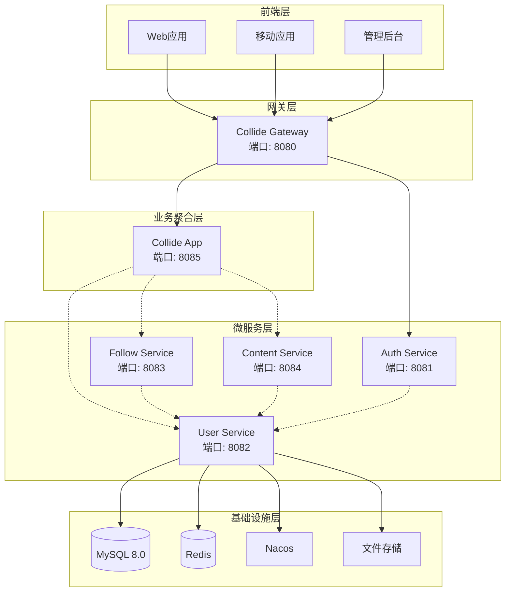
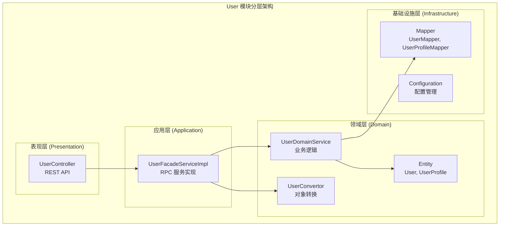
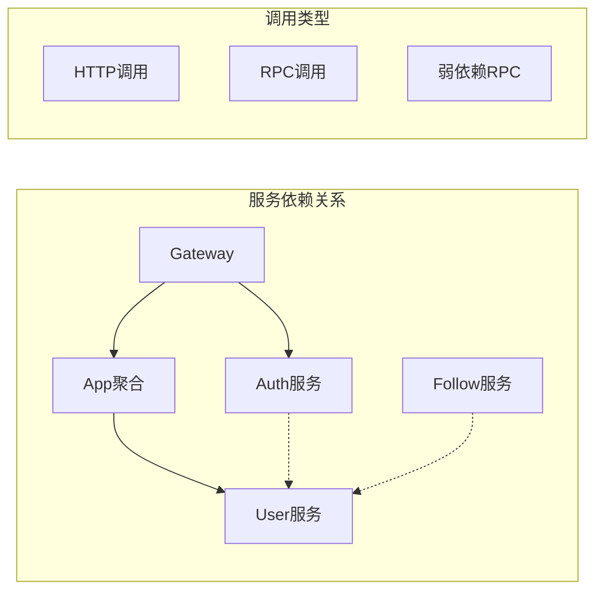
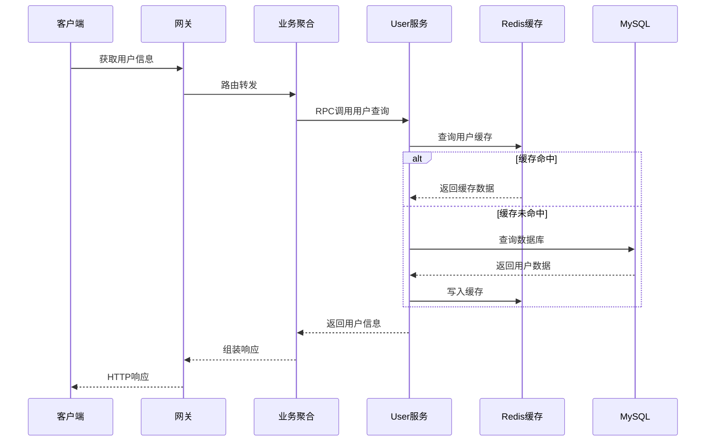
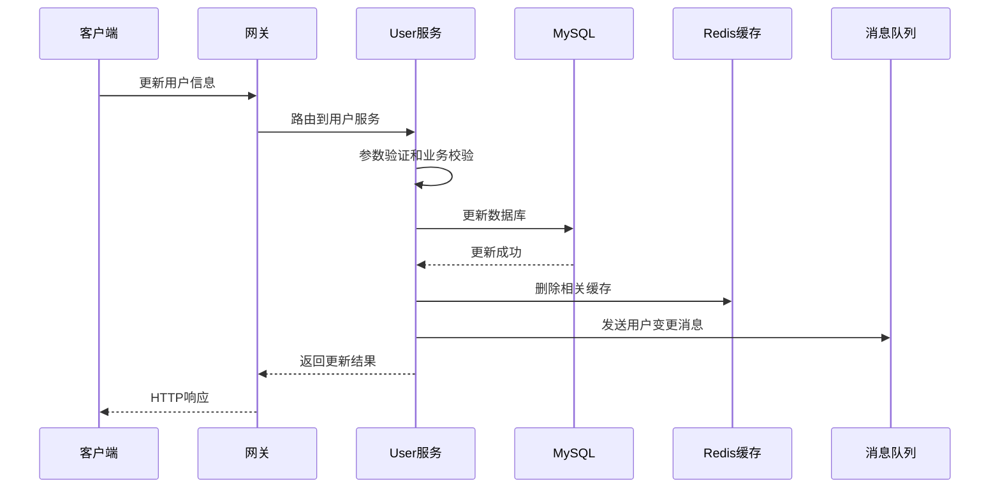
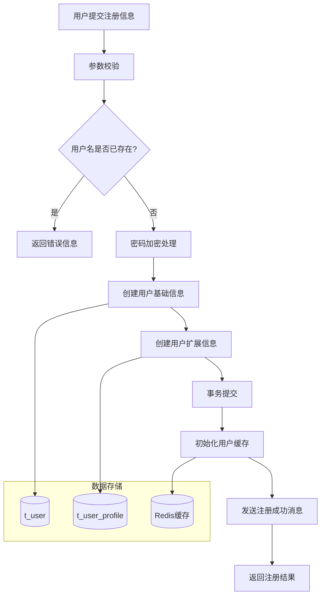
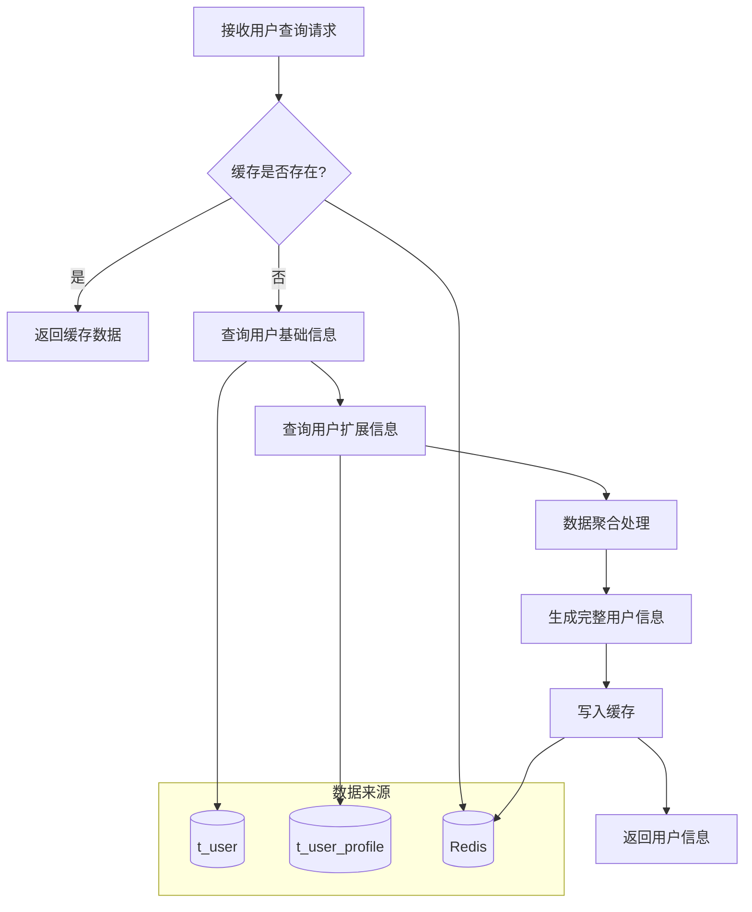
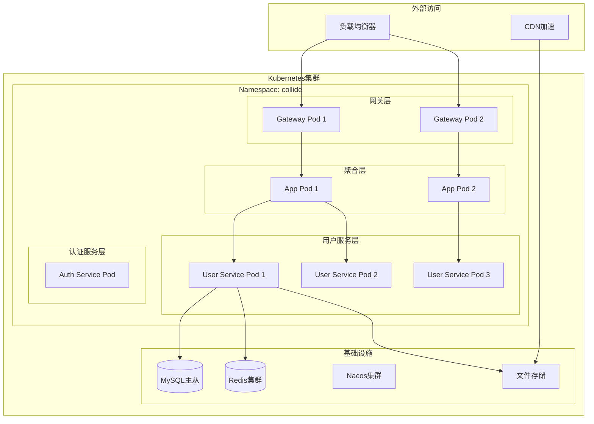
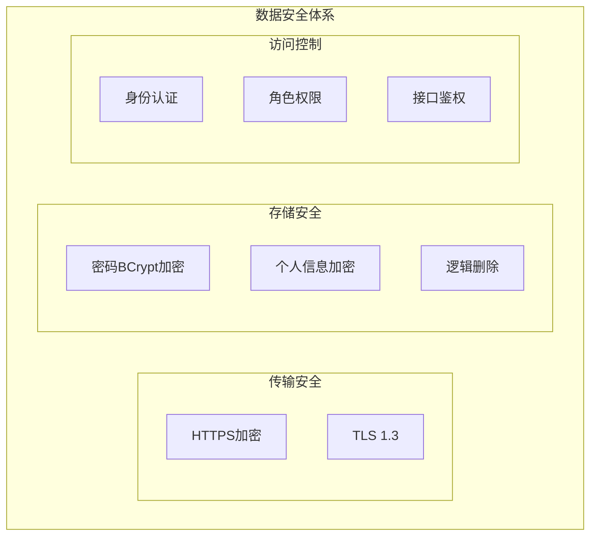

# User 模块系统设计概览

## 📋 目录
- [系统架构](#系统架构)
- [技术栈选型](#技术栈选型)
- [模块分层](#模块分层)
- [服务交互](#服务交互)
- [数据流转](#数据流转)
- [部署架构](#部署架构)

---

## 🏗️ 系统架构

### 整体架构图



### 核心组件说明

| 组件名称 | 职责 | 端口 | 技术栈 |
|----------|------|------|--------|
| User Service | 用户信息管理、档案维护 | 8082 | Spring Boot + MyBatis Plus |
| Auth Service | 用户认证、Token管理 | 8081 | Spring Boot + Sa-Token |
| Collide App | 业务聚合、服务编排 | 8085 | Spring Boot + Dubbo |
| Collide Gateway | API网关、路由转发 | 8080 | Spring Cloud Gateway |

---

## 🔧 技术栈选型

### 后端技术栈

| 分类 | 技术选型 | 版本 | 选型理由 |
|------|----------|------|----------|
| **基础框架** | Spring Boot | 3.2.x | 成熟稳定，生态完善 |
| **微服务** | Spring Cloud | 2023.x | 完整微服务解决方案 |
| **RPC通信** | Apache Dubbo | 3.2.x | 高性能、功能强大 |
| **服务注册** | Nacos | 2.3.x | 配置中心 + 注册中心 |
| **数据库** | MySQL | 8.0 | 事务支持、性能稳定 |
| **ORM框架** | MyBatis Plus | 3.5.x | 简化开发、性能优秀 |
| **缓存** | Redis | 7.x | 高性能、丰富数据结构 |
| **认证授权** | Sa-Token | 1.37.x | 轻量级、功能完善 |
| **密码加密** | BCrypt | - | 安全的密码哈希算法 |

### 开发工具链

| 分类 | 工具 | 用途 |
|------|------|------|
| **对象映射** | MapStruct | 高性能Bean转换 |
| **代码简化** | Lombok | 减少样板代码 |
| **参数校验** | Jakarta Validation | 请求参数验证 |
| **API文档** | OpenAPI 3.0 | 接口文档生成 |
| **JSON处理** | FastJSON2 | 高性能序列化 |

---

## 🏛️ 模块分层

### DDD分层架构



### 各层职责详解

#### 表现层 (Presentation Layer)
- **UserController**: 处理HTTP请求，参数验证，响应格式化
- **职责**: 
  - REST API接口暴露
  - 请求参数绑定和验证
  - 响应数据格式化
  - 异常处理和错误码映射
- **技术**: Spring MVC, Jakarta Validation

#### 应用层 (Application Layer)  
- **UserFacadeServiceImpl**: RPC服务实现，对外暴露业务能力
- **职责**: 
  - Dubbo服务接口实现
  - 跨服务业务编排
  - 事务边界控制
  - 异常处理和响应包装
- **技术**: Dubbo, Spring Transaction

#### 领域层 (Domain Layer)
- **UserDomainService**: 核心业务逻辑，用户管理规则
- **Entity**: 用户领域对象，封装业务数据和行为  
- **Convertor**: 领域对象与API对象转换
- **职责**: 
  - 用户业务逻辑实现
  - 数据验证和业务规则
  - 领域对象管理
  - 业务异常处理
- **技术**: Spring Service, MapStruct

#### 基础设施层 (Infrastructure Layer)
- **UserMapper**: 数据持久化，数据库交互
- **UserProfileMapper**: 用户扩展信息数据访问
- **Configuration**: 技术配置和第三方集成
- **职责**: 
  - 数据库CRUD操作
  - 复杂查询实现
  - 缓存集成
  - 外部服务调用
- **技术**: MyBatis Plus, Redis, File Storage

---

## 🔄 服务交互

### 服务调用关系



**依赖说明**:
- **强依赖**: App聚合服务直接调用User服务
- **弱依赖**: Auth/Follow服务可选择调用User服务
- **HTTP调用**: 网关到各服务的REST API调用

### 用户信息查询流程



### 用户信息更新流程



---

## 📊 数据流转

### 用户注册数据流



### 用户信息聚合流程



---

## 🚀 部署架构

### 容器化部署设计



### 部署配置

#### Deployment 配置
```yaml
apiVersion: apps/v1
kind: Deployment
metadata:
  name: collide-user
  namespace: collide
spec:
  replicas: 3
  selector:
    matchLabels:
      app: collide-user
  template:
    metadata:
      labels:
        app: collide-user
    spec:
      containers:
      - name: collide-user
        image: collide/user:v1.0.0
        ports:
        - containerPort: 8082
        env:
        - name: SPRING_PROFILES_ACTIVE
          value: "prod"
        - name: NACOS_SERVER_ADDR
          value: "nacos-service:8848"
        - name: MYSQL_HOST
          value: "mysql-service"
        - name: REDIS_HOST
          value: "redis-service"
        resources:
          requests:
            memory: "1Gi"
            cpu: "500m"
          limits:
            memory: "2Gi"
            cpu: "1000m"
        livenessProbe:
          httpGet:
            path: /actuator/health
            port: 8082
          initialDelaySeconds: 60
          periodSeconds: 30
        readinessProbe:
          httpGet:
            path: /actuator/health/readiness
            port: 8082
          initialDelaySeconds: 30
          periodSeconds: 10
```

#### Service 配置
```yaml
apiVersion: v1
kind: Service
metadata:
  name: collide-user-service
  namespace: collide
spec:
  selector:
    app: collide-user
  ports:
  - name: http
    protocol: TCP
    port: 8082
    targetPort: 8082
  - name: dubbo
    protocol: TCP
    port: 20882
    targetPort: 20882
  type: ClusterIP
```

### 环境配置矩阵

| 环境 | 实例数量 | CPU/内存 | 数据库 | 缓存 | 存储 |
|------|----------|----------|--------|------|------|
| **开发环境** | 1 | 0.5C/1Gi | MySQL单机 | Redis单机 | 本地存储 |
| **测试环境** | 2 | 0.5C/1Gi | MySQL单机 | Redis单机 | NFS共享 |
| **预生产** | 2 | 1C/2Gi | MySQL主从 | Redis主从 | 云存储 |
| **生产环境** | 3+ | 1C/2Gi | MySQL集群 | Redis集群 | 云存储+CDN |

---

## 📈 性能与监控

### 性能指标

| 指标类型 | 目标值 | 监控方式 | 告警阈值 |
|----------|--------|----------|----------|
| **响应时间** | P99 < 200ms | APM监控 | > 300ms |
| **吞吐量** | > 2000 QPS | 压力测试 | < 1000 QPS |
| **可用性** | 99.9% | 健康检查 | < 99% |
| **错误率** | < 0.1% | 日志监控 | > 0.5% |

### 容量规划

| 资源类型 | 当前配置 | 扩容触发条件 | 扩容策略 |
|----------|----------|--------------|----------|
| **CPU使用率** | 1Core/Pod | > 70% | 水平扩容 |
| **内存使用率** | 2Gi/Pod | > 80% | 垂直扩容 |
| **数据库连接** | 50/实例 | > 40 | 连接池调优 |
| **缓存使用率** | 4GB | > 80% | 增加节点 |

### 监控配置

#### Prometheus 监控
```yaml
# 用户服务监控指标
- job_name: 'collide-user'
  static_configs:
    - targets: ['collide-user:8082']
  metrics_path: '/actuator/prometheus'
  scrape_interval: 15s
```

#### 告警规则
```yaml
# 用户服务告警规则
- alert: UserServiceDown
  expr: up{job="collide-user"} == 0
  for: 1m
  labels:
    severity: critical
  annotations:
    summary: "用户服务已停止"

- alert: UserServiceHighLatency  
  expr: histogram_quantile(0.99, rate(http_request_duration_seconds_bucket{job="collide-user"}[5m])) > 0.2
  for: 5m
  labels:
    severity: warning
  annotations:
    summary: "用户服务响应时间过长"
```

---

## 🔒 安全设计

### 数据安全



### 隐私保护
- **数据脱敏**: 非生产环境使用脱敏数据
- **访问日志**: 记录敏感数据访问日志
- **权限控制**: 最小权限原则
- **数据擦除**: 支持用户数据删除

### API安全
- **参数校验**: 严格的输入验证
- **SQL注入防护**: PreparedStatement
- **XSS防护**: 输出转义
- **CSRF防护**: Token验证

---

## 📝 运维管理

### 日志管理
```yaml
# 日志配置
logging:
  level:
    com.gig.collide.users: DEBUG
    org.springframework.security: INFO
  pattern:
    file: "%d{yyyy-MM-dd HH:mm:ss} [%thread] %-5level [%X{traceId}] %logger{36} - %msg%n"
```

### 健康检查
```java
@Component
public class UserHealthIndicator implements HealthIndicator {
    
    @Override
    public Health health() {
        // 检查数据库连接
        // 检查Redis连接  
        // 检查关键业务指标
        return Health.up()
            .withDetail("database", "UP")
            .withDetail("cache", "UP")
            .build();
    }
}
```

### 故障处理
- **熔断降级**: 依赖服务故障时的降级策略
- **限流保护**: 防止系统过载的流量控制
- **数据备份**: 定期备份和恢复演练
- **灾备切换**: 跨机房故障切换方案

---

## 📞 技术支持

- **开发团队**: Collide Team
- **服务端口**: 8082 (HTTP), 20882 (Dubbo)
- **文档版本**: v1.0  
- **更新日期**: 2024-01-15
- **联系方式**: tech@collide.com

---

*本文档描述了 User 模块的完整系统设计，包含架构设计、技术选型、部署方案等核心内容。* 