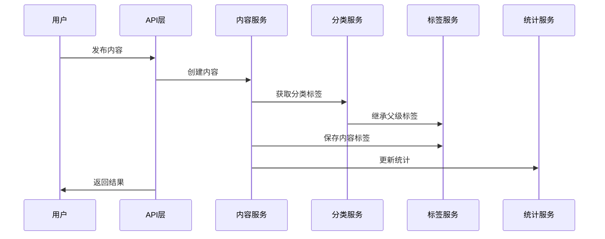
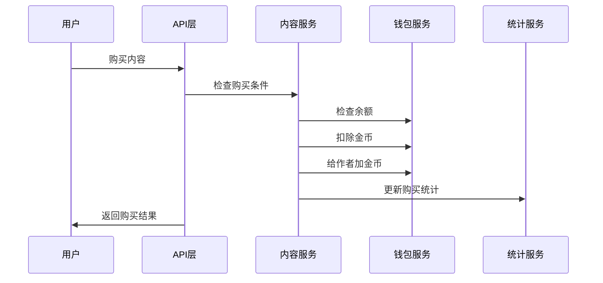
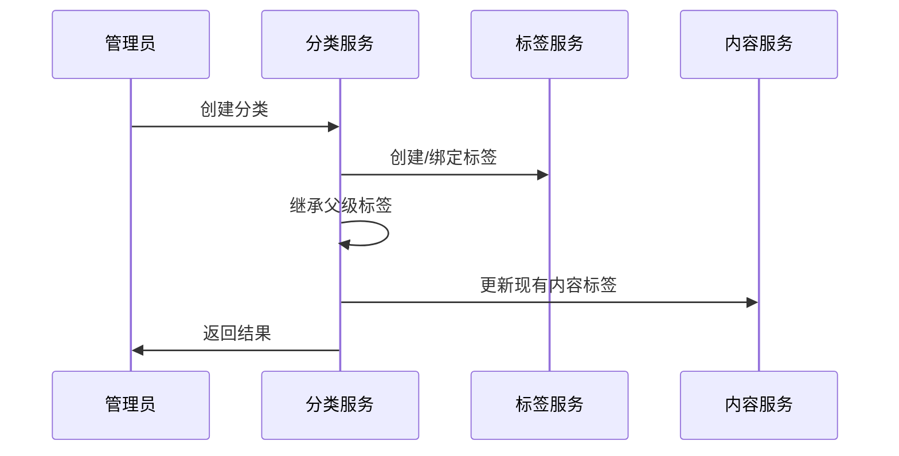

# 🎬 Social模块完整架构设计方案

## 📋 概览

Social模块作为**顶级社交平台模块**，整合了原有的content、like、comment、favorite等模块功能，形成了一个类似Instagram的完整社交视频平台。

### 🎯 核心功能

1. **用户关系管理** - 关注/粉丝系统
2. **内容管理** - 短视频/长视频/图片/文字内容
3. **付费内容系统** - 金币购买优质内容
4. **三级分类系统** - 标签自动继承，便于内容组织
5. **社交互动** - 点赞、评论、收藏、分享
6. **智能推荐** - 基于标签、关注、热度的多维推荐
7. **统计分析** - 完整的用户社交数据统计

### 🏗️ 模块整合策略

- **整合原有模块**: content、like、comment、favorite
- **新增功能**: share（分享）、付费内容、三级分类
- **保持独立模块**: users（用户）、tag（标签）、task（任务）
- **与既有模块协作**: 钱包系统、标签系统

## 🗄️ 数据库设计

### 核心数据表

1. **t_user_follow** - 用户关注关系
2. **t_social_category** - 三级分类系统
3. **t_category_tag_inheritance** - 分类标签继承
4. **t_social_content** - 社交内容（整合content）
5. **t_social_like** - 内容点赞（整合like）
6. **t_social_comment** - 内容评论（整合comment）
7. **t_social_favorite** - 内容收藏（整合favorite）
8. **t_social_share** - 内容分享（新增）
9. **t_social_content_tag** - 内容标签关联
10. **t_content_purchase** - 内容购买记录
11. **t_user_social_stats** - 用户社交统计

详见: `sql/social/social-simple.sql`

## 🎯 服务架构设计

### Facade层接口

```java
// 1. 用户关系服务
@DubboService(version = "1.0.0")
UserFollowFacadeService {
    Result<Void> followUser(Long followerId, Long followingId);
    Result<Void> unfollowUser(Long followerId, Long followingId);
    Result<PageResponse<UserFollowVO>> getFollowers(UserFollowQuery query);
    Result<PageResponse<UserFollowVO>> getFollowing(UserFollowQuery query);
    Result<Boolean> isFollowing(Long followerId, Long followingId);
    Result<List<UserRelationshipVO>> getBatchRelationships(Long userId, List<Long> targetUserIds);
}

// 2. 分类管理服务
@DubboService(version = "1.0.0")
SocialCategoryFacadeService {
    // 分类CRUD
    Result<SocialCategoryVO> createCategory(CreateCategoryRequest request);
    Result<SocialCategoryVO> updateCategory(UpdateCategoryRequest request);
    Result<Void> deleteCategory(Long categoryId);
    
    // 分类查询
    Result<List<CategoryTreeVO>> getCategoryTree();
    Result<List<SocialCategoryVO>> getCategoriesByLevel(Integer level);
    Result<List<Long>> getCategoryAllTags(Long categoryId);
    
    // 标签继承管理
    Result<Void> rebuildTagInheritance(Long categoryId);
    Result<List<TagInheritanceVO>> getCategoryTagInheritance(Long categoryId);
}

// 3. 社交内容服务
@DubboService(version = "1.0.0")
SocialContentFacadeService {
    // 内容CRUD
    Result<SocialContentVO> createContent(CreateContentRequest request);
    Result<SocialContentVO> updateContent(UpdateContentRequest request);
    Result<Void> deleteContent(Long contentId, Long userId);
    Result<SocialContentVO> getContentDetail(Long contentId, Long viewerUserId);
    
    // 内容查询
    Result<PageResponse<SocialContentVO>> getContentsByCategory(CategoryContentQuery query);
    Result<PageResponse<SocialContentVO>> getUserContents(UserContentQuery query);
    Result<PageResponse<SocialContentVO>> getFollowingContents(FollowingContentQuery query);
    
    // 付费内容
    Result<Boolean> checkContentAccess(Long userId, Long contentId);
    Result<ContentPurchaseVO> purchaseContent(PurchaseContentRequest request);
    Result<PageResponse<ContentPurchaseVO>> getPurchaseHistory(PurchaseHistoryQuery query);
}

// 4. 社交互动服务
@DubboService(version = "1.0.0")
SocialInteractionFacadeService {
    // 点赞
    Result<Void> likeContent(Long userId, Long contentId);
    Result<Void> unlikeContent(Long userId, Long contentId);
    Result<PageResponse<SocialLikeVO>> getContentLikes(ContentLikeQuery query);
    
    // 评论
    Result<SocialCommentVO> addComment(AddCommentRequest request);
    Result<Void> deleteComment(Long commentId, Long userId);
    Result<PageResponse<SocialCommentVO>> getContentComments(ContentCommentQuery query);
    
    // 收藏
    Result<Void> favoriteContent(FavoriteContentRequest request);
    Result<Void> unfavoriteContent(Long userId, Long contentId);
    Result<PageResponse<SocialFavoriteVO>> getUserFavorites(UserFavoriteQuery query);
    
    // 分享
    Result<SocialShareVO> shareContent(ShareContentRequest request);
    Result<PageResponse<SocialShareVO>> getContentShares(ContentShareQuery query);
}

// 5. 社交推荐服务
@DubboService(version = "1.0.0")
SocialRecommendFacadeService {
    // 内容推荐
    Result<PageResponse<SocialContentVO>> getRecommendContents(ContentRecommendQuery query);
    Result<PageResponse<SocialContentVO>> getHotContents(HotContentQuery query);
    Result<PageResponse<SocialContentVO>> getTagBasedContents(TagBasedQuery query);
    
    // 用户推荐
    Result<PageResponse<UserRecommendVO>> getRecommendUsers(UserRecommendQuery query);
    Result<PageResponse<UserRecommendVO>> getSimilarUsers(SimilarUserQuery query);
}

// 6. 社交统计服务
@DubboService(version = "1.0.0")
SocialStatsFacadeService {
    // 用户统计
    Result<UserSocialStatsVO> getUserSocialStats(Long userId);
    Result<Void> updateUserSocialStats(Long userId);
    
    // 内容统计
    Result<ContentStatsVO> getContentStats(Long contentId);
    Result<List<ContentStatsVO>> getBatchContentStats(List<Long> contentIds);
    
    // 收益统计
    Result<UserEarningsVO> getUserEarnings(Long userId);
    Result<EarningsReportVO> getEarningsReport(EarningsReportQuery query);
}

// 7. 社交Feed服务
@DubboService(version = "1.0.0")
SocialFeedFacadeService {
    // Feed流
    Result<PageResponse<SocialContentVO>> getUserFeed(UserFeedQuery query);
    Result<PageResponse<SocialContentVO>> getRecommendFeed(RecommendFeedQuery query);
    Result<PageResponse<SocialContentVO>> getHotFeed(HotFeedQuery query);
    
    // Feed管理
    Result<Void> refreshUserFeed(Long userId);
    Result<Void> markFeedViewed(Long userId, List<Long> contentIds);
}
```

## 📱 API接口设计

### REST Controller层

```java
// 1. 用户关系管理
@RestController
@RequestMapping("/api/v1/social/follow")
public class UserFollowController {
    
    @PostMapping("/users/{userId}")
    @Operation(summary = "关注用户")
    Result<Void> followUser(@PathVariable Long userId);
    
    @DeleteMapping("/users/{userId}")
    @Operation(summary = "取消关注")
    Result<Void> unfollowUser(@PathVariable Long userId);
    
    @GetMapping("/followers")
    @Operation(summary = "获取粉丝列表")
    Result<PageResponse<UserFollowVO>> getFollowers(@Valid UserFollowQuery query);
    
    @GetMapping("/following")
    @Operation(summary = "获取关注列表")
    Result<PageResponse<UserFollowVO>> getFollowing(@Valid UserFollowQuery query);
}

// 2. 内容管理
@RestController
@RequestMapping("/api/v1/social/contents")
public class SocialContentController {
    
    @PostMapping
    @Operation(summary = "发布内容")
    Result<SocialContentVO> createContent(@Valid @RequestBody CreateContentRequest request);
    
    @GetMapping("/{contentId}")
    @Operation(summary = "获取内容详情")
    Result<SocialContentVO> getContentDetail(@PathVariable Long contentId);
    
    @GetMapping
    @Operation(summary = "内容列表")
    Result<PageResponse<SocialContentVO>> getContents(@Valid ContentQuery query);
    
    @PostMapping("/{contentId}/purchase")
    @Operation(summary = "购买付费内容")
    Result<ContentPurchaseVO> purchaseContent(@PathVariable Long contentId);
}

// 3. 分类管理
@RestController
@RequestMapping("/api/v1/social/categories")
public class SocialCategoryController {
    
    @GetMapping("/tree")
    @Operation(summary = "获取分类树")
    Result<List<CategoryTreeVO>> getCategoryTree();
    
    @GetMapping("/{categoryId}/contents")
    @Operation(summary = "按分类获取内容")
    Result<PageResponse<SocialContentVO>> getContentsByCategory(
        @PathVariable Long categoryId, 
        @Valid CategoryContentQuery query);
}

// 4. 社交互动
@RestController
@RequestMapping("/api/v1/social/interactions")
public class SocialInteractionController {
    
    @PostMapping("/contents/{contentId}/like")
    @Operation(summary = "点赞内容")
    Result<Void> likeContent(@PathVariable Long contentId);
    
    @PostMapping("/contents/{contentId}/comments")
    @Operation(summary = "评论内容")
    Result<SocialCommentVO> addComment(@PathVariable Long contentId, @Valid @RequestBody AddCommentRequest request);
    
    @PostMapping("/contents/{contentId}/favorite")
    @Operation(summary = "收藏内容")
    Result<Void> favoriteContent(@PathVariable Long contentId, @Valid @RequestBody FavoriteContentRequest request);
    
    @PostMapping("/contents/{contentId}/share")
    @Operation(summary = "分享内容")
    Result<SocialShareVO> shareContent(@PathVariable Long contentId, @Valid @RequestBody ShareContentRequest request);
}

// 5. 推荐系统
@RestController
@RequestMapping("/api/v1/social/recommend")
public class SocialRecommendController {
    
    @GetMapping("/contents")
    @Operation(summary = "推荐内容")
    Result<PageResponse<SocialContentVO>> getRecommendContents(@Valid ContentRecommendQuery query);
    
    @GetMapping("/users")
    @Operation(summary = "推荐用户")
    Result<PageResponse<UserRecommendVO>> getRecommendUsers(@Valid UserRecommendQuery query);
    
    @GetMapping("/hot")
    @Operation(summary = "热门内容")
    Result<PageResponse<SocialContentVO>> getHotContents(@Valid HotContentQuery query);
}

// 6. Feed流
@RestController
@RequestMapping("/api/v1/social/feed")
public class SocialFeedController {
    
    @GetMapping
    @Operation(summary = "获取个人Feed")
    Result<PageResponse<SocialContentVO>> getUserFeed(@Valid UserFeedQuery query);
    
    @GetMapping("/recommend")
    @Operation(summary = "推荐Feed")
    Result<PageResponse<SocialContentVO>> getRecommendFeed(@Valid RecommendFeedQuery query);
    
    @GetMapping("/hot")
    @Operation(summary = "热门Feed")
    Result<PageResponse<SocialContentVO>> getHotFeed(@Valid HotFeedQuery query);
}
```

## 🔄 核心业务流程

### 1. 内容发布流程



### 2. 付费内容购买流程



### 3. 分类标签继承流程



## 🔗 模块集成策略

### 与Tag模块协作

```java
// 分类创建时自动创建/绑定标签
@Service
public class CategoryService {
    @DubboReference(version = "1.0.0")
    private TagFacadeService tagFacadeService;
    
    public void createCategory(CreateCategoryRequest request) {
        // 1. 创建分类
        SocialCategory category = createCategoryRecord(request);
        
        // 2. 调用tag模块创建标签
        for (String tagName : request.getTagNames()) {
            CreateTagRequest tagRequest = new CreateTagRequest();
            tagRequest.setTagName(tagName);
            Result<TagVO> result = tagFacadeService.createTag(tagRequest);
            
            if (result.getSuccess()) {
                // 3. 建立分类-标签绑定
                bindCategoryWithTag(category.getId(), result.getData().getId());
            }
        }
        
        // 4. 处理标签继承
        handleTagInheritance(category);
    }
}
```

### 与Users模块协作

```java
// 购买内容时操作用户钱包
@Service
public class ContentPurchaseService {
    @DubboReference(version = "1.0.0")
    private UserWalletFacadeService userWalletFacadeService;
    
    public Result<ContentPurchaseVO> purchaseContent(PurchaseContentRequest request) {
        // 1. 扣除购买者金币
        Result<Void> consumeResult = userWalletFacadeService.consumeCoins(
            request.getUserId(), request.getPrice(), "购买内容");
        
        if (!consumeResult.getSuccess()) {
            return Result.error("INSUFFICIENT_BALANCE", "余额不足");
        }
        
        // 2. 给内容作者增加收益
        Result<Void> rewardResult = userWalletFacadeService.grantCoins(
            request.getContentOwnerId(), request.getPrice(), "内容销售收益");
        
        // 3. 记录购买记录
        return createPurchaseRecord(request);
    }
}
```

## 💾 缓存策略

```java
// 缓存常量
public class SocialCacheConstant {
    // 分类相关
    public static final String CATEGORY_TREE_CACHE = "social:category:tree";
    public static final String CATEGORY_TAGS_CACHE = "social:category:tags";
    public static final String CATEGORY_CONTENTS_CACHE = "social:category:contents";
    
    // 内容相关
    public static final String CONTENT_DETAIL_CACHE = "social:content:detail";
    public static final String HOT_CONTENTS_CACHE = "social:content:hot";
    public static final String USER_CONTENTS_CACHE = "social:user:contents";
    
    // 用户关系相关
    public static final String USER_FOLLOWERS_CACHE = "social:user:followers";
    public static final String USER_FOLLOWING_CACHE = "social:user:following";
    public static final String USER_RELATIONSHIP_CACHE = "social:user:relationship";
    
    // 统计相关
    public static final String USER_STATS_CACHE = "social:user:stats";
    public static final String CONTENT_STATS_CACHE = "social:content:stats";
    
    // Feed相关
    public static final String USER_FEED_CACHE = "social:user:feed";
    public static final String RECOMMEND_FEED_CACHE = "social:recommend:feed";
    
    // 购买相关
    public static final String PURCHASE_STATUS_CACHE = "social:purchase:status";
    public static final String USER_PURCHASES_CACHE = "social:user:purchases";
}

// 缓存使用示例
@Service
public class SocialContentService {
    
    @Cached(name = SocialCacheConstant.CONTENT_DETAIL_CACHE, 
            expire = 30, timeUnit = TimeUnit.MINUTES)
    public SocialContentVO getContentDetail(Long contentId) {
        return contentMapper.getById(contentId);
    }
    
    @Cached(name = SocialCacheConstant.HOT_CONTENTS_CACHE, 
            expire = 10, timeUnit = TimeUnit.MINUTES)
    public List<SocialContentVO> getHotContents(HotContentQuery query) {
        return contentMapper.getHotContents(query);
    }
    
    @CacheInvalidate(name = SocialCacheConstant.USER_CONTENTS_CACHE)
    @CacheInvalidate(name = SocialCacheConstant.CATEGORY_CONTENTS_CACHE)
    public void createContent(CreateContentRequest request) {
        // 创建内容逻辑
    }
}
```

## 📊 实施计划

### 第一阶段：基础架构（1周）
1. 创建数据库表结构
2. 搭建项目基础架构（Entity、Mapper）
3. 创建基础API接口定义

### 第二阶段：核心功能（2周）
1. 用户关系管理（关注/粉丝）
2. 内容基础CRUD
3. 分类系统与标签继承
4. 基础互动功能（点赞、评论）

### 第三阶段：高级功能（2周）
1. 付费内容系统
2. 收藏与分享功能
3. 统计系统
4. 缓存集成

### 第四阶段：推荐系统（1周）
1. 基于标签的推荐
2. 基于关注的推荐
3. 热门内容推荐
4. Feed流生成

### 第五阶段：优化与测试（1周）
1. 性能优化
2. 缓存优化
3. 接口测试
4. 文档完善

## 🎯 总结

这个Social模块设计方案：

✅ **整合了多个模块**，减少了系统复杂度
✅ **支持付费内容**，具备商业价值
✅ **三级分类+标签继承**，便于内容组织
✅ **完整的社交功能**，类似Instagram体验
✅ **智能推荐系统**，提升用户粘性
✅ **详细的统计分析**，支持运营决策
✅ **合理的缓存策略**，保证系统性能

这是一个**企业级社交视频平台**的完整解决方案！🚀