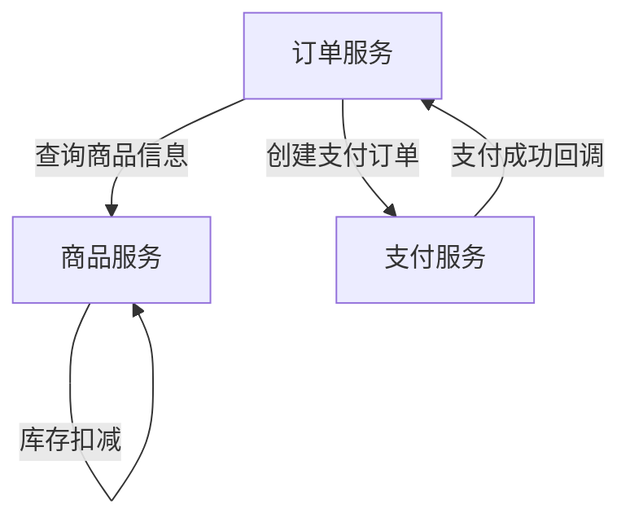
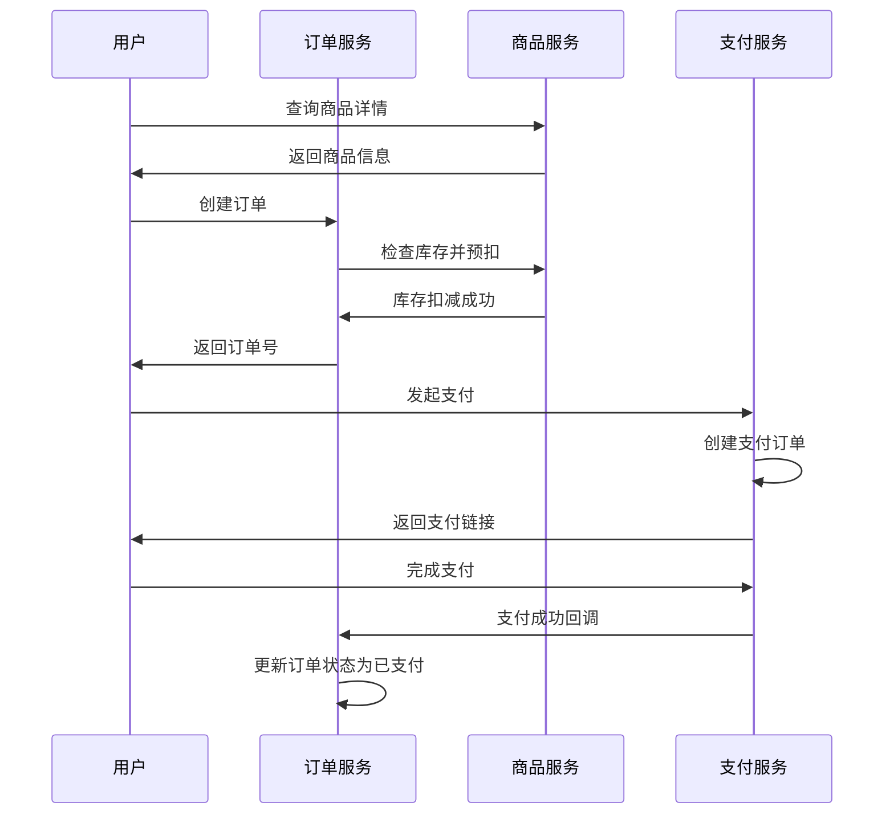

# Collide 微服务拆分完成总结

## 🎯 拆分目标

按照NFTurbo项目的微服务架构思想，将原有的混合业务模块 `collide-goods` 拆分为三个独立的微服务：
- **商品服务 (collide-goods-service)**
- **订单服务 (collide-order-service)**  
- **支付服务 (collide-payment-service)**

## 🏗️ 正确的架构模式

通过分析现有的Collide项目架构，我们理解了正确的模式：

### 1. API-Application 分层架构
```
collide-common/collide-api/          # API接口层
├── goods/                           # 商品服务API
│   ├── service/GoodsFacadeService   # 门面服务接口
│   ├── request/                     # 请求DTO
│   ├── response/                    # 响应DTO
│   └── constant/                    # 业务常量
├── order/                           # 订单服务API
└── payment/                         # 支付服务API

collide-application/                 # 应用实现层
├── collide-goods-service/           # 商品服务实现
│   └── facade/GoodsFacadeServiceImpl # 实现API接口
├── collide-order-service/           # 订单服务实现
└── collide-payment-service/         # 支付服务实现
```

### 2. 依赖关系
- **Application模块** 依赖 **API模块**
- 通过 `@DubboService` 实现API中定义的接口
- 服务间通过Dubbo RPC调用

## ✅ 已完成的工作

### 1. API层定义完成

#### 商品服务API (collide-api/goods/)
- ✅ `GoodsFacadeService` - 商品门面服务接口
- ✅ `GoodsType` - 商品类型常量 (COIN, SUBSCRIPTION)
- ✅ `GoodsStatus` - 商品状态常量
- ✅ `GoodsResponse` - 商品操作响应
- ✅ `GoodsQueryResponse` - 商品查询响应
- ✅ `GoodsInfo` - 商品信息DTO
- ✅ `GoodsCreateRequest` - 商品创建请求

#### 订单服务API (collide-api/order/)
- ✅ `OrderFacadeService` - 订单门面服务接口
- ✅ `OrderStatus` - 订单状态常量
- ✅ `OrderResponse` - 订单操作响应
- ✅ `OrderQueryResponse` - 订单查询响应
- ✅ `OrderCreateRequest` - 订单创建请求

#### 支付服务API (collide-api/payment/)
- ✅ `PaymentFacadeService` - 支付门面服务接口
- ✅ `PaymentStatus` - 支付状态常量
- ✅ `PaymentResponse` - 支付操作响应

### 2. Application层实现开始

#### 商品服务实现 (collide-goods-service/)
- ✅ 更新pom.xml依赖API模块
- ✅ `GoodsFacadeServiceImpl` - 实现商品API接口
- ✅ `GoodsConvertor` - 实体与DTO转换器
- ✅ 正确的@DubboService注解配置

## 🔄 服务间通信设计

### RPC调用关系


### 关键接口

**商品服务提供：**
- `queryGoods(GoodsQueryRequest)` - 查询商品信息
- `decreaseStock(GoodsStockRequest)` - 扣减库存
- `rollbackStock(GoodsStockRequest)` - 回滚库存
- `checkPurchasable(GoodsPurchaseCheckRequest)` - 检查可购买性

**订单服务提供：**
- `createOrder(OrderCreateRequest)` - 创建订单
- `updateOrderStatus(OrderStatusUpdateRequest)` - 更新订单状态

**支付服务提供：**
- `createPayment(PaymentCreateRequest)` - 创建支付
- `testPaymentSuccess(PaymentTestRequest)` - 测试支付成功

## 📊 业务流程示例

### 完整购买流程


## 📝 接下来需要完成的工作

### 1. 完善Application层实现
- [ ] 完成`GoodsDomainService`领域服务
- [ ] 完成`OrderFacadeServiceImpl`订单服务实现
- [ ] 完成`PaymentFacadeServiceImpl`支付服务实现

### 2. 缺失的API定义
- [ ] 补充商品API的其他请求DTO (`GoodsUpdateRequest`, `GoodsDeleteRequest`等)
- [ ] 补充订单API的其他请求DTO
- [ ] 补充支付API的请求/响应DTO

### 3. 数据库配置
- [ ] 各服务独立的数据库配置
- [ ] Mapper接口和XML配置

### 4. 配置文件
- [ ] 各服务的application.yml配置
- [ ] 端口分配和服务注册配置

## 🎉 架构优势

### 1. 清晰的分层
- **API层**: 定义服务契约，保证接口一致性
- **Application层**: 业务实现，专注具体逻辑

### 2. 服务解耦
- 每个服务职责单一，边界清晰
- 通过Dubbo RPC进行服务间通信
- 支持独立部署和扩展

### 3. 开发协作
- API先行，前后端和服务间可并行开发
- 接口变更影响范围可控
- 便于团队分工合作

## 🔧 技术栈

- **框架**: Spring Boot 3.2.2
- **RPC**: Dubbo 3.2.10
- **数据库**: MySQL 8.0 + MyBatis-Plus
- **缓存**: Redis
- **工具**: Lombok, MapStruct, FastJSON2

---

**本次拆分完全遵循了Collide项目的架构模式，通过API-Application分层和Dubbo RPC实现了高内聚、低耦合的微服务设计！** 🚀 