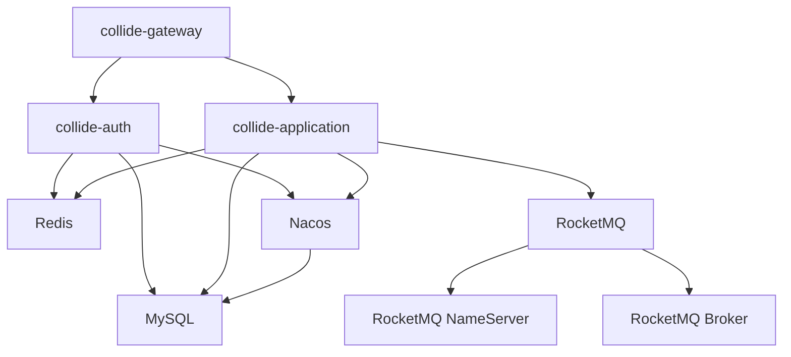

# Collide 项目 Docker 部署指南

## 📋 项目结构

```
Collide/
├── collide-gateway/              # 网关服务 (8081)
│   └── Dockerfile
├── collide-auth/                 # 认证服务 (8082)
│   └── Dockerfile
├── collide-application/          # 应用服务 (8085)
│   └── Dockerfile
├── config/
│   └── rocketmq/
│       └── broker.conf          # RocketMQ Broker配置
├── sql/
│   └── 01-init-database.sql     # 数据库初始化脚本
├── docker-compose.yml           # Docker编排文件
└── docker-deployment-guide.md   # 本文档
```

## 🚀 快速部署

### 1. 前置要求

- Docker 20.0+
- Docker Compose 2.0+
- 至少 4GB 内存
- 至少 10GB 磁盘空间

### 2. 一键启动

```bash
# 克隆项目
git clone <your-repo-url>
cd Collide

# 启动所有服务
docker-compose up -d

# 查看服务状态
docker-compose ps

# 查看日志
docker-compose logs -f
```

### 3. 服务访问地址

| 服务 | 地址 | 说明 |
|------|------|------|
| 网关服务 | http://localhost:8081 | 主要入口 |
| 认证服务 | http://localhost:8082 | 用户认证 |
| 应用服务 | http://localhost:8085 | 业务逻辑 |
| Nacos控制台 | http://localhost:8848/nacos | 用户名/密码：nacos/nacos |
| RocketMQ控制台 | http://localhost:19876 | 消息队列管理 |
| MySQL数据库 | localhost:3306 | 数据库 |
| Redis缓存 | localhost:6379 | 缓存服务 |

## 🔧 详细配置

### 服务端口配置

```yaml
# 基础设施服务
MySQL:     3306
Redis:     6379
Nacos:     8848, 9848
RocketMQ:  9876 (NameServer), 10911 (Broker), 19876 (Console)

# 应用服务
Gateway:       8081
Auth:          8082
Application:   8085
```

### 环境变量配置

各服务通过环境变量配置，主要配置项：

```bash
# 数据库配置
SPRING_DATASOURCE_URL=jdbc:mysql://mysql:3306/collide...
SPRING_DATASOURCE_USERNAME=collide
SPRING_DATASOURCE_PASSWORD=collide123

# Redis配置
SPRING_REDIS_HOST=redis
SPRING_REDIS_PASSWORD=redis123

# Nacos配置
SPRING_CLOUD_NACOS_DISCOVERY_SERVER_ADDR=nacos:8848
SPRING_CLOUD_NACOS_CONFIG_SERVER_ADDR=nacos:8848

# RocketMQ配置
ROCKETMQ_NAME_SERVER=rocketmq-namesrv:9876
COLLIDE_TURBO_ROCKETMQ_URL=rocketmq-namesrv:9876

# Dubbo配置
DUBBO_REGISTRY_ADDRESS=nacos://nacos:8848
```

## 📊 服务依赖关系



## 🛠️ 运维命令

### 启动服务

```bash
# 启动所有服务
docker-compose up -d

# 启动指定服务
docker-compose up -d mysql redis nacos

# 启动应用服务
docker-compose up -d collide-auth collide-application collide-gateway
```

### 停止服务

```bash
# 停止所有服务
docker-compose down

# 停止指定服务
docker-compose stop collide-gateway

# 停止并删除数据卷
docker-compose down -v
```

### 查看日志

```bash
# 查看所有服务日志
docker-compose logs -f

# 查看指定服务日志
docker-compose logs -f collide-application

# 查看最近100行日志
docker-compose logs --tail=100 collide-gateway
```

### 重启服务

```bash
# 重启指定服务
docker-compose restart collide-application

# 重建并重启服务
docker-compose up -d --build collide-application
```

### 扩容服务

```bash
# 扩容应用服务到3个实例
docker-compose up -d --scale collide-application=3
```

## 🔍 故障排查

### 1. 服务启动失败

```bash
# 查看服务状态
docker-compose ps

# 查看失败服务的日志
docker-compose logs collide-application

# 进入容器调试
docker-compose exec collide-application bash
```

### 2. 数据库连接问题

```bash
# 检查MySQL服务状态
docker-compose logs mysql

# 测试数据库连接
docker-compose exec mysql mysql -uroot -proot123 -e "SHOW DATABASES;"
```

### 3. 网络连接问题

```bash
# 查看网络配置
docker network ls
docker network inspect collide_collide-network

# 测试服务间连通性
docker-compose exec collide-application ping mysql
```

### 4. 内存不足

```bash
# 查看容器资源使用情况
docker stats

# 调整JVM内存配置（修改docker-compose.yml）
environment:
  - JAVA_OPTS=-Xmx512m -Xms256m
```

## 📈 性能优化

### 1. JVM参数调优

```yaml
# 网关服务 (轻量级)
environment:
  - JAVA_OPTS=-Xmx512m -Xms256m -XX:+UseG1GC

# 应用服务 (重量级)
environment:
  - JAVA_OPTS=-Xmx1024m -Xms512m -XX:+UseG1GC -XX:MaxGCPauseMillis=200
```

### 2. 数据库优化

```yaml
mysql:
  command: >
    --default-authentication-plugin=mysql_native_password
    --innodb-buffer-pool-size=512M
    --max-connections=1000
    --query-cache-size=64M
```

### 3. Redis优化

```yaml
redis:
  command: >
    redis-server 
    --appendonly yes 
    --requirepass redis123
    --maxmemory 256mb
    --maxmemory-policy allkeys-lru
```

## 🔐 安全配置

### 1. 生产环境密码

```bash
# 修改默认密码
MYSQL_ROOT_PASSWORD=your_secure_password
MYSQL_PASSWORD=your_secure_password
REDIS_PASSWORD=your_secure_password
```

### 2. 网络隔离

```yaml
# 仅暴露必要端口
ports:
  - "8081:8081"  # 仅暴露网关端口
# 其他服务端口仅内部访问
```

### 3. 数据持久化

```bash
# 备份数据卷
docker run --rm -v collide_mysql_data:/data -v $(pwd):/backup alpine tar czf /backup/mysql_backup.tar.gz /data

# 恢复数据卷
docker run --rm -v collide_mysql_data:/data -v $(pwd):/backup alpine tar xzf /backup/mysql_backup.tar.gz -C /
```

## 📋 健康检查

### 1. 服务健康状态

```bash
# 检查所有服务健康状态
docker-compose ps

# 检查特定服务
curl http://localhost:8081/actuator/health
curl http://localhost:8082/actuator/health
curl http://localhost:8085/actuator/health
```

### 2. 监控指标

访问以下地址查看监控指标：

- 应用指标: http://localhost:8085/actuator/prometheus
- JVM指标: http://localhost:8085/actuator/metrics
- 数据库状态: http://localhost:8085/actuator/health/db

## 🚀 CI/CD 集成

### 1. 构建脚本

```bash
#!/bin/bash
# build.sh

# 构建应用镜像
docker-compose build

# 推送到镜像仓库
docker-compose push

# 部署到生产环境
docker-compose -f docker-compose.prod.yml up -d
```

### 2. 版本管理

```bash
# 标记版本
docker tag collide-gateway:latest collide-gateway:v1.0.0

# 部署指定版本
docker-compose -f docker-compose.yml -f docker-compose.v1.0.0.yml up -d
```

## 📝 维护建议

1. **定期备份**: 每日备份数据库和重要配置文件
2. **日志轮转**: 配置日志轮转避免磁盘空间不足
3. **监控告警**: 配置资源使用监控和告警
4. **安全更新**: 定期更新基础镜像和依赖
5. **性能调优**: 根据实际负载调整资源配置

---

## 🆘 支持与帮助

如果遇到问题，请：

1. 检查本文档的故障排查部分
2. 查看服务日志: `docker-compose logs -f [service-name]`
3. 检查服务依赖关系和启动顺序
4. 确认端口是否被占用
5. 验证环境变量配置是否正确

**祝您部署成功！** 🎉 